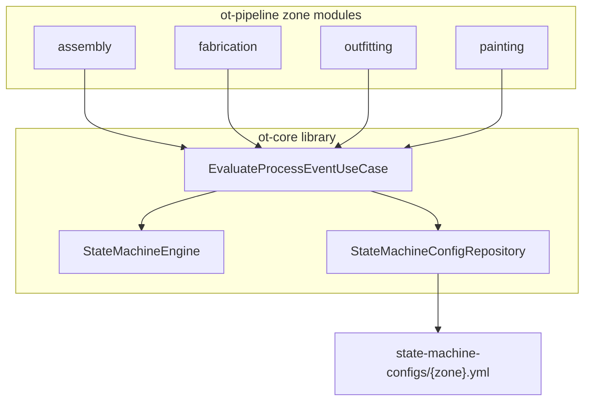
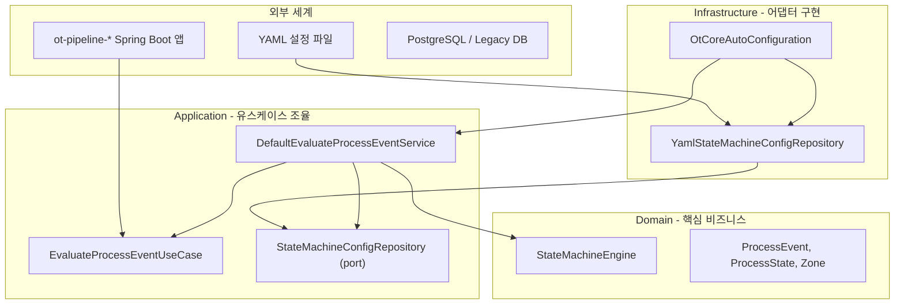
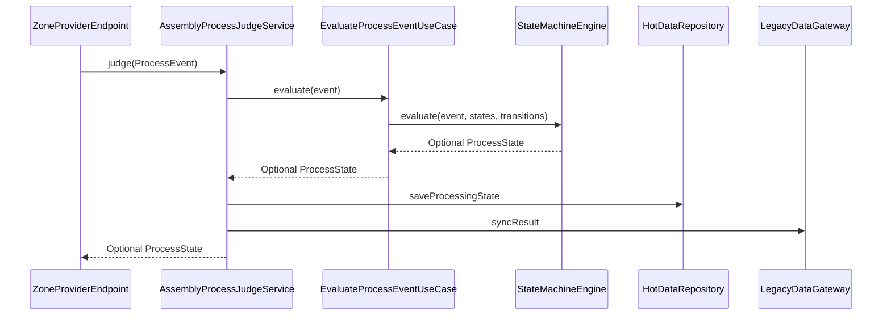

# ot-core 모듈 구조 및 헥사고날 아키텍처 가이드

본 문서는 `ot-core` 라이브러리 모듈의 구조, 헥사고날 아키텍처 레이어 역할, 공정(zone)별 이벤트·상태 차이 처리 방식을 설명한다.

관련 문서: [AGENTS.md](../AGENTS.md), [개발환경가이드.md](./개발환경가이드.md)

---

## 목차

1. [ot-core 역할과 위치](#1-ot-core-역할과-위치)
2. [헥사고날 아키텍처 레이어 역할](#2-헥사고날-아키텍처-레이어-역할)
3. [ot-core 패키지 구조](#3-ot-core-패키지-구조)
4. [Domain / Application / Infrastructure 상세](#4-domain--application--infrastructure-상세)
5. [zone 모듈과의 연동 흐름](#5-zone-모듈과의-연동-흐름)
6. [공정별 이벤트·상태 차이 예시](#6-공정별-이벤트상태-차이-예시)
7. [빌드·의존성·테스트](#7-빌드의존성테스트)
8. [설계상 한계·확장 포인트](#8-설계상-한계확장-포인트)

---

## 1. ot-core 역할과 위치

`ot-core`는 **실행 가능한 Spring Boot 앱이 아닌 라이브러리**(`java-library`, `bootJar` 없음)다. 4개 `ot-pipeline-*` 모듈이 **유일하게 공유 의존**하는 모듈이며, zone별 고유 로직(DB 저장, Legacy 연동, 알림)은 각 파이프라인에 두고 **공정 상태 판별(인식 규칙)** 만 여기서 담당한다.



---

## 2. 헥사고날 아키텍처 레이어 역할

헥사고날 아키텍처(Ports & Adapters)는 **의존 방향이 안쪽(Domain)으로만 향하도록** 역할을 나눈다.



| 레이어 | 질문 | 하는 일 | ot-core 예시 |
|--------|------|---------|--------------|
| **Domain** | 이 시스템의 **진짜 규칙**은? | 비즈니스 개념·순수 로직. 프레임워크·DB 비의존 | `ProcessEvent`, `StateMachineEngine` |
| **Application** | **어떤 순서**로 일을 처리할까? | 유스케이스 조율. 외부는 Port(인터페이스)로만 접근 | `EvaluateProcessEventUseCase`, `DefaultEvaluateProcessEventService` |
| **Infrastructure** | Port를 **실제로** 어떻게 구현할까? | 파일, DB, Spring 설정 등 기술 세부사항 | `YamlStateMachineConfigRepository`, `OtCoreAutoConfiguration` |

**핵심:** 공정별로 이벤트·상태가 달라도 Domain 엔진은 하나다. 차이는 **YAML 설정(규칙 내용)** 과 **zone 모듈의 어댑터(입출력 구현)** 에 둔다.

---

## 3. ot-core 패키지 구조

베이스 패키지: `com.hanwha.ocean.otcore`

| 레이어 | 경로 | Spring 의존 | 역할 |
|--------|------|-------------|------|
| Domain | `domain/model/`, `domain/statemachine/`, `domain/exception/` | 없음 | 순수 도메인 모델·엔진 |
| Application | `application/port/in/`, `application/port/out/`, `application/service/` | 없음 | 유스케이스·포트·오케스트레이션 |
| Infrastructure | `infrastructure/config/` | 있음 | YAML 로딩, Spring AutoConfiguration |

[AGENTS.md](../AGENTS.md)에 정의된 헥사고날 규칙과 일치한다. **`domain/`은 프레임워크를 import하지 않는다.**

---

## 4. Domain / Application / Infrastructure 상세

### 4.1 Domain 레이어

#### 모델 (`domain/model/`)

| 클래스 | 설명 |
|--------|------|
| [Zone.java](../src/ot-core/src/main/java/com/hanwha/ocean/otcore/domain/model/Zone.java) | 4개 공정존 enum: `FABRICATION`, `ASSEMBLY`, `OUTFITTING`, `PAINTING` |
| [ProcessEvent.java](../src/ot-core/src/main/java/com/hanwha/ocean/otcore/domain/model/ProcessEvent.java) | 입력 이벤트 record (`eventId`, `zone`, `eventType`, `workOrderId`, `occurredAt`, `attributes`) |
| [ProcessState.java](../src/ot-core/src/main/java/com/hanwha/ocean/otcore/domain/model/ProcessState.java) | 판별 결과 상태 record (`stateId`, `name`, `terminal`) |

#### State Machine 엔진 (`domain/statemachine/`)

[StateMachineEngine.java](../src/ot-core/src/main/java/com/hanwha/ocean/otcore/domain/statemachine/StateMachineEngine.java)가 핵심 로직:

```java
// eventType이 일치하는 transition을 찾아 targetStateId에 해당하는 ProcessState 반환
transitions.stream()
    .filter(t -> t.eventType().equals(event.eventType()))
    .findFirst()
    .flatMap(t -> states.stream()
        .filter(s -> s.stateId().equals(t.targetStateId()))
        .findFirst());
```

**현재 구현 특성:**

- **현재 상태(current state)를 추적하지 않음** — 이벤트 타입 → 목표 상태의 **1:1 매핑**만 수행
- 매칭 transition이 없거나 입력이 null이면 `Optional.empty()` 반환
- `Transition`은 엔진 내부 record (`eventType`, `targetStateId`)

#### 예외 (`domain/exception/`)

- [StateMachineException.java](../src/ot-core/src/main/java/com/hanwha/ocean/otcore/domain/exception/StateMachineException.java) — YAML 로딩 실패 등 런타임 예외

### 4.2 Application 레이어

#### Inbound Port (zone 모듈이 호출하는 진입점)

[EvaluateProcessEventUseCase.java](../src/ot-core/src/main/java/com/hanwha/ocean/otcore/application/port/in/EvaluateProcessEventUseCase.java)

```java
Optional<ProcessState> evaluate(ProcessEvent event);
```

#### Outbound Port (설정 로딩 추상화)

[StateMachineConfigRepository.java](../src/ot-core/src/main/java/com/hanwha/ocean/otcore/application/port/out/StateMachineConfigRepository.java)

- `zone()` — YAML의 zone 필드
- `loadStates()` / `loadTransitions()` — 엔진에 넘길 상태·전이 목록

#### Service (오케스트레이션)

[DefaultEvaluateProcessEventService.java](../src/ot-core/src/main/java/com/hanwha/ocean/otcore/application/service/DefaultEvaluateProcessEventService.java)

1. `StateMachineConfigRepository`에서 states/transitions 로드
2. `StateMachineEngine.evaluate()` 호출
3. 결과 `Optional<ProcessState>` 반환

### 4.3 Infrastructure 레이어

#### YAML 설정 로딩

[YamlStateMachineConfigRepository.java](../src/ot-core/src/main/java/com/hanwha/ocean/otcore/infrastructure/config/YamlStateMachineConfigRepository.java)

- [StateMachineProperties](../src/ot-core/src/main/java/com/hanwha/ocean/otcore/infrastructure/config/StateMachineProperties.java)의 `state-machine.config-path`로 경로 결정
- **파일 시스템 경로 우선**, 없으면 classpath 리소스 fallback

#### Spring Boot 자동 구성

[OtCoreAutoConfiguration.java](../src/ot-core/src/main/java/com/hanwha/ocean/otcore/infrastructure/config/OtCoreAutoConfiguration.java)가 Bean 등록:

- `YamlStateMachineConfigRepository`
- `EvaluateProcessEventUseCase` → `DefaultEvaluateProcessEventService`

[AutoConfiguration.imports](../src/ot-core/src/main/resources/META-INF/spring/org.springframework.boot.autoconfigure.AutoConfiguration.imports)로 zone Spring Boot 앱이 **별도 import 없이** ot-core를 끌어온다.

---

## 5. zone 모듈과의 연동 흐름

각 `ot-pipeline-*`의 `*ProcessJudgeService`가 ot-core를 **내부 위임**한다.

예: [AssemblyProcessJudgeService.java](../src/ot-pipeline-assembly/src/main/java/com/hanwha/ocean/pipeline/assembly/application/service/AssemblyProcessJudgeService.java)



zone별 `application.yml`에서 YAML 경로 지정:

```yaml
state-machine:
  config-path: ${STATE_MACHINE_CONFIG_PATH:../state-machine-configs}/assembly.yml
```

운영 시 `STATE_MACHINE_CONFIG_PATH` 환경변수로 외부 마운트 경로를 주입하면 재빌드 없이 규칙 변경 가능 ([AGENTS.md](../AGENTS.md) 규칙).

---

## 6. 공정별 이벤트·상태 차이 예시

> **참고:** 현재 레포의 [assembly.yml](../src/state-machine-configs/assembly.yml), [painting.yml](../src/state-machine-configs/painting.yml) 등은 동일한 스캐폴드다. 아래 YAML은 **실제로 규칙이 갈라질 때**의 가상 예시다.

### 6.1 시나리오: 조립 vs 도장

| 구분 | 조립(Assembly) | 도장(Painting) |
|------|----------------|----------------|
| 센서 | LiDAR, Vision OCR | PLC(Modbus) |
| 대표 이벤트 | `LIDAR_BLOCK_DETECTED`, `VISION_OCR_READ` | `PLC_COIL_ON`, `PLC_COIL_OFF` |
| 상태 | `WAITING`, `BLOCK_IN_POSITION`, `WELDING`, `DONE` | `BOOTH_ENTERED`, `SPRAYING`, `CURING`, `DONE` |

### 6.2 공통 Domain — 같은 `ProcessEvent`, 같은 엔진

```java
new ProcessEvent(
    "evt-001",
    Zone.ASSEMBLY,           // 또는 PAINTING
    "VISION_OCR_READ",       // eventType만 다름
    "WO-2026-001",
    Instant.now(),
    Map.of("blockNo", "BLK-A12", "bay", "B3")
);
```

`StateMachineEngine`은 eventType → targetState 매칭만 수행한다. 조립이든 도장이든 **엔진 코드는 동일**하다.

### 6.3 Infrastructure — 공정별 YAML

**조립 서버** (`ot-pipeline-assembly`):

```yaml
state-machine:
  config-path: ../state-machine-configs/assembly.yml
```

**가상 assembly.yml:**

```yaml
zone: assembly
states:
  - id: WAITING
    name: 대기
    terminal: false
  - id: BLOCK_IN_POSITION
    name: 블록 위치확인
    terminal: false
  - id: WELDING
    name: 용접중
    terminal: false
  - id: DONE
    name: 완료
    terminal: true
transitions:
  - eventType: VISION_OCR_READ
    targetStateId: BLOCK_IN_POSITION
  - eventType: LIDAR_BLOCK_DETECTED
    targetStateId: WELDING
  - eventType: WORK_COMPLETED
    targetStateId: DONE
```

**가상 painting.yml:**

```yaml
zone: painting
states:
  - id: BOOTH_ENTERED
    name: 도장부스 진입
    terminal: false
  - id: SPRAYING
    name: 도장중
    terminal: false
  - id: CURING
    name: 건조중
    terminal: false
  - id: DONE
    name: 완료
    terminal: true
transitions:
  - eventType: PLC_COIL_ON
    targetStateId: SPRAYING
  - eventType: PLC_COIL_OFF
    targetStateId: CURING
  - eventType: CURING_COMPLETE
    targetStateId: DONE
```

### 6.4 zone Application — 같은 흐름, 다른 어댑터

`AssemblyProcessJudgeService`와 `PaintingProcessJudgeService`는 동일한 패턴:

1. `evaluateProcessEventUseCase.evaluate(event)` — ot-core에 위임
2. 결과가 있으면 Hot DB 저장 → Legacy 동기화 → 알림

실제로 갈라지는 것은 **Infrastructure 어댑터**:

| Port | 조립 | 도장 |
|------|------|------|
| Inbound | ISL4 Provider → LiDAR/Vision OCR을 `ProcessEvent`로 변환 | Modbus Agent → PLC coil을 `ProcessEvent`로 변환 |
| HotDataRepository | 조립 Hot DB 스키마 | 도장 Hot DB 스키마 |
| LegacyDataGateway | SAP RFC 등 | Oracle 등 |

### 6.5 정리

| 공정별로 **다른** 것 | 공정별로 **같은** 것 |
|---------------------|---------------------|
| YAML(상태·전이 규칙) | `ProcessEvent`, `ProcessState` 모델 |
| Inbound 어댑터(이벤트 변환) | `StateMachineEngine` |
| Outbound 어댑터(DB/Legacy) | `EvaluateProcessEventUseCase` 인터페이스 |

---

## 7. 빌드·의존성·테스트

### 빌드·의존성

[ot-core/build.gradle](../src/ot-core/build.gradle):

- `java-library` 플러그인 (실행 JAR 아님)
- `api spring-boot-starter` — AutoConfiguration·`@ConfigurationProperties`용
- `implementation snakeyaml` — YAML 파싱

4개 파이프라인은 `implementation project(':ot-core')`로만 의존 ([ot-pipeline-assembly/build.gradle](../src/ot-pipeline-assembly/build.gradle) 등).

### 테스트

| 테스트 | 검증 내용 |
|--------|-----------|
| [StateMachineEngineTest](../src/ot-core/src/test/java/com/hanwha/ocean/otcore/domain/statemachine/StateMachineEngineTest.java) | eventType 기반 transition 매칭 |
| [DefaultEvaluateProcessEventServiceTest](../src/ot-core/src/test/java/com/hanwha/ocean/otcore/application/service/DefaultEvaluateProcessEventServiceTest.java) | Repository + Engine 조합 |

도메인·애플리케이션 계층은 Spring 없이 단위 테스트 가능한 구조다.

---

## 8. 설계상 한계·확장 포인트

- **상태 추적 없음**: 동일 eventType이 여러 transition에 있어도 첫 번째만 사용; 이전 상태 검증 없음
- **zone 필드 미사용**: `ProcessEvent.zone`과 YAML `zone`은 엔진 판별에 쓰이지 않음 (zone 분리는 배포 단위·설정 파일 분리로 처리)
- **규칙은 코드가 아닌 YAML**: [state-machine-configs/](../src/state-machine-configs/)가 source of truth
- **ot-core 변경 시 영향**: 4개 zone 모듈 전체에 영향 → PR 시 영향 범위 명시 필요 ([AGENTS.md](../AGENTS.md) 모듈 의존성 규칙)
