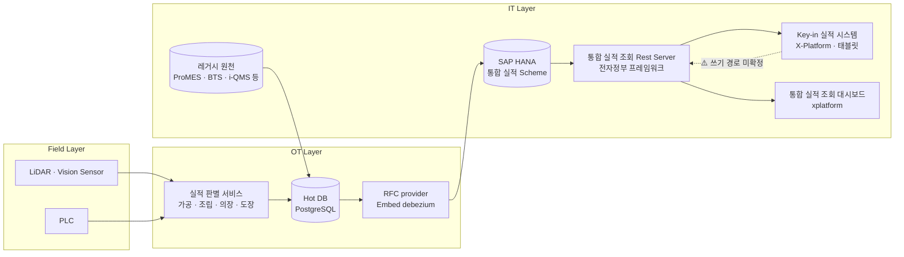
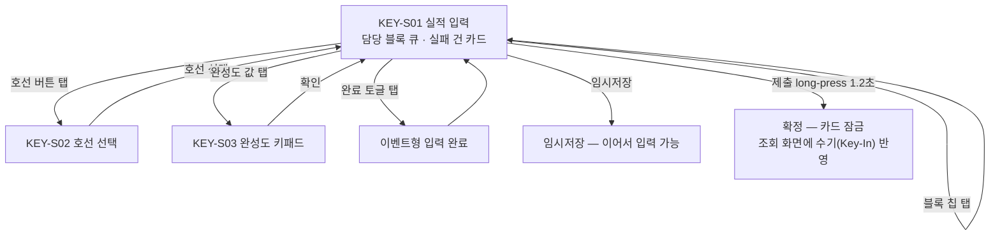

# 내업 공정실적 자동수집 시스템
# Key-in 실적 시스템 기능 정의서

**버전:** v0.2
**작성:** 이태훈 PM
**소속:** 한화에너지 컨버전스사업부 R&D센터 솔루션개발1팀

> **Draft:** 본 문서는 1차 개발 UI/UX 정의 자료를 근거로 작성한 초안이다. ⚠️ 표기 항목은 확정 후 갱신한다.

---

## 목차

1. [개요](#1-개요)
2. [시스템 구성](#2-시스템-구성)
3. [사용자 및 권한](#3-사용자-및-권한)
4. [화면 목록](#4-화면-목록)
5. [화면 흐름](#5-화면-흐름)
6. [화면별 상세 정의](#6-화면별-상세-정의)
7. [기능 목록](#7-기능-목록)
8. [기능별 상세 정의](#8-기능별-상세-정의)
9. [인터페이스 정의](#9-인터페이스-정의)
10. [비기능 요구사항](#10-비기능-요구사항)
11. [제약사항 및 미확정 항목](#11-제약사항-및-미확정-항목)
12. [용어 정의](#12-용어-정의)

---

## 1. 개요

본 문서는 Key-in 실적 시스템의 화면 및 기능 요구사항을 정의한다.

- **목적:** 자동수집(LiDAR·Vision, 레거시 I/F)이 실패한 실적 건을 현장 관리자가 태블릿에서 **직접 보완 입력**한다. 판단·분석 화면이 아니라 **자동수집이 놓친 구멍을 메우는 입력 도구**다.
- **범위:**
  - 포함 — 자동수집 실패 건 조회, 공정별 실적 보완 입력(이벤트형·완성도형), 입력값 검증 및 사유 선택, 임시저장, 제출(확정), 수기 구분 저장.
  - 제외 — 전체 실적 현황 조회(통합실적대시보드 소관), 자동수집·판별 로직(실적 판별 서비스 소관), i-QMS 검사 결과 보완(품질 시스템 소관).
- **핵심 설계 원칙**

  | 원칙 | 내용 |
  |---|---|
  | 데이터 게더링 보완 | 판단·분석 화면이 아니다. 자동수집이 놓친 구멍을 메우는 입력 도구다 |
  | 자동수집 실패 건만 표시 | 전체 현황은 통합 조회 화면의 몫이다. 본 시스템에는 **입력할 것만** 노출한다 |
  | 탭만으로 입력 완결 | 자유 텍스트 입력이 없다 — 칩·키패드·토글만 쓰며 OS 키보드를 사용하지 않는다 |
  | 수기/자동 구분 저장 | Key-In 값은 자동수집 값과 구분해 저장하고, 통합 조회 화면에 "수기(Key-In)"로 반영한다 |
  | 터치 기준 | 모든 터치 타깃 44px 이상, 본문 14px 이상, 입력값 52px |

- **대상 사용자:** 현장 관리자(부서·담당 블록 단위).
- **대상 독자:** 개발자·PM. 관련 문서 「통합실적대시보드 기능 정의서」, 「인터페이스 정의서」 참조.
- **근거 자료:**
  - Confluence 「실적 Key-In 시스템 — 1차 개발 UI/UX 정의」 (`https://hc-support.atlassian.net/wiki/spaces/advancedre/pages/296419686`), 2026-08-19 조회
  - 같은 페이지 첨부 화면 캡처 9종 (2026-08-11) — §6에 삽입
  - 같은 페이지 첨부 `내업공정실적 Key-In (standalone).html` (화면 프로토타입 번들)
  - `docs/design/system_architecture/시스템 아키텍쳐.drawio` — 「시스템 아키텍쳐」 페이지 (§2 시스템 구성의 근거)

> ⚠️ **근거 자료의 한계:** 프로토타입 번들에 표시되는 **행 데이터는 시드 기반으로 생성된 모의 데이터**다. 본 문서는 프로토타입에서 **화면 구성·항목·조작·검증 규칙**만 근거로 채택했고, 표시된 **개별 값(호선번호·블록번호·건수·완성도 수치 등)은 요구사항으로 취급하지 않았다.**

---

## 2. 시스템 구성

Key-in 실적 시스템은 IT 구간의 태블릿용 입력 화면이며, **「통합 실적 조회 Rest Server」를 진입점으로 삼는다.** 이 서버는 통합실적대시보드와 **공유**한다.



| 구성요소 | 역할 | 배치 | 비고 |
|---|---|---|---|
| Key-in 실적 시스템 | 본 문서의 대상. 자동수집 실패 건 보완 입력 | ⚠️ 미확정 (IT 구간) | **X-Platform**. 9~10인치 태블릿 |
| 통합 실적 조회 Rest Server | 조회·저장 진입점 | ⚠️ 미확정 (IT 구간) | **전자정부 프레임워크**. 통합실적대시보드와 공유 |
| 통합 실적 Scheme | 통합 실적 적재 스킴 | IT망 SAP HANA | Rest Server의 원천 |
| 통합 실적 조회 대시보드 | 실적 통합 조회 | ⚠️ 미확정 (IT 구간) | Key-In 입력값을 "수기(Key-In)"로 표시 |
| Hot DB · 실적 판별 서비스 | 자동수집 실적 판별·보관 | OT 구간 | 자동수집 실패 판정의 원천 |

> **참고:** 위 구성은 「시스템 아키텍쳐」 다이어그램을 근거로 한다. 다이어그램은 각 연계 지점에 `I-n`(IT) · `O-n`(OT) · `F-n`(Field) 라벨을 부여하고 있으나, 이는 **다이어그램 내부 표기이며 「인터페이스 정의서」의 IF-ID가 아니다.**

> ⚠️ **쓰기 경로가 미확정이다.** 다이어그램은 `Rest Server → Key-In 실적 webapp` 방향만 표기한다. 입력·확정된 실적이 어느 저장소에 어떤 경로로 반영되는지(Rest Server 경유 여부, 통합 실적 스킴 직접 반영 여부)는 **확정이 필요하다.** 물리 배치와 인증 방식도 미확정이다.

---

## 3. 사용자 및 권한

| 역할 | 설명 | 접근 가능 화면 | 허용 조작 |
|---|---|---|---|
| 현장 관리자 | 부서·담당 블록 단위로 자동수집 실패 건을 보완 입력한다. 화면 우상단에 부서·성명이 표기된다 | KEY-S01 ~ KEY-S03 | 조회, 입력, 임시저장, 제출(확정) |
| 관리자 | 확정된 건의 수정 담당 — 확정 카드에 "확정됨 · 수정하려면 관리자 문의"로 안내된다 | ⚠️ 미확정 | ⚠️ 확정 건 수정 |

- **담당 블록 한정:** 블록 칩 스트립에는 **담당 블록만** 표시된다.
- **확정 후 잠금:** 제출로 확정된 건은 화면에서 수정할 수 없다.

> ⚠️ 담당 블록 배정 기준, 관리자 역할의 수정 절차·권한 체계, 인증·세션 정책은 **미확정**이다.

---

## 4. 화면 목록

본 시스템은 **단일 화면 + 팝업 2종** 구성이다.

| 화면ID | 화면명 | 메뉴 경로 | 주요 기능 | 관련 기능ID |
|---|---|---|---|---|
| KEY-S01 | 실적 입력 (메인) | 진입 화면 | 실패 건 큐 조회, 공정별 보완 입력, 임시저장·제출 | KEY-F01, KEY-F03 ~ KEY-F09 |
| KEY-S02 | 호선 선택 | KEY-S01 헤더의 호선 버튼 탭 | 대상 호선 전환 | KEY-F02 |
| KEY-S03 | 완성도(%) 입력 키패드 | KEY-S01 완성도 카드의 값 영역 탭 | 0~100 완성도 숫자 입력 | KEY-F04 |

---

## 5. 화면 흐름



---

## 6. 화면별 상세 정의

### 6.1 KEY-S01 실적 입력 (메인)

- **용도:** 담당 블록의 자동수집 실패 건을 카드로 표시하고 공정별로 보완 입력한다.
- **진입 경로:** 시스템 진입 시 최초 화면.

화면은 4개 영역으로 구성된다.

```
┌─────────────────────────────────────────────────────────────┐
│ ① 헤더 — 실적 입력 · 호선 선택 · 남은 입력 N건 · 사용자/시각      │
│ ② 블록 칩 스트립 — 담당 블록 큐 (미입력 건수 배지)                │
│ ③ 공정 카드 영역 — 선택 블록의 실패 건 카드 (가로 2열)            │
│ ④ 하단 액션바 — 상태 메시지 · 임시저장 · 제출(long-press)        │
└─────────────────────────────────────────────────────────────┘
```


*그림 1. ① 헤더 · ② 블록 칩 스트립*

**구성 요소**

| 구분 | 명칭 | 타입 | 필수 | 설명 |
|---|---|---|---|---|
| ① 헤더 | 화면명 | 표시 | - | `실적 입력` |
| ① 헤더 | 호선 선택 | 버튼 | - | 현재 호선 표기(예: `7004호 ▾`). 탭 시 KEY-S02 표시 |
| ① 헤더 | 남은 입력 N건 | 배지 | - | 전체 미입력 건수. 입력할 때마다 실시간 감소 |
| ① 헤더 | 부서·사용자·일시 | 표시 | - | 우측 정렬 |
| ② 블록 칩 | 담당 블록 칩 | 가로 스크롤 칩 | - | 칩 높이 52px. 블록번호 + 배지 |
| ② 블록 칩 | 배지 | 표시 | - | `N건`(미입력, 적색) / `완료`(녹색) / `없음`(회색) |
| ③ 카드 | 공정 카드 | 카드 | - | 1카드 = 블록 × 공정 × 수집 이벤트 1건 |
| ④ 액션바 | 상태 메시지 | 표시 | - | 정보(회색) / 경고(적색) / 완료(녹색) |
| ④ 액션바 | 임시저장 | 버튼 | - | 입력값을 저장하고 제출은 보류 |
| ④ 액션바 | 제출 (N건) | 버튼(long-press) | - | 1.2초 누름으로 확정 |

- 선택된 블록 칩은 주황(`#EE7A00`) 채움으로 표시한다 — **한 번에 한 블록씩 처리하는 큐** 개념이다.
- 공정 카드는 화면 방향에 따라 1~2열로 자동 배치한다.

**공정 카드 공통 구성**

| 영역 | 내용 |
|---|---|
| 카드 헤더 | 공정명(공정별 색) + 이벤트명 + 상태 칩 |
| 실패 사유 밴드 | `자동수집 실패` + 사유 (적색 배경) |
| 입력 영역 | 공정 유형별로 상이(아래 §6.1.1) |
| 좌측 띠 | 사유 필수 미충족 = 적색, 확정 = 녹색 |

#### 6.1.1 공정별 입력 유형

| 공정 | 수집 원형 | 입력 유형 | 입력 UI |
|---|---|---|---|
| 가공 | 완료 이벤트 (불출·절단·사상·모듬 편성) | **이벤트형** | 완료 토글 + 완료일 칩 |
| 조립 | 도면 대비 완성도 % (LiDAR·Vision) | **완성도형** | % 키패드 + 칩 |
| 의장 | 의장품 설치 완성도 % (LiDAR) | **완성도형** | % 키패드 + 칩 (조립과 동일) |
| 도장 | 스텝 완료 (S/P → T/UP → FINAL, BTS) | **이벤트형** | 완료 토글 + 완료일 칩 |

| 가공 | 조립 |
|---|---|
|  |  |

| 의장 | 도장 |
|---|---|
|  |  |

*그림 2. 공정별 입력 카드*

**이벤트형 (가공·도장)**

- 큰 버튼 1개 `완료로 기록` → 탭 시 `✓ 완료 · MM-DD`로 바뀌며 **오늘 날짜가 자동 입력**된다. 재탭하면 해제된다.
- 완료일 변경은 `오늘` / `어제` / `그제` 칩(44px)으로 한다.

**완성도형 (조립·의장)**

- 큰 값 표시(52px)를 탭하면 전용 숫자 키패드(KEY-S03)가 열린다.
- 빠른 입력 칩 `0% / 25% / 50% / 75% / 100%` 와 `−5` / `+5` 버튼을 제공한다.
- **직전 자동값**을 병기한다 — 마지막 성공 수집값과 수집 시점(예: `41% (08-07)`). 최초부터 미인식인 건은 `없음`으로 표기하고 차이 행을 숨긴다.

**이벤트·실패 사유 정합**

실패 사유는 수집 이벤트와 정합하게 표시된다.

| 공정 | 수집 이벤트 | 자동수집 실패 사유 |
|---|---|---|
| 가공 | 불출(전처리) 실적 | 실적 I/F 수신 누락 |
| 가공 | 절단 완료일 | 절단장비 미인식 · 실적 I/F 수신 누락 |
| 가공 | 사상 완료일 | 태그 인식 실패 · 실적 I/F 수신 누락 |
| 가공 | 모듬 편성 | 모듬번호 미부여 · 실적 I/F 수신 누락 |
| 조립 | 도면 대비 완성도 | 스캔 음영구역 · AI 신뢰도 미달 · LiDAR 미스캔 |
| 의장 | 의장품 설치 완성도 | 형상 미확보 — 미인식 · LiDAR 미스캔 |
| 도장 | S/P 스텝 완료 | BTS 실적 미전송 |
| 도장 | T/UP 스텝 완료 | BTS 실적 미전송 · 실적 I/F 수신 누락 |
| 도장 | FINAL 스텝 완료 | BTS 실적 미전송 |

> **참고:** i-QMS 검사 결과는 Key-In 보완 대상이 아니다(품질 시스템 소관).

#### 6.1.2 입력 검증 및 사유 선택


*그림 3. 차이 임계 초과 시 사유 선택*

| 규칙 | 동작 |
|---|---|
| % 범위 | 키패드에서 0~100으로 자동 제한 |
| 차이 강조 | `입력값 − 직전 자동값`이 **±7%p 이상 황색**, **±15%p 이상 적색** |
| 사유 필수 | 차이 **±15%p 이상**이면 사유 칩 선택 없이는 **제출 차단** |
| 사유 칩 | `현장 실측 결과` · `작업 진척 반영` · `자동값 오류로 판단` · `작업 중단` · `기타` (자유 입력 없음) |
| 이벤트형 | 완료 선택 시 완료일 필수 (오늘 자동 기입으로 기본 충족) |

- 사유가 필요한 상태에서는 `직전 자동값과 N%p 차이 — 사유를 선택하세요` 문구를 카드에 표시한다.
- 사유 필수 규칙은 **완성도형에만** 적용된다. 직전 자동값이 없는 건은 차이를 산출하지 않으므로 대상이 아니다.

#### 6.1.3 상태 및 저장 흐름

```
미입력 → 입력됨 → 임시저장 → 확정 (수정 불가)
```

| 상태 | 색 | 의미 |
|---|---|---|
| 미입력 | 회색 | 값 없음 — 블록 칩 배지에 집계된다 |
| 입력됨 | 주황 | 값 있음, 미저장 |
| 임시저장 | 파랑 | 저장됨, 제출 전 수정 가능 |
| 확정 | 녹색 | 제출 완료 — 카드 잠금, 컨트롤 비활성, `확정됨 · 수정하려면 관리자 문의` 표시 |


*그림 4. 확정된 카드(우)와 제출 결과 메시지*

**동작 / 이벤트**

| 트리거 | 처리 | 결과 |
|---|---|---|
| 화면 진입 | 담당 블록의 자동수집 실패 건 조회 | 첫 블록 선택, 카드 표시 |
| 블록 칩 탭 | 해당 블록의 실패 건 카드로 전환 | 카드 영역 갱신 |
| 완료 토글 탭 | 완료 기록 + 오늘 날짜 자동 입력 | 상태 `입력됨` |
| 완성도 값 탭 | 숫자 키패드 표시 | KEY-S03 |
| 빠른 입력 칩 / ±5 탭 | 완성도 값 설정·증감 | 상태 `입력됨`, 차이 재산출 |
| 사유 칩 탭 | 사유 설정 | 제출 차단 해제 |
| `임시저장` 탭 | 입력된 건을 저장 | 상태 `임시저장`, `N건 임시저장했습니다 — 나중에 이어서 입력할 수 있습니다` |
| `제출` long-press 완료 | 입력된 건을 확정 | 상태 `확정`, `N건 확정 제출했습니다 — 조회 화면에 수기(Key-In)로 반영됩니다` |

- **검증 / 예외 규칙:**
  - 사유 미선택 건이 있으면 제출을 시작하는 순간 차단하고 `직전 자동값과 15%p 이상 차이 나는 N건은 사유를 선택해야 제출됩니다`를 표시한다.
  - 입력값이 하나도 없으면 `제출할 입력값이 없습니다`를 표시한다.
  - 확정된 건은 제출·임시저장 대상에서 제외한다.
- **관련 기능:** KEY-F01, KEY-F03 ~ KEY-F09
- **관련 인터페이스:** KEY-IF01 (§9)

---

### 6.2 KEY-S02 호선 선택

- **용도:** 입력 대상 호선을 전환한다.
- **진입 경로:** KEY-S01 헤더의 호선 버튼 탭.


*그림 5. 호선 선택 팝업 (배경은 KEY-S01 전체 화면)*

**구성 요소**

| 구분 | 명칭 | 타입 | 필수 | 설명 |
|---|---|---|---|---|
| 팝업 헤더 | 제목 | 표시 | - | `호선 선택` |
| 팝업 헤더 | 닫기 | 버튼 | - | 팝업 종료 |
| 목록 | 호선 행 | 선택 | - | 행 높이 60px. 현재 호선은 주황 강조 + `현재` 배지 |

**동작 / 이벤트**

| 트리거 | 처리 | 결과 |
|---|---|---|
| 호선 행 탭 | 대상 호선 전환 | 팝업 종료, 블록 칩·카드 갱신 |
| 닫기 탭 | 전환 없이 종료 | KEY-S01 유지 |

- **관련 기능:** KEY-F02
- **관련 인터페이스:** KEY-IF01 (§9)

---

### 6.3 KEY-S03 완성도(%) 입력 키패드

- **용도:** 조립·의장 완성도를 0~100 범위로 입력한다.
- **진입 경로:** KEY-S01 완성도 카드의 값 영역 탭.


*그림 6. 완성도 입력 키패드*

**구성 요소**

| 구분 | 명칭 | 타입 | 필수 | 설명 |
|---|---|---|---|---|
| 팝업 헤더 | 제목 | 표시 | - | `{블록}블록 · {공정} {이벤트명}` |
| 팝업 헤더 | 닫기 | 버튼 | - | 입력 취소 |
| 값 표시 | 현재 입력값 | 표시 | - | 큰 숫자 + `%` |
| 키패드 | 숫자 `1`~`9`, `0` | 버튼 | - | 키 64px |
| 키패드 | `C` | 버튼 | - | 전체 지움 |
| 키패드 | `←` | 버튼 | - | 한 자리 지움 |
| 하단 | `확인` | 버튼 | - | 값 확정 후 팝업 종료 |

- **검증 / 예외 규칙:** 0~100 범위를 벗어나는 입력은 키패드에서 자동 제한한다.
- **관련 기능:** KEY-F04
- **관련 인터페이스:** KEY-IF01 (§9)

---

## 7. 기능 목록

| 기능ID | 기능명 | 설명 | 관련 화면ID | 우선순위 |
|---|---|---|---|---|
| KEY-F01 | 실패 건 큐 조회 | 담당 블록의 자동수집 실패 건만 조회·표시 | KEY-S01 | ⚠️ 미확정 |
| KEY-F02 | 호선 전환 | 입력 대상 호선 선택 | KEY-S02 | ⚠️ 미확정 |
| KEY-F03 | 이벤트형 실적 입력 | 완료 기록 및 완료일 지정 (가공·도장) | KEY-S01 | ⚠️ 미확정 |
| KEY-F04 | 완성도(%) 입력 | 키패드·칩·증감으로 완성도 입력 (조립·의장) | KEY-S01, KEY-S03 | ⚠️ 미확정 |
| KEY-F05 | 직전 자동값 대비 차이 산출 | 입력값과 직전 자동값의 차이 산출 및 임계 강조 | KEY-S01 | ⚠️ 미확정 |
| KEY-F06 | 사유 선택 | 차이 임계 초과 시 사유 칩 선택 강제 | KEY-S01 | ⚠️ 미확정 |
| KEY-F07 | 임시저장 | 입력값 저장, 제출 전 수정 허용 | KEY-S01 | ⚠️ 미확정 |
| KEY-F08 | 제출(확정) | long-press로 확정, 확정 건 잠금 | KEY-S01 | ⚠️ 미확정 |
| KEY-F09 | 상태·잔여 건수 관리 | 건별 상태 전이 및 미입력 건수 집계 | KEY-S01 | ⚠️ 미확정 |
| KEY-F10 | 수기 구분 저장 | Key-In 값을 자동수집 값과 구분해 저장·전달 | - | ⚠️ 미확정 |

---

## 8. 기능별 상세 정의

### 8.1 KEY-F01 실패 건 큐 조회

- **입력:** 사용자의 담당 블록, 선택 호선.
- **처리 규칙:** 자동수집이 실패한 건만 조회한다. 1건 = **블록 × 공정 × 수집 이벤트**. 블록별 미입력 건수를 집계해 칩 배지에, 전체 미입력 건수를 헤더 배지에 표시한다.
- **출력:** 블록 칩 스트립, 선택 블록의 공정 카드 목록.
- **예외 처리:** 실패 건이 없는 블록은 배지를 `없음`으로 표시한다.
- **관련 화면:** KEY-S01
- **관련 인터페이스:** KEY-IF01 (§9)

> ⚠️ **자동수집 실패 판정의 주체·시점·기준이 미확정이다.** 어느 시스템이 어떤 조건으로 "실패"를 확정해 본 시스템에 전달하는지 정의가 필요하다.

### 8.2 KEY-F02 호선 전환

- **입력:** 선택 호선.
- **처리 규칙:** 호선 전환 시 블록 칩과 카드 목록을 해당 호선 기준으로 다시 구성한다.
- **출력:** 갱신된 큐.
- **관련 화면:** KEY-S02

> ⚠️ 선택 가능한 호선 목록의 산출 기준(담당 범위 / 진행 중 호선 등)이 **미확정**이다.

### 8.3 KEY-F03 이벤트형 실적 입력

- **입력:** 완료 여부, 완료일.
- **처리 규칙:** `완료로 기록` 선택 시 완료로 표시하고 **오늘 날짜를 자동 기입**한다. 재선택하면 해제한다. 완료일은 `오늘`·`어제`·`그제` 중에서 고른다. **완료 표시와 완료일이 모두 있어야 입력된 것으로 본다.**
- **출력:** 완료 여부 + 완료일, 상태 `입력됨`.
- **예외 처리:** 완료일이 없으면 미입력으로 간주한다.
- **관련 화면:** KEY-S01

> ⚠️ `그제` 이전 날짜의 입력 방법이 정의되어 있지 않다 — **확정 필요**.

### 8.4 KEY-F04 완성도(%) 입력

- **입력:** 0~100 정수.
- **처리 규칙:** 키패드(KEY-S03), 빠른 입력 칩(`0/25/50/75/100%`), `−5`/`+5` 증감 중 어느 방법으로도 값을 설정할 수 있다. 범위를 0~100으로 제한한다.
- **출력:** 완성도 값, 상태 `입력됨`.
- **관련 화면:** KEY-S01, KEY-S03

### 8.5 KEY-F05 직전 자동값 대비 차이 산출

- **입력:** 입력값, 직전 자동값(마지막 성공 수집값과 그 시점).
- **처리 규칙:**
  1. `차이 = 입력값 − 직전 자동값` (단위 %p)
  2. `|차이| ≥ 15` → **적색** 강조, 사유 필수
  3. `7 ≤ |차이| < 15` → **황색** 강조
  4. `|차이| < 7` → 녹색
  5. 직전 자동값이 없으면(최초부터 미인식) 차이를 산출하지 않고 자동값을 `없음`으로 표기하며 차이 행을 숨긴다.
- **출력:** 차이 값과 강조 색.
- **관련 화면:** KEY-S01

### 8.6 KEY-F06 사유 선택

- **입력:** 사유 칩 1개.
- **처리 규칙:** `|차이| ≥ 15`인 완성도형 건은 사유를 선택해야 제출할 수 있다. 사유는 5종 고정 칩에서만 고르며 **자유 텍스트 입력을 제공하지 않는다.**
- **출력:** 선택된 사유. 확정 후에도 카드에 `사유: {선택값}`으로 표시한다.
- **예외 처리:** 미선택 시 제출을 차단하고 대상 건수를 메시지로 알린다.
- **관련 화면:** KEY-S01

### 8.7 KEY-F07 임시저장

- **입력:** 입력된(확정되지 않은) 건 전체.
- **처리 규칙:** 입력값이 있는 건을 `임시저장` 상태로 전이한다. 확정 건은 대상에서 제외한다. **사유 미선택 건도 임시저장은 가능하다**(제출만 차단된다).
- **출력:** 상태 전이, `N건 임시저장했습니다 — 나중에 이어서 입력할 수 있습니다`. 대상이 없으면 `입력한 값이 없습니다`(경고).
- **관련 화면:** KEY-S01

> ⚠️ 임시저장 데이터의 보관 위치(단말 로컬 / 서버)와 보존 기간이 **미확정**이다.

### 8.8 KEY-F08 제출(확정)

- **입력:** 입력 완료되고 차단되지 않은 건 전체.
- **처리 규칙:**
  1. `제출 (N건)` 버튼을 **1.2초 누르고 있으면** 게이지가 차오르며 제출이 실행된다.
  2. 중간에 떼면 취소하고 `끝까지 누르고 있어야 제출됩니다`를 안내한다.
  3. 누르는 순간 사유 미선택 건을 검사해 있으면 차단한다.
  4. 확정된 건은 `확정` 상태로 잠기며 카드 컨트롤이 비활성화된다.
- **출력:** 상태 `확정`, `N건 확정 제출했습니다 — 조회 화면에 수기(Key-In)로 반영됩니다`.
- **예외 처리:** 제출 대상이 없으면 `제출할 입력값이 없습니다`.
- **관련 화면:** KEY-S01
- **관련 인터페이스:** KEY-IF01 (§9)

> **참고:** 확인 팝업 대신 long-press를 채택한 이유는 오탭으로 인한 제출을 막고, "읽지 않고 확인"을 원천 차단하면서도 단계를 늘리지 않기 위함이다.

### 8.9 KEY-F09 상태·잔여 건수 관리

- **입력:** 건별 입력·저장·제출 이벤트.
- **처리 규칙:** 상태는 `미입력 → 입력됨 → 임시저장 → 확정` 순으로 전이하며 **확정은 최종 상태**다. 미입력 건수를 블록 칩 배지와 헤더 `남은 입력 N건`에 실시간 반영한다.
- **출력:** 상태 칩, 배지 수치.
- **관련 화면:** KEY-S01

### 8.10 KEY-F10 수기 구분 저장

- **입력:** 확정된 Key-In 값.
- **처리 규칙:** Key-In 입력값은 자동수집 값과 **구분해 저장**하고, 통합 조회 화면에서 `수기(Key-In)`로 식별되게 한다.
- **출력:** 구분 저장된 실적.
- **관련 화면:** - (백엔드 처리)
- **관련 인터페이스:** KEY-IF01 (§9)

> ⚠️ **저장 대상·경로·데이터 구조가 미확정이다**(§2 쓰기 경로 참조). 입력자·입력 시각·사유의 보존 여부와 이력 관리 방식도 정의가 필요하다.

---

## 9. 인터페이스 정의

> **본 장은 요약이다.** 송·수신 시스템, 연동 주기, 인증, 오류 처리 등 상세는 「인터페이스 정의서」(`docs/인터페이스정의서.md`)를 단일 소스로 한다.

본 시스템은 **「통합 실적 조회 Rest Server」와 연계한다**(§2). 조회(실패 건 큐)와 저장(확정 실적) 양방향이 필요하나, 저장 경로는 근거가 없어 미확정이다.

| I/F ID | 종류 | 방향 | 대상 | 관련 기능 |
|---|---|---|---|---|
| KEY-IF01 | REST | IT (양방향) | 통합 실적 조회 Rest Server (전자정부 프레임워크) | KEY-F01, KEY-F02, KEY-F05, KEY-F07, KEY-F08, KEY-F10 |

> ⚠️ KEY-IF01은 채번만 완료되었고 **엔드포인트·요청/응답 스키마·주기·인증·오류 처리는 미확정**이다. 특히 **저장 방향의 수신 저장소가 미확정**이다(§2 쓰기 경로 참조). 상세와 확정 이력은 「인터페이스 정의서」를 따른다.

**상류 경로(본 시스템의 인터페이스가 아님).** 조회 데이터가 통합 실적 스킴까지 도달하는 경로는 이미 채번되어 있거나 다른 문서의 소관이므로 본 문서에서 중복 채번하지 않는다.

| 구간 | 대응 | 비고 |
|---|---|---|
| 실적 판별 서비스 → Hot DB | CMN-IF01 | 확정 |
| SAP → RFC Agent | CMN-IF02 | ⚠️ 미확정 |
| 레거시 DB → DB Agent | CMN-IF03 | ⚠️ 미확정 |
| 실적판별서비스 Provider → 통합 실적(SAP HANA) | CMN-IF04 | ⚠️ 미확정 |
| Hot DB → 통합 실적 Scheme (RFC provider, CDC) | ⚠️ 미채번 | 「인터페이스 정의서」에서 채번 검토 필요 |
| 통합 실적 Scheme → Rest Server | ⚠️ 미채번 | Rest Server 소관 |

> ⚠️ 「통합 실적 조회 Rest Server」는 **통합실적대시보드와 공유**된다(§2). API 규격 변경 시 두 시스템에 함께 영향이 미치므로 규격 확정 시 양쪽을 함께 검토한다.

---

## 10. 비기능 요구사항

| 항목 | 요구사항 | 비고 |
|---|---|---|
| 대상 기기 | 9~10인치 태블릿 | 가로 기본, 세로 지원 |
| 개발 스택 | X-Platform | 「시스템 아키텍쳐」와 정합 |
| 입력 방식 | **OS 키보드 미사용** — 칩·키패드·토글만 사용, 자유 텍스트 입력 없음 | 장갑 착용 현장 고려 |
| 터치 타깃 | 모든 터치 타깃 44px 이상 | 칩 52px, 키패드 키 64px, 호선 행 60px |
| 가독성 | 본문 14px 이상, 입력값 52px | |
| 오조작 방지 | 제출은 1.2초 long-press | 확인 팝업 미사용 |
| 화면 갱신 | 미입력 건수 실시간 반영 | |
| 디자인 토큰 | 통합 조회 화면과 공유 (주색 `#EE7A00`, 배경 `#EDEAE0`, 폰트 Pretendard) | 상태색·공정색 별도 정의 |
| 성능 | ⚠️ 응답 시간·동시 사용 규모 미정의 | |
| 보안 | 인증·세션 정책 ⚠️ 미확정. 자격증명은 환경변수 주입 | AGENTS.md 보안 규칙 |
| 운영 | ⚠️ 네트워크 단절 시 동작(오프라인 입력·재전송) 미정의 | |

---

## 11. 제약사항 및 미확정 항목

- ⚠️ 근거 자료의 프로토타입 데이터는 **모의 데이터**다. 개별 값은 요구사항이 아니다(§1 참조).
- ⚠️ **입력·확정 실적의 쓰기 경로가 미확정이다**(§2, §8.10). 「시스템 아키텍쳐」는 Rest Server → webapp 방향만 표기한다.
- ⚠️ **자동수집 실패 판정의 주체·시점·기준이 미확정이다**(§8.1).
- ⚠️ 본 시스템의 인터페이스는 `KEY-IF01`로 채번되었으나 **엔드포인트·스키마·인증·오류 처리가 미확정**이다(§9).
- ⚠️ 대시보드·Rest Server와 마찬가지로 **물리 배치가 미확정**이다.
- ⚠️ 담당 블록 배정 기준, 호선 목록 산출 기준이 미확정이다(§3, §8.2).
- ⚠️ 확정 건 수정 절차("관리자 문의")의 실제 처리 방법과 권한 체계가 미확정이다(§3).
- ⚠️ 임시저장 데이터의 보관 위치·보존 기간이 미확정이다(§8.7).
- ⚠️ 이벤트형에서 `그제` 이전 완료일의 입력 방법이 정의되어 있지 않다(§8.3).
- ⚠️ 네트워크 단절 시 입력·재전송 정책이 미정의다(§10).
- 본 시스템은 **자동수집 실패 건만** 다룬다. 전체 현황 조회는 통합실적대시보드 소관이다.
- **i-QMS 검사 결과는 Key-In 보완 대상이 아니다**(품질 시스템 소관).
- 사유는 고정 칩 5종에서만 선택하며 자유 입력을 제공하지 않는다.

---

## 12. 용어 정의

| 용어 | 설명 |
|---|---|
| Key-In | 자동수집이 실패한 실적을 사람이 직접 보완 입력하는 행위 및 그 값 |
| 이벤트형 | 완료 여부와 완료일로 기록하는 입력 유형 (가공·도장) |
| 완성도형 | 0~100% 값으로 기록하는 입력 유형 (조립·의장) |
| 직전 자동값 | 해당 건에서 마지막으로 성공한 자동수집 값과 그 수집 시점 |
| 차이(%p) | 입력값에서 직전 자동값을 뺀 값. 퍼센트 포인트 단위 |
| 사유 칩 | 차이가 임계를 넘을 때 선택하는 고정 사유 5종 |
| 임시저장 | 입력값을 저장하되 확정하지 않은 상태. 이후 수정 가능 |
| 확정 | 제출이 완료되어 화면에서 수정할 수 없는 상태 |
| long-press | 버튼을 일정 시간(1.2초) 누르고 있어야 실행되는 조작 방식 |
| 모듬 편성 | 부재를 팔레트 편성 단위로 묶는 가공 공정 이벤트 |
| S/P · T/UP · FINAL | 도장 공정의 스텝. 순차 진행하며 BTS에서 실적을 수집한다 |
| 담당 블록 | 사용자에게 배정되어 블록 칩 스트립에 노출되는 블록 |

---

## 변경 이력

| 버전 | 날짜 | 내용 |
|---|---|---|
| v0.1 | 2026-08-19 | 최초 작성. Confluence 「실적 Key-In 시스템 — 1차 개발 UI/UX 정의」(2026-08-11) 및 「시스템 아키텍쳐」 다이어그램 기반 초안 |
| v0.2 | 2026-08-19 | 「인터페이스 정의서」에 `KEY-IF01`(Key-in 실적 조회·저장) 채번 완료에 따라 §9 요약표 동기화 |
