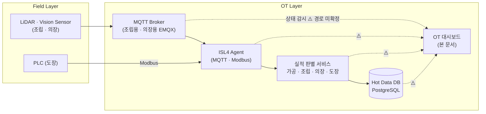
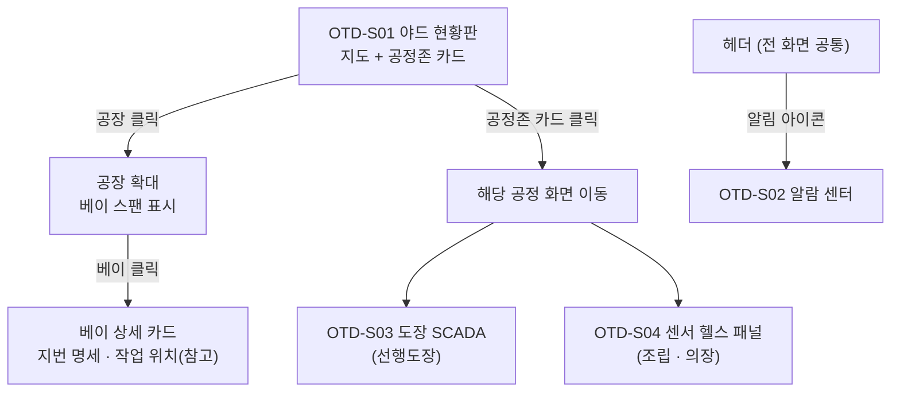

# 내업 공정실적 자동수집 시스템
# OT 대시보드 기능 정의서

**버전:** v0.1
**작성:** 이태훈 PM
**소속:** 한화에너지 컨버전스사업부 R&D센터 솔루션개발1팀

> **Draft:** 본 문서는 web-dashboard 현 구현 화면을 근거로 작성한 최초 초안이다. ⚠️ 표기 항목은 확정 후 갱신한다.

---

## 목차

1. [개요](#1-개요)
2. [시스템 구성](#2-시스템-구성)
3. [사용자 및 권한](#3-사용자-및-권한)
4. [화면 목록](#4-화면-목록)
5. [화면 흐름](#5-화면-흐름)
6. [화면별 상세 정의](#6-화면별-상세-정의)
7. [기능 목록](#7-기능-목록)
8. [기능별 상세 정의](#8-기능별-상세-정의)
9. [인터페이스 정의](#9-인터페이스-정의)
10. [비기능 요구사항](#10-비기능-요구사항)
11. [제약사항 및 미확정 항목](#11-제약사항-및-미확정-항목)
12. [용어 정의](#12-용어-정의)

---

## 1. 개요

본 문서는 OT 대시보드(OTD)의 화면 및 기능 요구사항을 정의한다.

- **목적:** 내업 공정실적 자동수집 시스템의 **수집 파이프라인과 필드 설비가 지금 제대로 돌고 있는가**를 감시한다 — 공정존별 수집 경로·판별·적재의 헬스, 필드 센서(LiDAR)의 생존·품질, 선행도장 설비(제습기·가스히터)의 운전 상태, 그리고 이상 발생 시의 알람이다. 실적 수치를 판단하는 화면이 아니다.
- **범위:**
  - 포함 — 공정존(가공·조립·의장·도장) 수집 파이프라인 상태 카드, 야드 지도 기반 공간 드릴다운(공장 → 베이 → 지번), 알람 센터, 선행도장 설비 SCADA(가동·환경 metric), 필드 센서(LiDAR) 헬스 패널.
  - 제외 — 실적 조회·정합성 확인(통합실적대시보드 소관), 실적 등록·보완 입력(Key-in 실적 시스템 소관), 센서 원천데이터(점군 등) 3D 뷰어(⚠️ 관할 미확정 — §11).
- **기능 축 구분(설계 원칙):** 본 시스템의 화면·기능은 **① 설비 상태 모니터링** 축에 속한다. **③ 실적 조회** 축은 통합실적대시보드(IPD) 소관이며, 본 시스템 화면에 노출되는 실적성 수치(처리 건수, 작업 위치 등)는 파이프라인 처리량·공간 문맥의 **참고 표기**로 한정하고 공식 실적으로 읽히지 않게 단서를 둔다. **② 센서 원천데이터 뷰어** 축은 본 시스템에 인접하나 관할 미확정이다. **④ 기준정보·공간**(야드 지번·공장·베이·설비 배치)은 어느 축의 소유도 아닌 공용 기반으로, IPD와 공유한다.
- **대상 사용자:** OT 운영 담당자(수집 파이프라인·필드 설비 관리).
- **대상 독자:** 개발자·PM. 관련 문서 「통합실적대시보드 기능 정의서」, 「인터페이스 정의서」, 「필드 데이터 수집 메시지 설계」 참조.
- **근거 자료:**
  - `web-dashboard/` 현 구현 화면 (React + Vite 프로토타입, 2026-09-02 기준) — 메인 `/` 현황판(야드 지도 + 공정존 카드), 헤더 상태 표시·알람 센터, 선행도장 SCADA(`/zones/painting`), 조립 워크스페이스 센서 패널·의장 목록의 센서 표시
  - `docs/design/system_architecture/시스템 아키텍쳐.drawio` — 「시스템 아키텍쳐」·「물리 배포 다이어그램」 페이지 (§2 시스템 구성의 근거)

> ⚠️ **근거 자료의 한계:** 현 구현은 프로토타입이며 **상태·판정·알람·metric 값은 전부 모의(mock) 데이터**다(기준정보·설비 배치 좌표만 실측 기반). 본 문서는 화면 **구성·항목·조작·판정 어휘**만 요구사항으로 채택했고, 표시된 개별 값(건수·지연 ms·온습도 등)과 판정 임계값은 요구사항으로 취급하지 않았다. 실데이터 임계값·판정 규칙은 별도 확정한다.

---

## 2. 시스템 구성

OT 대시보드는 **OT 구간의 상태 감시 화면**이다. 감시 대상은 필드 센서 → MQTT Broker/Modbus → ISL4 Agent → 실적 판별 서비스 → Hot Data DB로 이어지는 수집 파이프라인 자체이며, 실적 데이터의 내용이 아니라 **각 구간의 생존·지연·오류율**을 본다.

| 구성요소 | 역할 | 배치 | 비고 |
|---|---|---|---|
| OT 대시보드 | 본 문서의 대상. 파이프라인·설비 상태 감시 | ⚠️ 미확정 (OT 구간) | 현 프로토타입은 web-dashboard(React) |
| 실적 판별 서비스 4종 | 권역별 실적 판별. 상태 감시의 대상 | OT Server A · B | 「인터페이스 정의서」 |
| MQTT Broker (EMQX) 2종 | 조립용·의장용 수집 경로. 상태 감시의 대상 | OT Server A · B | |
| ISL4 Agent · Engine | MQTT/Modbus 구독·중계. 도장 PLC 데이터의 취득 지점 | ISL Server 등 | ISL v4 스택 소관 |
| Hot Data DB | 판별 실적 적재. 적재 체크의 대상 | Hot Data DB 서버 | CMN-IF01 |

> ⚠️ **본 시스템이 상태 데이터를 어디서 어떻게 조회하는지(감시 데이터 경로)가 미확정이다.** 후보 — 각 구성요소의 헬스 엔드포인트(actuator 등) 직접 조회, ISL4 Engine/Dashboard 경유, Hot DB의 수신 메타 조회. 현 프로토타입은 전 항목 mock으로 대체하고 있다. 인터페이스 채번은 「인터페이스 정의서」 소관이다(§9).

---

## 3. 사용자 및 권한

| 역할 | 설명 | 접근 가능 화면 | 허용 조작 |
|---|---|---|---|
| OT 운영 담당자 | 수집 파이프라인·필드 설비 상태 감시 | OTD-S01 ~ OTD-S04 | 조회, 알람 읽음 처리 |

> ⚠️ 역할 구분(관리자/일반), 인증·세션 정책은 **미확정**이다. 현 프로토타입에는 로그인 화면이 없다. 본 화면은 **조회 전용**이며 설비 제어(원격 기동·정지 등)를 포함하지 않는다.

---

## 4. 화면 목록

| 화면ID | 화면명 | 메뉴 경로 | 주요 기능 | 관련 기능ID |
|---|---|---|---|---|
| OTD-S01 | 야드 현황판 (메인) | `/` (시스템 진입 화면) | 야드 지도 + 공정존 수집 상태 카드 4장, 공간 드릴다운 | OTD-F01, OTD-F02, OTD-F06 |
| OTD-S02 | 알람 센터 | 헤더 알림 아이콘 | 수집·설비 알람 목록, 심각도 필터, 읽음 처리 | OTD-F03 |
| OTD-S03 | 선행도장 설비 SCADA | 선행도장 배치 화면 | 제습기·가스히터 가동 상태·환경 metric·공장별 요약 | OTD-F04 |
| OTD-S04 | 필드 센서 헬스 패널 (조립·의장) | 각 공정 화면 내 패널 | LiDAR 생존(Heartbeat)·FOV·점검 필요 판정·데이터 지연 경고 | OTD-F05 |

> ⚠️ OTD-S04는 현 구현에서 독립 화면이 아니라 **조립 워크스페이스의 센서 패널·의장 목록의 센서 표시로 내장**되어 있다. 축 분리 설계(§1 기능 축 구분)에 따라 요구사항 소유는 본 문서로 두되, **화면 배치(독립 화면 vs 공정 화면 내 패널 유지)는 미확정**이다.

---

## 5. 화면 흐름

- 시스템 진입 시 최초 화면은 OTD-S01이다. 지도 데이터(베이스맵·지번)가 로드되기 전에는 공정존 카드를 먼저 표시한다.
- 알람 센터는 어느 화면에서든 헤더에서 진입한다.

---

## 6. 화면별 상세 정의

> ⚠️ **화면 캡처 확보 필요.** 확정 화면 캡처를 `docs/assets/화면설계/OT대시보드/`에 배치한 뒤 각 절에 삽입한다.

### 6.1 OTD-S01 야드 현황판 (메인)

- **용도:** 옥포 야드 지도 위에서 4개 공정존 수집 파이프라인의 상태를 한눈에 파악하고, 공장 → 베이 → 지번으로 공간 드릴다운한다.
- **진입 경로:** 시스템 진입 시 최초 화면 (`/`).

**구성 요소**

| 구분 | 명칭 | 타입 | 필수 | 설명 |
|---|---|---|---|---|
| 상단바 | 시스템명·내비게이션 | 표시 | - | 사이드바에 공정존 메뉴 |
| 상단바 | 실시간 상태 표시 | 표시(상태 알약) | - | 수집 생존 표시 + 현재 시각(초 단위 갱신 — 화면이 살아 있다는 증거) |
| 상단바 | 알림 아이콘 | 버튼 + 배지 | - | 안 읽은 알람 건수 배지. 클릭 시 OTD-S02 |
| 본문 | 야드 지도 | 지도(2.5D) | - | 지번·공장 폴리곤을 분류색으로 표시. 기준정보(④ 공용 기반) |
| 본문 | 공정존 상태 카드 ×4 | 카드(오버레이) | - | 가공·조립·의장·도장 각 1장. 아래 표시 항목 참조 |
| 드릴다운 | 베이 상세 카드 | 패널 | - | 선택 베이의 지번 명세 + 작업 위치 목록(**참고 표기** — 실적 판단은 IPD 소관) |

**표시 항목 — 공정존 상태 카드 (공정별 1장)**

| 항목 | 설명 |
|---|---|
| 공정존 이름·수집 원천 | 예: 조립 — LiDAR / 도장 — PLC / 가공 — Legacy DB |
| 서비스 상태 | 실적 판별 서비스의 기동 상태(가동/중지 등)와 상태 설명 |
| 수집 품질(헬스) | 3단 판정 — `정상`(연결·지연·오류율 모두 기준 안) / `저하`(수집은 되지만 일부 지표 이탈) / `불량`(수집이 사실상 끊김 — 실적 누락 가능) |
| 파이프라인 체크 3종 | `수집 경로` / `판별` / `적재` 각각 `정상`/`주의`/`불량` + 세부 설명(예: 커밋 지연 ms) |
| 처리 건수 | 파이프라인 처리량. **실적 건수가 아니라 처리량 지표**임을 단서로 표기 |
| 최근 갱신 | 해당 존 상태의 마지막 갱신 시각 |

**동작 / 이벤트**

| 트리거 | 처리 | 결과 |
|---|---|---|
| 화면 진입 | 지도·공정존 상태 로드 | 지도 로드 전에는 카드만 우선 표시 |
| 공장 클릭 | 해당 공장으로 지도 확대 | 베이 스팬 표시 |
| 베이 클릭 | 베이 상세 조회 | 베이 상세 카드(지번 명세·작업 위치) 표시 |
| 공정존 카드 클릭 | 해당 공정 화면으로 이동 | OTD-S03(도장)·OTD-S04(조립·의장) 등 |

- **검증 / 예외 규칙:** 상태 미수신 존은 판정을 지어내지 않고 미수신으로 표기한다. ⚠️ 판정 임계값(지연·오류율 기준)은 미확정이다.
- **관련 기능:** OTD-F01, OTD-F02, OTD-F06

---

### 6.2 OTD-S02 알람 센터

- **용도:** 수집 파이프라인·필드 설비에서 발생한 알람을 심각도별로 확인하고 읽음 처리한다.
- **진입 경로:** 헤더 알림 아이콘 (전 화면 공통).

**구성 요소**

| 구분 | 명칭 | 타입 | 필수 | 설명 |
|---|---|---|---|---|
| 헤더 | 안 읽은 건수 | 배지 | - | 안 읽은 알람 건수 |
| 목록 | 알람 항목 | 리스트 | - | 제목 + 메시지 + 발생 시각 + 심각도 |
| 조작 | 심각도 필터 | 버튼군 | - | `전체` / `안 읽음` / `위험` / `주의` |
| 조작 | 모두 읽음 | 버튼 | - | 전체 읽음 처리 |
| 조작 | 지우기 | 버튼(항목별) | - | 개별 알람 제거 |

**표시 항목 — 알람 1건**

| 항목 | 설명 |
|---|---|
| 심각도 | `위험`(critical) / `주의`(warning) / `정보`(info) 3단 |
| 제목·메시지 | 대상(공정·장비·구간)과 현상, 권장 조치. 예: 센서 무응답, 정합률 저하, DB 쓰기 지연, 세션 재연결, 배치 완료 |
| 발생 시각 | 알람 발생 시각 |

- **검증 / 예외 규칙:** 알람이 없으면 비어 있음 안내를 표시한다. ⚠️ 알람 발생 규칙(어떤 조건이 어떤 심각도를 만드는가)·보존 기간·이력 조회는 미확정이다.
- **관련 기능:** OTD-F03

---

### 6.3 OTD-S03 선행도장 설비 SCADA

- **용도:** 도장 공장 지번 위 설비 배치도에서 제습기·가스히터의 운전 상태와 환경 metric을 감시한다.
- **진입 경로:** 선행도장 공정 화면.
- **대상 설비:** 야드 설비 기준정보 중 도장 몫 — 제습기(DH)·가스히터(GH). 배치 좌표는 실측 기반 기준정보다.

**구성 요소**

| 구분 | 명칭 | 타입 | 필수 | 설명 |
|---|---|---|---|---|
| 본문 | 설비 배치도 | 지도 | - | 공장 → 베이 → 설비 순 드릴다운. 설비 클릭 시 상세 |
| 본문 | 설비 목록 | 리스트 | - | 필터(전체/이상만), 종류 필터(제습기/가스히터), 정렬(ID/실측값) |
| 요약 | 공장별 요약 | 카드 | - | 공장 단위 가동/온라인/이상 대수, 평균 온도·평균 습도, 마지막 폴링 시각 |

**표시 항목 — 설비 1대**

| 항목 | 설명 |
|---|---|
| 운전 상태 | `가동 중` / `정지` / `정비` |
| 통신 상태 | `온라인` / `오프라인` / `오류` |
| Fault | 정상 또는 Fault 코드 |
| 설정값 / 실측값 | 온도·습도 등 제어 목표와 실측 |
| 당일 가동 시간 | 당일 누적 가동 |
| 최근 수신 | 마지막 신호 수신 경과 (`N초 전`). 수신 없음은 별도 표기 |

- **검증 / 예외 규칙:** 수신이 없는 설비는 값을 지어내지 않고 `수신 없음`으로 표기한다. 계산으로 파생한 값은 `(계산값)` 단서를 단다.
- **관련 기능:** OTD-F04
- ⚠️ metric 목록(온습도 외 항목)·폴링 주기·이상 판정 임계값은 **PLC 레지스터 맵 확정 후** 정의한다. 현 프로토타입 문구도 "운전 상태값은 실연동 전 모의 데이터"임을 명시하고 있다.

---

### 6.4 OTD-S04 필드 센서 헬스 패널 (조립·의장)

- **용도:** 조립·의장 권역 LiDAR 센서의 생존·품질을 감시하고, 수집이 끊긴 구간을 드러낸다.
- **진입 경로:** 조립 워크스페이스의 센서 패널, 의장 목록의 센서 표시(현 구현 기준 — 배치 미확정, §4 참조).

**표시 항목**

| 항목 | 설명 |
|---|---|
| 센서 수 요약 | 공장(구역)별 `전체 n대 중 점검 필요 k대` |
| Heartbeat | 센서 생존 신호 기준의 데이터 신선도 |
| FOV | 센서 시야 범위 표시 |
| 점검 필요 판정 | 센서별 점검 필요 여부 |
| 데이터 지연 경고 | 수신 지연 시 배너 — `데이터 지연 — 마지막 수신 {시각}` |
| 최근 스캔 | 구역(의장)·정반(조립)별 마지막 스캔 시각 |

- **검증 / 예외 규칙:** ⚠️ 점검 필요 판정 기준(Heartbeat 임계·오류 코드 등)은 미확정이다. 현 구현은 heartbeat·오류 코드·스캔율·온도·RSSI·FOV 항목을 "장비 데이터 연동 후 표시" 자리로만 잡아 두었다 — 이 항목 목록을 후보로 채택하되 확정은 장비 스펙 협의 후로 미룬다.
- **관련 기능:** OTD-F05

---

## 7. 기능 목록

| 기능ID | 기능명 | 설명 | 관련 화면ID | 우선순위 |
|---|---|---|---|---|
| OTD-F01 | 공정존 파이프라인 상태 집계 | 존별 서비스 상태·수집 품질·경로/판별/적재 체크 집계 표시 | OTD-S01 | ⚠️ 미확정 |
| OTD-F02 | 야드 지도 공간 드릴다운 | 전체 → 공장 → 베이 → 지번 확대·상세 표시 | OTD-S01 | ⚠️ 미확정 |
| OTD-F03 | 알람 수신·목록 관리 | 알람 표시, 심각도 필터, 읽음 처리 | OTD-S02 | ⚠️ 미확정 |
| OTD-F04 | 도장 설비 운전 상태 감시 | 설비별 운전·통신·Fault·환경 metric, 공장별 요약 | OTD-S03 | ⚠️ 미확정 |
| OTD-F05 | 필드 센서 헬스 감시 | LiDAR 생존·품질·점검 필요 판정, 데이터 지연 경고 | OTD-S04 | ⚠️ 미확정 |
| OTD-F06 | 실시간 수집 상태 표기 | 헤더 생존 표시·시각, 존 카드 최근 갱신 시각 | OTD-S01 | ⚠️ 미확정 |

---

## 8. 기능별 상세 정의

### 8.1 OTD-F01 공정존 파이프라인 상태 집계

- **입력:** 존별 판별 서비스 상태, 수집 경로/판별/적재 각 구간의 헬스 지표(연결·지연·오류율), 처리 건수, 갱신 시각.
- **처리 규칙:**
  1. 수집 품질은 `정상`/`저하`/`불량` 3단으로 판정한다 — 연결·지연·오류율이 모두 기준 안이면 정상, 일부 이탈이면 저하, 수집이 사실상 끊기면 불량(실적 누락 가능 상태).
  2. 파이프라인 체크는 `수집 경로`·`판별`·`적재` 3구간을 각각 `정상`/`주의`/`불량`으로 판정하고 세부 근거를 병기한다.
  3. 공정별 수집 원천을 라벨로 표시한다 — 조립·의장: LiDAR(MQTT 경유), 도장: PLC(Modbus 직결), 가공: Legacy DB(필드 센서 없음).
- **출력:** 공정존 카드 4장.
- **예외 처리:** 상태 미수신 존은 미수신으로 표기한다.
- **관련 화면:** OTD-S01

> ⚠️ 판정 임계값(지연 ms·오류율 %·끊김 판정 시간)과 상태 데이터의 취득 경로가 미확정이다(§2).

### 8.2 OTD-F02 야드 지도 공간 드릴다운

- **입력:** 야드 지번·공장·베이 기준정보(공용 기반), 선택 공장·베이.
- **처리 규칙:** 전체 야드 → 공장(베이 스팬) → 베이(지번 명세) 순으로 확대한다. 베이 상세의 작업 위치 목록은 공간 문맥의 참고 표기로 한정하며 실적 판단 용도가 아님을 화면에 단서로 남긴다.
- **출력:** 확대 지도, 베이 상세 카드.
- **관련 화면:** OTD-S01

### 8.3 OTD-F03 알람 수신·목록 관리

- **입력:** 알람 스트림(심각도·제목·메시지·발생 시각).
- **처리 규칙:** 심각도 3단(`위험`/`주의`/`정보`)으로 분류하고 필터(전체/안 읽음/위험/주의)를 제공한다. 개별·전체 읽음 처리와 개별 제거를 지원하며, 안 읽은 건수를 헤더 배지에 반영한다.
- **출력:** 알람 목록, 안 읽은 건수.
- **예외 처리:** 알람 없음·필터 결과 없음 안내를 구분해 표시한다.
- **관련 화면:** OTD-S02

> ⚠️ 알람 발생 규칙(조건→심각도 매핑)·보존 기간·이력 조회·알람 수신 경로가 미확정이다.

### 8.4 OTD-F04 도장 설비 운전 상태 감시

- **입력:** 설비별 PLC 수집값 — 운전 상태, 통신 상태, Fault 코드, 설정값·실측값(온도·습도 등), 가동 시간, 수신 시각.
- **처리 규칙:**
  1. 설비 1대를 운전 상태(`가동 중`/`정지`/`정비`) × 통신 상태(`온라인`/`오프라인`/`오류`) × Fault로 표시한다.
  2. 공장 단위로 가동/온라인/이상 대수와 평균 온도·평균 습도를 집계하고 마지막 폴링 시각을 병기한다.
  3. 파생 계산값에는 `(계산값)` 단서를 단다. 수신이 끊긴 설비는 `수신 없음`으로 표기한다.
- **출력:** 설비 배치도 마커 상태, 설비 상세, 공장별 요약.
- **관련 화면:** OTD-S03

> ⚠️ 감시 metric의 확정 목록과 이상 판정 임계값은 PLC 레지스터 맵(「필드 데이터 수집 메시지 설계」·PNT-IF01) 확정 후 정의한다.

### 8.5 OTD-F05 필드 센서 헬스 감시

- **입력:** 센서별 Heartbeat, 상태 지표(후보: 오류 코드·스캔율·온도·RSSI·FOV), 구역·정반별 최근 스캔 시각.
- **처리 규칙:** Heartbeat 기준으로 데이터 신선도를 판정하고, 기준 이탈 센서를 `점검 필요`로 집계한다(`전체 n대 중 점검 필요 k대`). 수신 지연 시 화면 상단에 지연 배너를 표시한다.
- **출력:** 센서 요약·목록, 지연 배너.
- **관련 화면:** OTD-S04

> ⚠️ 점검 필요 판정 기준과 상태 지표의 확정 목록이 미확정이다 — 장비(LiDAR) 스펙·Edge 서비스 메시지 설계 협의 후 확정한다.

### 8.6 OTD-F06 실시간 수집 상태 표기

- **입력:** 화면 시계, 존별 최근 갱신 시각.
- **처리 규칙:** 헤더에 생존 표시와 현재 시각(초 단위)을 상시 표시한다. 각 존 카드에 최근 갱신 시각을 표기해 정보의 신선도를 드러낸다.
- **출력:** 헤더 상태 표시, 카드 갱신 시각.
- **관련 화면:** OTD-S01

---

## 9. 인터페이스 정의

> **본 장은 요약이다.** 인터페이스의 채번·상세는 「인터페이스 정의서」(`docs/인터페이스정의서.md`)를 단일 소스로 한다. **본 문서는 새 IF-ID를 채번하지 않는다.**

본 시스템 명의로 채번된 인터페이스는 아직 없다.

| I/F ID | 종류 | 방향 | 대상 | 관련 기능 |
|---|---|---|---|---|
| ⚠️ 미채번 | ⚠️ 미확정 | OT | 상태 감시 데이터 취득 경로(§2 — 헬스 엔드포인트 / ISL4 Engine / Hot DB 수신 메타 중 미확정) | OTD-F01, OTD-F03 ~ OTD-F06 |

> ⚠️ 감시 데이터 취득 경로가 확정되면 「인터페이스 정의서」에서 `OTD-IF##`로 채번한다(접두어 `OTD`는 동 문서에 이미 등록되어 있다). 본 문서는 채번을 따라 갱신한다.

**감시 대상 경로(본 시스템의 인터페이스가 아님).** 아래는 본 시스템이 **상태를 감시하는 대상**이 되는 기존 인터페이스로, 이미 「인터페이스 정의서」에 채번되어 있다. 본 시스템이 이 채널로 데이터를 주고받는 것이 아니다.

| 구간 | 대응 | 비고 |
|---|---|---|
| 조립 필드 실적 수집 (MQTT) | ASM-IF01 | 확정. 조립 존 카드·센서 헬스의 감시 대상 |
| 선행의장 필드 실적 수집 (MQTT) | OUT-IF01 | ⚠️ 미확정. 의장 존 카드·센서 헬스의 감시 대상 |
| 선행도장 PLC 실적 수집 (Modbus) | PNT-IF01 | ⚠️ 미확정. 도장 SCADA metric의 원천 경로 |
| 실적 판별 서비스 → Hot Data DB | CMN-IF01 | 확정. `적재` 체크의 감시 대상 |
| 레거시 취득 채널 (RFC·JDBC) | CMN-IF02 · CMN-IF03 | ⚠️ 미확정. 가공 존 카드(Legacy DB 경로)의 감시 대상 |
| ISL v4 내부 메시징 | CMN-IF05 | 참조(범위 밖) |

---

## 10. 비기능 요구사항

| 항목 | 요구사항 | 비고 |
|---|---|---|
| 성능 | ⚠️ 상태 갱신 주기·응답 시간 미정의 | 헤더 시계는 초 단위 갱신 |
| 동시 사용 | ⚠️ 동시 접속 규모 미정의 | |
| 표시 정확도 | 상태 미수신 시 값을 지어내지 않는다 — `수신 없음`/미수신 표기 | §6.3·§8.1 |
| 실적 수치 단서 | 화면의 실적성 수치(처리 건수·작업 위치)는 참고 표기임을 명시 | §1 기능 축 구분 |
| 지도 로드 | 지도 데이터 로드 전 공정존 카드 우선 표시 | OTD-S01 |
| 브라우저/단말 | ⚠️ 지원 브라우저·해상도 미정의 | 현 프로토타입은 데스크톱 폭 기준 |
| 보안 | 인증·세션 정책 ⚠️ 미확정. 자격증명은 환경변수 주입 | AGENTS.md 보안 규칙 |
| 운영 | ⚠️ 감시 대상 연동 실패 시 화면 표시 정책 미정의 | 미수신 표기 원칙만 확정 |

---

## 11. 제약사항 및 미확정 항목

- ⚠️ 근거 자료는 **web-dashboard 프로토타입**이며 상태·판정·알람·metric 값은 전부 모의 데이터다. 개별 값·임계값은 요구사항이 아니다(§1 참조).
- ⚠️ **상태 감시 데이터의 취득 경로가 미확정**이다 — 헬스 엔드포인트 직접 조회 / ISL4 Engine 경유 / Hot DB 수신 메타 중 결정 필요(§2). 결정 후 「인터페이스 정의서」에서 채번한다(§9).
- ⚠️ 수집 품질·파이프라인 체크·점검 필요의 **판정 임계값**(지연·오류율·Heartbeat 기준)이 미확정이다(§8.1·§8.5).
- ⚠️ **알람 발생 규칙**(조건→심각도)·보존 기간·이력 조회·수신 경로가 미확정이다(§8.3).
- ⚠️ 도장 SCADA의 **감시 metric 확정 목록**은 PLC 레지스터 맵 확정 후 정의한다(§8.4).
- ⚠️ OTD-S04(센서 헬스 패널)의 **화면 배치**(독립 화면 vs 공정 화면 내 패널)가 미확정이다(§4).
- ⚠️ **센서 원천데이터 뷰어(② 축 — 3D 점군·CAD 정합 등)의 관할이 미확정**이다. 통합실적대시보드는 "센서 원시 신호 처리"를 명시 제외하고 있어 본 시스템에 인접하나, 본 초안의 범위에는 포함하지 않았다.
- ⚠️ 본 시스템의 소속 레포·물리 배치·구현 기술 스택이 미확정이다 — 현 프로토타입(web-dashboard, React)이 그대로 본 시스템이 되는지 여부를 포함한다.
- 본 화면은 **조회 전용**이다. 설비 제어는 범위 밖이며, 실적 조회는 통합실적대시보드, 실적 입력은 Key-in 실적 시스템 소관이다.

---

## 12. 용어 정의

| 용어 | 설명 |
|---|---|
| 공정존 | 수집 파이프라인의 관리 단위 — 가공·조립·선행의장·선행도장 4개 권역 |
| 수집 품질(헬스) | 존 파이프라인의 종합 판정 — 정상/저하/불량 3단 |
| 파이프라인 체크 | 수집 경로·판별·적재 3구간별 정상/주의/불량 판정 |
| Heartbeat | 필드 센서가 주기적으로 보내는 생존 신호. 데이터 신선도 판정의 기준 |
| FOV | 센서 시야 범위(Field of View) |
| SCADA | 설비 감시 화면 통칭. 본 문서에서는 선행도장 설비(제습기·가스히터) 감시 화면 |
| DH / GH | 제습기(Dehumidifier) / 가스히터(Gas Heater) — 야드 설비 기준정보의 종류ID |
| 처리 건수 | 파이프라인이 처리한 이벤트 양. 실적 건수가 아닌 처리량 지표 |
| 기능 축 | 화면 기능의 관할 구분 — ①설비 상태(본 문서) / ②원천데이터 뷰어(관할 미확정) / ③실적 조회(IPD) / ④기준정보·공간(공용) |

---

## 변경 이력

| 버전 | 날짜 | 내용 |
|---|---|---|
| v0.1 | 2026-09-02 | 최초 작성. web-dashboard 현 구현(메인 `/` 현황판·알람 센터·선행도장 SCADA·조립/의장 센서 패널)을 ① 설비 상태 모니터링 축으로 요구사항화. 화면 4종(OTD-S01~S04)·기능 6종(OTD-F01~F06) 정의, 인터페이스는 기존 IF 참조·미채번 표기만(채번은 「인터페이스 정의서」 소관) |
