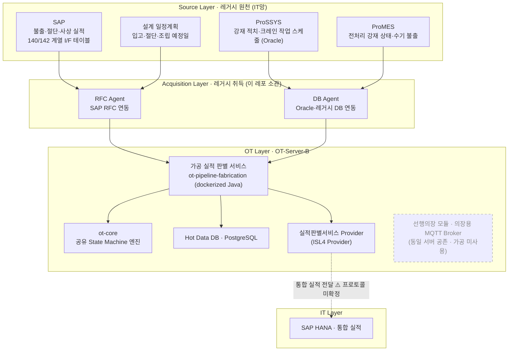
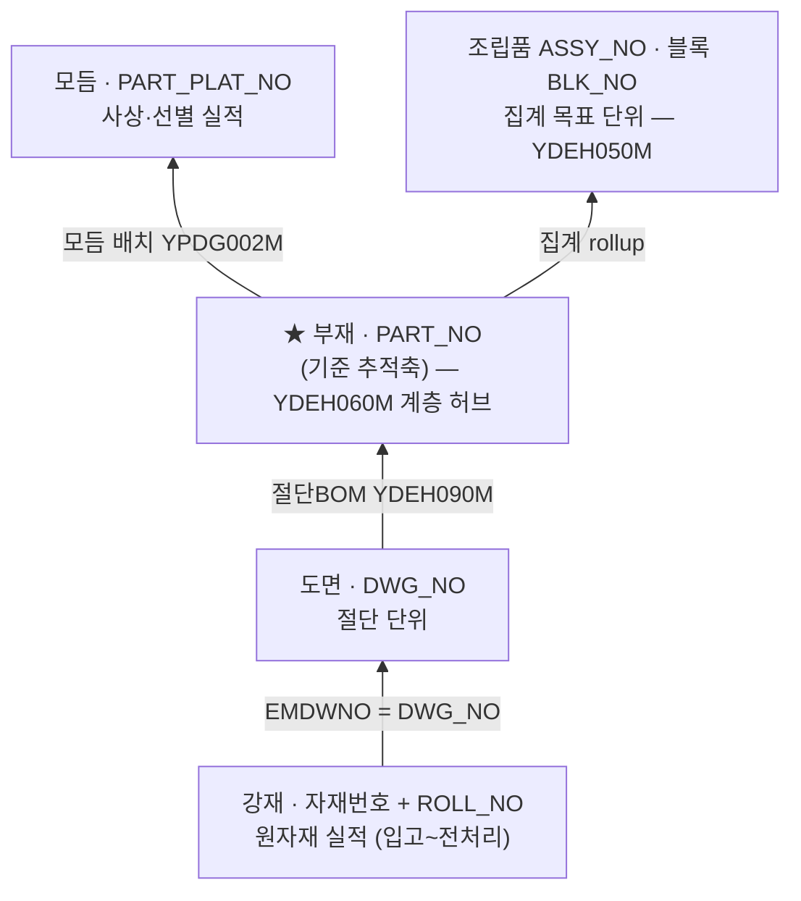

# 내업 공정실적 자동수집 시스템
# 가공권역 실적 판별 기능 정의서

**버전:** v0.5
**작성:** 이태훈 PM
**소속:** 한화에너지 컨버전스사업부 R&D센터 솔루션개발1팀

> ⚠️ **초안(Draft):** 본 문서는 `가공권역_dataflow.drawio`·시스템 아키텍처 다이어그램과 「2026-07-29 내업공정실적 가공권역 ProSSYS 소개 및 담당자 미팅」 회의록을 근거로 작성한 초안이다. 두 자료가 다루지 않는 구간과 자료 간 상충 사항은 9장에 ⚠️로 정리했으며 후속 협의로 확정한다.

---

## 목차

1. [개요](#1-개요)
2. [시스템 구성](#2-시스템-구성)
3. [데이터 흐름](#3-데이터-흐름)
4. [레거시 데이터 소스 및 키체인](#4-레거시-데이터-소스-및-키체인)
5. [기능 목록](#5-기능-목록)
6. [기능별 상세 정의](#6-기능별-상세-정의)
7. [인터페이스 정의](#7-인터페이스-정의)
8. [비기능 요구사항](#8-비기능-요구사항)
9. [제약사항 및 미확정 항목](#9-제약사항-및-미확정-항목)
10. [용어 정의](#10-용어-정의)

---

## 1. 개요

본 문서는 내업 공정실적 자동수집 시스템의 **가공권역**(`ot-pipeline-fabrication`) 실적 판별 기능을 정의한다.

- **목적:** 가공권역의 레거시 실적 데이터(강재 입고·선별·불출·전처리·절단·사상)를 수집·판별하여, **부재(PART_NO) 기준**으로 실적을 확정하고 조립품·블록·호선으로 집계(rollup)한다.
- **범위:** 강재 입고부터 사상·선별을 거쳐 조립 권역으로 불출되기까지의 실적 발생·매칭·판별·집계. 후속 조립 공정은 상위 흐름 맥락으로만 참조하며 본 문서 범위 밖이다.
- **범위 밖:** 가공권역에는 **LiDAR·PLC 등 필드 센서를 두지 않는다.** 현장 형상 인식·OCR 추론, 전처리(PreProcess) 서비스, 모델 학습은 별도 주체가 담당하며 본 문서 범위 밖이다.
- **대상 독자:** 가공권역 판별 서비스 개발자, PM. 시스템 전반 구조는 「개발환경 가이드」, 「OT Server 인프라 구성 및 CI/CD 설계서」를 참조한다.
- **근거 자료:** `가공권역_dataflow.drawio` — 가공권역 Legacy 데이터플로우(공정 흐름·추적 계층·테이블 키체인) / `시스템 아키텍쳐.drawio` — 시스템 아키텍처, 물리 배포 다이어그램 / 회의록 「2026-07-29 내업공정실적 가공권역 ProSSYS 소개 및 담당자 미팅」(참석: 허원석 책임·김유경 사원 외).

---

## 2. 시스템 구성

가공권역은 **Source Layer(레거시 원천)** → **Acquisition Layer(취득)** → **OT Layer(판별)** → **IT Layer(통합 실적)**의 4계층으로 동작한다. OT-Server-B(가공 + 선행의장)에 가공 실적 판별 서비스가 배치된다.

**가공권역은 LiDAR·PLC 등 필드 센서를 두지 않으며, MQTT Broker를 경유한 구독 경로를 사용하지 않는다.** 실적의 유일한 원천은 레거시 시스템(ProSSYS·ProMES·SAP)이며, RFC Agent·DB Agent를 통해 취득한다.

> **참고:** OT-Server-B에는 선행의장 모듈과 의장용 MQTT Broker(EMQX)가 함께 배치되나, 가공권역은 이를 사용하지 않는다(위 그림에서 점선 표시). 같은 서버에 zone 2개가 뜨므로 actuator 등 관리 포트는 모듈별로 분리한다(예: 8080/8081). `Provider → SAP HANA` 통합 실적 전달 프로토콜은 미확정이다(9장 참조).

---

## 3. 데이터 흐름

### 3.1 가공 공정 흐름 (현장 순서)

공정은 크게 **강재 취급(SSY·전처리, ①~④)** → **절단(⑤)** → **사상·선별·불출(⑥~⑧)**의 3개 구간으로 나뉜다.

> SSY 내부는 입고 → 1차 선별 → 2차 선별 → 불출의 4단계로 관리하나, 전사 SAP 기준으로는 선별을 하나로 보아 **입고·선별·불출 3단계**면 충분하다. 선별이 2단계인 이유는 불출을 위해 강판을 ① 일자별로 1차 선별하고, ② 그중에서 절단 장비별로 한 번 더 2차 선별하기 때문이다(회의록 1).

### 3.2 상태 절점 및 트리거 정의

| 절점 | 트리거 | 비고 |
|---|---|---|
| 입고 | 스케줄 작업 실적 테이블의 작업 시작일시·완료일시 | ⚠️ 물리 테이블명 미확정 |
| 선별 | 동일 테이블의 작업 시작일시·완료일시 | 1차·2차를 SAP 기준 1단계로 병합 |
| 불출 | 불출일 | 불출 = 전처리 라인에 올려놓는 행위 |
| 전처리 통과 | 마킹 상태 `Y` | 마킹기 센서 감지. 3.4 참조 |
| 절단 | `YPWC310M.CUT_MFG_FD`(절단 완료일자), `PRCS_STUS_CODE` | 도면(DWG_NO) 단위 |
| 사상 | `YPWC820M.WORK_DATE`(사상 작업일자) | 모듬(PART_PLAT_NO) 단위 |

- SSY에서 불출은 곧 전처리 라인 투입을 의미하므로, 불출일을 전처리 착수 트리거로 활용한다(회의록 2).
- SSY의 불출 예정일 = 절단 예정일 −1일이다(후공정 절단 하루 전 불출이 기본).
- 선별 작업지시는 가공팀이 SAP에서 보통 화요일에 일주일치를 일괄 하달하며(불출 예정일 기준 전주), SSY가 이를 1차 선별 → 2차 선별 → 불출로 세분화하여 크레인 작업 스케줄을 생성한다(회의록 7).

### 3.3 추적 계층과 집계(rollup)

실적은 **강재 → 도면 → 부재 → 모듬 → 조립품·블록**으로 전개·집계된다. 기준 추적축은 **부재(PART_NO)** 이며, 부재만 확정되면 블록·조립품이 자동 전개된다.

> **조립권역의 기준 추적축은 어셈블리(ASSY_NO)이나 가공권역은 부재(PART_NO)다.** 두 문서를 함께 볼 때 혼동하지 않도록 주의한다.

**처리 원칙(dataflow 명시):**

- 기준 추적축 = 부재(PART_NO) — 부재만 잡으면 블록·조립품이 자동 전개된다.
- 블록·조립품은 롤업 집계로 산출한다(YDEH060M → YDEH050M).
- 강재 단계에서 **블록은 실시간**으로 확정되나 **조립품은 절단 네스팅 확정 후 소급** 반영된다.
- 필수 수집 대상: 강판 ↔ 부재 전개 매핑(모듬 YPDG002M · 절단BOM YDEH090M).
- 예외: **혼재 네스팅**(여러 블록을 한 강판에 배치) 발생 시 강재 실적을 배분해야 한다.

### 3.4 전처리 통과 판정 소스 비교

불출 이후 SSY는 상태를 관리하지 않는다. SSY → SAP으로 불출 데이터가 전달되면 전처리 라인으로 흘러가고, 마킹기의 센서가 마킹 여부를 감지하여 상태를 관리한다(회의록 5).

| 구분 | SSY 불출 데이터 | 마킹 상태(Y/N/R) |
|---|---|---|
| 판정 근거 | 불출일(전처리 라인 투입 시점) | 마킹기 센서 통과 여부 |
| 겹장 백(Back) 처리 | **미반영** — 불출 상태를 유지한 채 재불출되어 실제와 어긋남 | 반영 — 백 처리분은 `N`으로 남음 |
| 공용재 수기 불출 | 크레인 작업 스케줄 실적에 미포착 가능 | ⚠️ 커버리지 미확정 |
| 후공정(절단 공장) 인식 | — | 후공정도 마킹 완료 여부를 통과 기준으로 봄 |

**상태값 정의(라인 출력 화면 기준):**

| 코드 | 의미 |
|---|---|
| `N` | 전처리 라인에 올라왔으나 마킹 전 |
| `R` | 마킹 준비 중 또는 마킹 진행 중 |
| `Y` | 마킹 완료(마킹기 통과) |
| 그 외 | 대부분 경고/오류 코드(예: 실측 두께가 데이터와 불일치) ⚠️ 코드별 의미 미확정 |

> **담당자 권고:** 겹장 백 사례까지 고려하면 다음 공정 이동 여부는 SSY 불출 데이터보다 **마킹 상태(Y/N/R) 기준으로 판단하는 것이 더 정확하다**(회의록 5). ⚠️ 본 방식의 최종 채택 여부는 미확정이다.

### 3.5 관리 단위 전환

| 구간 | 추적 단위 | 비고 |
|---|---|---|
| 입고 ~ 전처리 | 자재번호 (+ ROLL_NO) | 하나의 자재번호에 강판이 여러 장 붙을 수 있음(1:N) |
| 절단 · 선별 이후 | 부재번호(PART_NO) | 기준 추적축 |

- 자재번호에 붙는 개별 강판의 고유 식별번호가 **롤넘버(ROLL_NO, 강재번호)** 다.
- ⚠️ 롤넘버는 3~4년 주기로 중복 재사용될 수 있다(과거 강재가 이미 처리된 상태 전제) — **단독 PK로 사용할 수 없으며 기간 한정이 필요하다**(회의록 6).
- 판계번호는 불출 일자 + 순서를 조합한 값으로 사실상 불출 순서를 의미하나, 흐름 확인 목적이라면 필수가 아니므로 **자재번호 기준으로 진행**하기로 합의하였다(회의록 3).

---

## 4. 레거시 데이터 소스 및 키체인

가공권역 실적 판별은 아래 레거시 테이블을 키체인으로 조인하여 실적을 전개한다.

| 계층 | 테이블 | 역할 | 핵심 키(★=추적 키체인 핵심) |
|---|---|---|---|
| 강재 | YPWC140M 강재 컨베이어 불출실적 | 컨베이어 불출 실적 | PK MANDT, ★PICK_SER_ID(피킹/불출 시리얼ID), ROLL_NO, ISS_QTY, ISS_DATE, CNVR_LINE_NO |
| 강재 | YPWC111M 강재 원자재 불출/재고 | 원자재 불출·재고 | PK MANDT·DWG_NO, ★PICK_SER_ID(=STIDNO), FK RAW_MAT_NO(=YDEH081M.MAT_NO), LOC_CODE |
| 강재 | ZMMTA001 자재이동/반출예정 | 강재 실적 ↔ 반출예정 연결 | PK MANDT, ★STIDNO(=PICK_SER_ID), ★EMDWNO(=DWG_NO), RAW_MATNR, YEDAT(반출 예정일), CUTPLC/CUTMCH |
| 도면·절단 | YPWC310M 도면별 절단·마킹 실적 | 절단·마킹 실적 | PK MANDT·CUT_BAY_NO·CUT_MCH_CODE, ★DWG_NO, CUT_MFG_FD(절단 완료일자), PRCS_STUS_CODE |
| 도면→부재 | YDEH090M 절단BOM | 도면 ↔ 부재 전개 | PK MANDT, ★DWG_NO(=YPWC310M.DWG_NO), ★PART_NO(→YDEH060M), CUT_REQ_QTY |
| 부재(허브) | **YDEH060M 부재 마스터** | **★계층 허브 · 기준 추적축** | PK MANDT, ★PART_NO, ★PROJ_NO, ★BLK_NO, ★ASSY_STRC_CODE, ★ASSY_SER_NO, ASSY_WSTG_CODE, PART_TYPE_CODE, PART_WT/PART_ACR, CUT_MFG_QTY |
| 모듬 | YPDG002M 모듬(전개판) 배치 | 부재 ↔ 모듬 매핑 | PK MANDT, ★PART_PLAT_NO, ★PART_NO(=YDEH060M.PART_NO), DWG_NO, PART_PLAT_DATE |
| 모듬 | YPWC820M 사상/모듬 실적 | 사상 실적 | PK MANDT, ★PART_PLAT_NO(=YPDG002M), DWG_NO/PART_NO, CUT_BAY_NO, WORK_DATE |
| 조립품·블록 | YDEH050M 조립품 정보 | 블록·조립품 확정 | PK MANDT, ★ASSY_NO, ★PROJ_NO, ★BLK_NO, ASSY_STRC_CODE/ASSY_SER_NO |

**회의록에서만 확인된 소스(물리 테이블명 미확정):**

| 소스(논리명) | 역할 | 물리 테이블명 |
|---|---|---|
| SSY 스케줄 작업 실적 | 입고·선별 착수/완료 트리거 | ⚠️ 미확정 |
| SAP 불출 실적 | 판계번호, 선별 강재 고유번호, 롤넘버, 자재번호, 정상 불출 처리 여부 | ⚠️ 미확정(142 계열 추정) |
| ProMES 전처리 강재 상태 | 마킹 상태 Y/N/R | ⚠️ 미확정 — 화면 확인 후 쿼리 역추적 예정 |
| ProMES 수기 불출 처리 | 공용재 수기 불출 | ⚠️ 미확정 |
| 설계 일정계획 | 입고·절단·조립 예정일 | ⚠️ 미확정 |

- **인터페이스 테이블:** SSY → SAP 인터페이스 원본이 **140 계열**이며, SAP이 이를 재가공한 것이 **142 계열**이다. 활용 시 **142 계열 참조를 권장**한다(회의록 6).
- **SSY DB는 Oracle**이며, 밀사(제철소) B2B 수신 데이터와 SAP 인터페이스 데이터를 별도 Oracle 테이블로 구성해 관리한다. 밀사 데이터도 SAP 특정 테이블에 저장된 후 SSY가 받는 구조이므로 SAP에서도 조회 가능하다(회의록 6).

### 4.1 핵심 키 필드 규칙

- **DWG_NO(도면번호):** `SUBSTR(1,4)`=호선 · `(7,3)`=블록 · `(11,2)`=도면그룹. 예) `4506DS142CSY55`
- **PART_NO(부재번호):** 호선-블록-부위-순번. 예) `4506-142-FR38E-W1`
- **PART_PLAT_NO(모듬번호):** 사상·선별 묶음(모듬) 단위. 예) `202605139115`
- **ASSY_NO(조립품번호):** `PROJ_NO + BLK_NO + ASSY_STRC_CODE + ASSY_SER_NO` 조합키
- **PICK_SER_ID / STIDNO:** 강재 불출 전표 ID. 강재실적 ↔ 반출예정을 잇는 연결고리
- **키체인(조인 경로):** `PICK_SER_ID = STIDNO` → `EMDWNO = DWG_NO` → `DWG_NO 일치`(YPWC310M ↔ YDEH090M) → `PART_NO`(도면→부재) → `PART_PLAT_NO`(부재→모듬) → `PROJ+BLK+STRC+SER → ASSY_NO`(부재→조립품)
- ⚠️ **ROLL_NO(롤넘버):** 3~4년 주기 재사용 가능 — 단독 PK 금지, 기간 한정 조회 필요

---

## 5. 기능 목록

| 기능ID | 기능명 | 설명 | 우선순위 |
|---|---|---|---|
| FAB-F01 | 강재 입고·적치 실적 수집 | SSY 스케줄 작업 실적 기준 입고 착수/완료 수집 | 상 |
| FAB-F02 | 선별 실적 판별 | 1차·2차 선별을 SAP 기준 1단계로 병합하여 실적 반영 | 상 |
| FAB-F03 | 불출 실적 판별 | 불출일 기준 전처리 라인 투입 판정 | 상 |
| FAB-F04 | 전처리 통과 판정 | 마킹 상태(Y/N/R) 기준 전처리 통과 여부 판정 | 상 |
| FAB-F05 | 절단 실적 판별 | 도면(DWG_NO) 단위 절단 완료·공정 상태 판정 | 상 |
| FAB-F06 | 사상·모듬 실적 판별 | 모듬(PART_PLAT_NO) 단위 사상 실적 판정 | 상 |
| FAB-F07 | 강재→도면→부재 전개 매핑 | 키체인 조인으로 강재 실적을 부재 단위로 전개 | 상 |
| FAB-F08 | 부재→조립품·블록 롤업 집계 | 부재 실적을 조립품·블록·호선으로 상향 집계 | 상 |
| FAB-F09 | 혼재 네스팅 실적 배분 | 한 강판에 여러 블록이 배치된 경우 강재 실적 배분 | 중 |
| FAB-F10 | 겹장 백(Back) 처리 예외 보정 | 겹장 불출 후 백 처리·재불출 구간 보정 | 상 |
| FAB-F11 | 공용재 수기 불출 보완 | 수기 불출로 스케줄 실적에 미포착된 건 보완 | 중 |
| FAB-F12 | 긴급 선별건 처리 | 1·2차 선별을 생략한 긴급 불출건 처리 | 중 |
| FAB-F13 | 입고·불출 지연 판별 | 예정일 경과 기준 지연 건 식별 | 상 |
| FAB-F14 | 실적 저장·결과 통지 | Hot Data DB 저장 및 통합 실적 전달 | 상 |

---

## 6. 기능별 상세 정의

### 6.1 FAB-F01 강재 입고·적치 실적 수집

- **입력:** SSY 스케줄 작업 실적(작업 시작일시·완료일시), 자재번호, ROLL_NO. YPWC111M 강재 원자재 불출/재고(LOC_CODE 보관 위치).
- **처리:** 크레인 작업 스케줄 실적의 시작·완료일시를 입고 착수·완료 절점으로 판정한다. 적치는 입고 후 선별 전까지의 대기 상태이며 별도 절점으로 두지 않는다.
- **출력:** 자재번호 단위 입고 실적(착수/완료).
- **예외:** ⚠️ 스케줄 작업 실적 물리 테이블명 미확정.
- **비고:** 적치를 독립 단계로 관리하지 않기로 확인하였다(회의록 1).

### 6.2 FAB-F02 선별 실적 판별

- **입력:** SSY 스케줄 작업 실적(1차 선별·2차 선별), SAP 선별 작업지시.
- **처리:** SSY 내부 1차 선별(일자별)·2차 선별(절단 장비별)을 **SAP 기준 선별 1단계로 병합**하여 실적을 반영한다. 가공팀이 내리는 지시는 '선별' 하나이며 선별/불출 지시가 각각 내려오는 구조가 아니다.
- **출력:** 자재번호 단위 선별 실적.
- **예외:** 선별 작업은 하루에 끝나지 않고 일주일에 걸쳐 순차 수행된다(화·수·목 등) — 단일 시점 판정 불가.
- **비고:** ⚠️ 선별 구간의 **자동 수집 방안이 정리되지 않았다**(「가공권역 수집 데이터 모니터링 POC」에서 선별은 "자동화 방안 없음"으로 대상 제외). 본 기능은 레거시 조회 기반 실적 반영까지만 정의하며 자동화 범위는 미확정이다(회의록 1·7).

### 6.3 FAB-F03 불출 실적 판별

- **입력:** 불출일, YPWC140M 강재 컨베이어 불출실적(PICK_SER_ID·ROLL_NO·ISS_QTY·ISS_DATE·CNVR_LINE_NO), ZMMTA001 자재이동/반출예정(STIDNO·YEDAT).
- **처리:** 불출은 전처리 라인에 올려놓는 행위이므로, 불출일을 **전처리 착수 트리거**로 판정한다. SSY에서 불출 행위가 발생하면 SAP 불출 실적 테이블에 즉시 적재된다.
- **출력:** 자재번호·전표(PICK_SER_ID) 단위 불출 실적, 전처리 착수 트리거.
- **예외:** 불출 이후 SSY는 상태를 관리하지 않으므로 이 데이터만으로는 전처리 통과를 판정할 수 없다(FAB-F04로 보완).
- **비고:** 불출 예정일 = 절단 예정일 −1일. 전처리 라인은 A·B·C 3개이며 통상 C라인은 도급재, B라인은 사급재 위주로 운영한다(회의록 2·3).

### 6.4 FAB-F04 전처리 통과 판정

- **입력:** ProMES 전처리 강재 상태(마킹 상태 `Y`/`N`/`R` 및 경고·오류 코드).
- **처리:** 마킹 완료(`Y`)를 전처리 통과로 판정한다. 후공정(절단 공장)도 동일 기준으로 인식한다. 전후 강판이 모두 `Y`인데 중간이 `N`으로 남은 건은 이슈 발생으로 백 처리 후 재투입된 케이스로 본다.
- **출력:** 자재·강판 단위 전처리 통과 여부.
- **예외:** 오류·경고 발생 시 전처리 자체는 진행되나 마킹이 되지 않아 수기 마킹으로 처리하는 경우가 대부분으로 **추정**된다. ⚠️ 현업(가공팀) 재확인 필요.
- **비고:** 담당자 권고에 따라 SSY 불출 데이터보다 마킹 상태를 우선 판정 소스로 둔다. ⚠️ 최종 채택 여부 미확정. 라인에는 두께·폭·길이를 자동 측정하는 센서가 있어 오불출·겹장·규격 초과를 사전 체크한다(설비 고장 방지 목적)(회의록 3·5).

### 6.5 FAB-F05 절단 실적 판별

- **입력:** YPWC310M 도면별 절단·마킹 실적(DWG_NO, CUT_BAY_NO, CUT_MCH_CODE, CUT_MFG_FD, PRCS_STUS_CODE).
- **처리:** 도면(DWG_NO) 단위로 절단 완료일자와 공정 상태코드를 판정하여 절단 실적을 확정한다.
- **출력:** 도면 단위 절단 실적(절단 BAY·설비 포함).
- **예외:** ⚠️ `PRCS_STUS_CODE` 코드값 체계 미확정.
- **비고:** 도면은 절단 단위이며, 부재 전개는 FAB-F07에서 절단BOM(YDEH090M)으로 수행한다(dataflow).

### 6.6 FAB-F06 사상·모듬 실적 판별

- **입력:** YPWC820M 사상/모듬 실적(PART_PLAT_NO, DWG_NO/PART_NO, CUT_BAY_NO, WORK_DATE), YPDG002M 모듬(전개판) 배치.
- **처리:** 모듬(PART_PLAT_NO) 단위로 사상 작업일자를 판정하여 사상 실적을 확정한다. 모듬은 사상·선별 묶음 단위다.
- **출력:** 모듬 단위 사상 실적, 부재 단위 전개 결과.
- **예외:** ⚠️ 사상 이후 ⑦ 선별·⑧ 불출→조립 구간의 트리거는 근거 자료에 명시되지 않아 미확정이다.
- **비고:** 사상은 KEY_IN 입력 특성이 있어 실적 발생 간격이 불규칙할 수 있다(dataflow, POC 계획).

### 6.7 FAB-F07 강재→도면→부재 전개 매핑

- **입력:** ZMMTA001(STIDNO·EMDWNO), YPWC111M/YPWC140M(PICK_SER_ID), YPWC310M(DWG_NO), YDEH090M 절단BOM(DWG_NO·PART_NO·CUT_REQ_QTY), YDEH060M 부재 마스터.
- **처리:** 키체인을 순차 조인하여 강재 실적을 부재(PART_NO) 단위로 전개한다. `PICK_SER_ID = STIDNO` → `EMDWNO = DWG_NO` → `DWG_NO 일치` → `PART_NO`.
- **출력:** 부재 단위 실적(기준 추적축).
- **예외:** 혼재 네스팅 시 1:N 배분이 필요하다(FAB-F09).
- **비고:** 강판 ↔ 부재 전개 매핑(YPDG002M·YDEH090M)은 **필수 수집 대상**이다(dataflow 처리 원칙).

### 6.8 FAB-F08 부재→조립품·블록 롤업 집계

- **입력:** YDEH060M 부재 마스터(PART_NO, PROJ_NO, BLK_NO, ASSY_STRC_CODE, ASSY_SER_NO), YDEH050M 조립품 정보.
- **처리:** 부재 실적을 조립품(ASSY_NO)·블록(BLK_NO)·호선(PROJ_NO)으로 상향 집계한다. ASSY_NO는 `PROJ_NO+BLK_NO+ASSY_STRC_CODE+ASSY_SER_NO` 조합키로 산출한다.
- **출력:** 조립품·블록·호선 단위 집계 실적.
- **예외:** 강재 단계에서 **블록은 실시간** 확정되나 **조립품은 절단 네스팅 확정 후 소급** 반영된다 — 시점 차이를 전제로 설계한다.
- **비고:** ⚠️ 조립품 소급 반영의 트리거·주기 미확정(dataflow 처리 원칙).

### 6.9 FAB-F09 혼재 네스팅 실적 배분

- **입력:** 절단BOM(YDEH090M) 전개 결과, 강재 실적(수량·중량).
- **처리:** 여러 블록의 부재가 한 강판에 배치된 경우(혼재 네스팅) 강재 실적을 부재별로 배분한다.
- **출력:** 배분된 부재 단위 강재 실적.
- **예외:** ⚠️ **배분 규칙 미확정** — dataflow는 배분 필요성만 명시하고 산식을 규정하지 않는다.
- **비고:** 부재 중량·면적(PART_WT/PART_ACR)이 배분 기준 후보다(dataflow).

### 6.10 FAB-F10 겹장 백(Back) 처리 예외 보정

- **입력:** 불출 실적, 마킹 상태(Y/N/R).
- **처리:** 불출 시 얇은 강판이 밑에 붙어 두 장이 함께 들어가면 전처리 라인을 후진(백)시켜 걷어낸 뒤 나중에 재불출한다. SSY는 이때 별도 상태 처리를 하지 않고 불출 상태를 유지하므로, **SSY 데이터만으로 판단하면 실제와 어긋나는 구간이 발생**한다. 마킹 상태로 교차 검증하여 보정한다.
- **출력:** 보정된 전처리 통과 실적, 재불출 이력.
- **예외:** 백 처리 건은 별도 상태값이 남지 않아 마킹 상태 `N` 잔존으로만 추정 가능하다.
- **비고:** 본 예외가 마킹 상태 우선 판정을 권고하는 주된 근거다(회의록 4·5).

### 6.11 FAB-F11 공용재 수기 불출 보완

- **입력:** ProMES 수기 불출 처리 데이터.
- **처리:** 공용재(공통 자재)는 현업이 수기로 불출 처리하는 경우가 있어 SSY 크레인 작업 스케줄 실적에 잡히지 않을 수 있다. 수기 불출 처리분을 별도 수집하여 실적을 보완한다.
- **출력:** 보완된 불출 실적.
- **예외:** ⚠️ 수기 불출 처리 화면·테이블 미확정 — 담당자가 화면 확인 후 공유 예정. 화면이 확인되면 해당 DB 쿼리를 역추적하는 방식으로 진행한다.
- **비고:** MES(통합생산시스템) 쪽 화면을 가공팀이 처리하는 것으로 파악되었다(회의록 4).

### 6.12 FAB-F12 긴급 선별건 처리

- **입력:** SAP 선별 작업지시(긴급 상태값), SSY 크레인 작업 스케줄.
- **처리:** 불출 예정일이 이미 지난 자재가 뒤늦게 입고되는 경우(강판 결함·운송 문제 등) 1·2차 선별을 생략하고 바로 불출 처리한다. 긴급 건은 화요일 일괄 지시와 별도로 긴급 상태값이 붙어 하달되며 SSY 화면에서도 긴급 라인으로 표시된다.
- **출력:** 긴급 플래그가 부여된 불출 실적.
- **예외:** 일부 수기 조정이 개입한다. 긴급 건도 SAP 승인·지시 절차는 거친다.
- **비고:** 긴급 패스 건은 사실상 입고 즉시 전처리 투입이므로 **착수/완료를 세분화할 실익이 낮다**(회의록 7).

### 6.13 FAB-F13 입고·불출 지연 판별

- **입력:** 설계 일정계획(입고·절단·조립 예정일), SSY 적치 현황, 전처리 통과 실적.
- **처리:** 잠정 판단 기준(협의 결과) — ① 입고 예정일이 경과했는데 SSY에 적치되지 않은 강판을 지연 건으로 판단한다. ② 또는 불출 예정일이 경과했는데 미입고이거나 전처리 라인을 통과하지 않은 자재를 지연 건으로 판단한다.
- **출력:** 호선-블록-송선 단위 지연 건 목록.
- **예외:** "전처리 미진행 = 결품"으로 간주하는 방안은 비약이 커서 **채택하지 않기로 하였다**. 긴급 선별 상태값으로 지연 건 일부는 식별 가능하나 미입고분 전체를 잡으려면 예정일 기준 비교가 필요하다.
- **비고:** ⚠️ 스케줄 작업 실적만으로는 입고 지연 파악이 어려우며, SAP 쪽 참고 테이블은 가공팀 확인이 필요하다(회의록 8).

### 6.14 FAB-F14 실적 저장·결과 통지

- **입력:** FAB-F01~F13의 판별 결과.
- **처리:** 판별 중간·최종 결과를 Hot Data DB(PostgreSQL)에 저장하고, 통합 실적(SAP HANA)으로 결과를 전달한다. 상태 전이 판정은 `ot-core`의 공유 State Machine 엔진을 사용하며 인식 규칙은 `state-machine-configs/fabrication.yml`로 외부화한다.
- **출력:** Hot Data DB 적재 레코드, 통합 실적 전달 메시지.
- **예외:** ⚠️ **결과 전달 프로토콜 미확정** — 포트(`ProcessResultNotifier`)만 정의하고 구현은 확정 후 진행한다.
- **비고:** 시스템 아키텍처 다이어그램·AGENTS.md 기준.

---

## 7. 인터페이스 정의

> **본 장은 요약이다.** 송·수신 시스템, 연동 주기, 인증, 오류 처리 등 상세는 「인터페이스 정의서」(`docs/인터페이스정의서.md`)를 단일 소스로 한다.

| I/F ID | 종류 | 방향 | 대상 | 관련 기능 |
|---|---|---|---|---|
| FAB-IF01 | JDBC | IT → OT | ProSSYS(Oracle) 강재 작업 이력·지시 | FAB-F01, FAB-F02, FAB-F03, FAB-F12 |
| FAB-IF02 | SAP RFC | IT → OT | SAP 불출 실적(142 계열) | FAB-F03, FAB-F07 |
| FAB-IF03 | SAP RFC | IT → OT | SSY→SAP 인터페이스 원본(140 계열) | FAB-F03 |
| FAB-IF04 | JDBC | IT → OT | ProMES 전처리 강재 상태(마킹) | FAB-F04, FAB-F10 |
| FAB-IF05 | SAP RFC | IT → OT | 설계 일정계획(예정일) | FAB-F13 |
| FAB-IF06 | JDBC | IT → OT | ProMES 수기 불출 처리 | FAB-F11 |
| FAB-IF07 | JDBC | OT | Hot Data DB(PostgreSQL) | FAB-F14 |
| FAB-IF08 | Provider | OT → IT | 통합 실적(SAP HANA) | FAB-F14 |
| FAB-IF09 | SAP RFC | IT → OT | 도면별 절단·마킹 실적(YPWC310M) | FAB-F05 |
| FAB-IF10 | SAP RFC | IT → OT | 사상/모듬 실적(YPWC820M) | FAB-F06 |
| FAB-IF11 | SAP RFC | IT → OT | 절단BOM·모듬 배치(YDEH090M·YPDG002M) | FAB-F06, FAB-F07, FAB-F09 |
| FAB-IF12 | SAP RFC | IT → OT | 부재 마스터·조립품 정보(YDEH060M·YDEH050M) | FAB-F07, FAB-F08 |
| FAB-IF13 | SAP RFC | IT → OT | 원자재 마스터(YDEH081M) | FAB-F03 |
| FAB-IF14 | JDBC | IT → OT | ProSSYS ROLL·자재 마스터(STY01C·STY02C) | FAB-F01, FAB-F02, FAB-F03, FAB-F13 |

> ⚠️ FAB-IF08(통합 실적 전달)은 프로토콜이 미확정이다 — 포트만 정의하고 구현은 확정 후 진행한다. 상세는 「인터페이스 정의서」의 CMN-IF04를 따른다.
>
> ⚠️ FAB-IF04·IF05·IF06은 대상 테이블·화면이 미확정이므로 접속 대상이 확정된 뒤 상세를 채운다.

---

## 8. 비기능 요구사항

| 항목 | 요구사항 | 비고 |
|---|---|---|
| 성능 | 주간(화요일 선별 지시) 사이클과 일 단위(불출·마킹) 폴링을 모두 처리 | 수치 목표 ⚠️ 미확정 |
| 가용성/재시도 | DB 연결 견고성(`initialization-fail-timeout: -1` 등), 기동 순서 비가정 | AGENTS.md |
| 정합성 | SSY 불출 데이터와 마킹 상태가 불일치하는 구간은 완료 처리 금지 | FAB-F04/FAB-F10 |
| 운영 | State Machine 인식 규칙 외부화(`STATE_MACHINE_CONFIG_PATH`), 재빌드 없이 재시작 반영 | `state-machine-configs/fabrication.yml` |
| 보안 | 레거시 DB·SAP RFC 자격증명 env 주입, 비공개 자료 비노출 | 플레이스홀더 |

---

## 9. 제약사항 및 미확정 항목

**데이터 소스**
- ⚠️ **SSY 스케줄 작업 실적 물리 테이블명 미확정** — 입고·선별 트리거의 근거 테이블.
- ⚠️ **ProMES 전처리 강재 상태 화면·쿼리 미확보** — 담당자가 화면 캡처·명칭 확인 후 전달 예정. 화면 확인 후 DB 쿼리 역추적 방식으로 진행한다.
- ⚠️ **ProMES 수기 불출 처리 화면·테이블 미확정**(공용재).
- ⚠️ **설계 일정계획 테이블 미확정** — 지연 판정의 기준 데이터.
- ⚠️ **입고 지연 판정용 SAP 참고 테이블 미확정** — 가공팀 확인 필요.

**판정 규칙**
- ⚠️ **마킹 상태 Y/N/R 외 코드의 의미 미확정**(경고·오류 코드 체계).
- ⚠️ **오류·경고 시 수기 마킹 처리 여부** — 현업(가공팀) 재확인 필요(현재 추정).
- ⚠️ **마킹 상태 우선 판정 방식의 최종 채택 여부 미확정.**
- ⚠️ **혼재 네스팅 강재 실적 배분 규칙 미확정** — 필요성만 명시되어 있다.
- ⚠️ **조립품 소급 반영 트리거·주기 미확정**("절단 네스팅 확정 후 소급"의 구체 조건).
- ⚠️ **`PRCS_STUS_CODE`(공정 상태코드) 코드값 체계 미확정.**

**범위**
- ⚠️ **선별 구간 자동 수집 방안 부재** — 「가공권역 수집 데이터 모니터링 POC 구현계획」에서 선별은 "자동화 방안 없음"으로 대상 제외되었다. 회의록상 데이터는 존재하나 자동화 범위가 미확정이다.
- ⚠️ **CAS/PAS·T-Bar·형강 필드 미확정** — 동 POC에서 대상 제외.
- ⚠️ **⑦ 선별·⑧ 불출→조립 구간 트리거 미확정** — 근거 자료에 명시되지 않았다.
- ⚠️ **「가공권역_실적데이터_메시지설계_v0.1」 문서가 레포에 부재** — 「가공권역 수집 데이터 모니터링 POC 구현계획」이 인용만 하고 있어 원본 확보가 필요하다.

**연동**
- ⚠️ **결과 전달 프로토콜 미확정** — OT-Server ↔ 통합 실적(SAP HANA/ISL Provider) 전달 방식. `ProcessResultNotifier` 포트만 정의하고 구현 보류.
- ⚠️ **RFC/DB Agent 물리 배치 상이** — 물리 배포 다이어그램은 Hot Data DB 서버에 배치하나 AGENTS.md는 ISL Server로 규정한다. 확정 필요.
- ⚠️ **판별 서비스 ↔ RFC/DB Agent 연동 방식**(직접 JDBC vs Agent 경유) 설계 확정 필요.

**식별자**
- ⚠️ **ROLL_NO 3~4년 주기 재사용 대응 방안 미확정** — 단독 PK 사용 불가, 기간 한정 조회 필요.

**구현 현황**
- ⚠️ **`state-machine-configs/fabrication.yml`이 플레이스홀더 상태**(전이 1건, `fromState`·guard 개념 없음) — 실제 공정 상태 모델링 미착수.

---

## 10. 용어 정의

| 용어 | 설명 |
|---|---|
| SSY | 강재 적치장(Steel Stock Yard). 강재 입고·선별·불출을 관리하는 영역 |
| ProSSYS | SSY 운영 시스템. 모바일·관제·크레인 탑재·현장 모니터 화면을 보유 |
| ProMES | 통합생산시스템. 전처리 강재 상태 표시·수기 불출 처리 화면 보유 |
| 적치 | 입고 후 선별 전까지의 대기 상태. 별도 절점으로 관리하지 않음 |
| 1차/2차 선별 | 1차=일자별 선별, 2차=절단 장비별 선별. SAP 기준으로는 선별 1단계로 병합 |
| 불출 | 강판을 전처리 라인에 올려놓는 행위. 전처리 착수 트리거 |
| 전처리 | 불출된 강판이 A·B·C 라인을 통과하며 마킹까지 완료되는 공정 |
| 마킹 | 마킹기가 강판에 표시를 남기는 작업. 상태 `Y`(완료)/`N`(전)/`R`(진행) |
| 겹장 | 불출 시 얇은 강판이 밑에 붙어 두 장이 함께 들어가는 현상 |
| 백(Back) 처리 | 겹장 발생 시 전처리 라인을 후진시켜 걷어낸 뒤 재불출하는 조치 |
| 공용재 | 특정 블록에 귀속되지 않는 공통 자재. 수기 불출 처리되는 경우가 있음 |
| 판계번호 | 불출 일자 + 순서 조합값. 사실상 불출 순서. 추적 필수 항목은 아님 |
| ROLL_NO(롤넘버) | 개별 강판의 고유 식별번호(강재번호). 3~4년 주기 재사용 가능 |
| DWG_NO(도면) | 절단 단위. `(1,4)`=호선 · `(7,3)`=블록 · `(11,2)`=도면그룹 |
| PART_NO(부재) | **가공권역의 기준 추적축.** 호선-블록-부위-순번 |
| PART_PLAT_NO(모듬) | 사상·선별 묶음 단위(전개판) |
| 네스팅 | 한 강판 위에 부재를 배치하는 것 |
| 혼재 네스팅 | 여러 블록의 부재를 한 강판에 배치한 경우. 강재 실적 배분 필요 |
| 밀사 | 제철소. B2B로 강재 데이터를 수신 |
| 140/142 계열 | SSY→SAP 인터페이스 원본(140)과 SAP 재가공본(142). 활용 시 142 권장 |
| 롤업(rollup) | 부재 → 조립품·블록 → 호선 상향 집계 |

---

## 변경 이력

| 버전 | 날짜 | 내용 |
|---|---|---|
| v0.1 | 2026-08-18 | 최초 작성 (가공권역 DataFlow + 시스템 아키텍처 + 「2026-07-29 가공권역 ProSSYS 미팅」 회의록 기반) |
| v0.2 | 2026-08-19 | §7 인터페이스 요약표에 FAB-IF09~FAB-IF13 추가(인터페이스 정의서 v0.3 신규 채번 동기화). FAB-IF02 관련 기능에 FAB-F07 누락분 보정 |
| v0.3 | 2026-08-19 | §7 요약표 종류를 SAP RFC로 확정(대상 테이블 SAP HANA 소재 확인, 2026-08-19 조사 — 인터페이스 정의서 v0.8 동기) |
| v0.4 | 2026-08-25 | §7 요약표에 FAB-IF14(ProSSYS ROLL·자재 마스터) 추가, FAB-IF01 대상을 `ProSSYS(Oracle) 강재 작업 이력·지시`로 확정하고 관련 기능에 FAB-F03·FAB-F12 보강. 대상 테이블 미확정 콜아웃에서 FAB-IF01 해소(2026-08-24 「Legacy Oracle 테이블·필드 정리」 — 인터페이스 정의서 v0.9 동기)
| v0.5 | 2026-08-25 | RFID 경로 폐기 반영 — §1 범위 밖·§2 본문의 필드 센서 열거에서 RFID 제거(`LiDAR·PLC 등`). 가공권역에 필드 센서가 없다는 사실 자체는 불변 |
