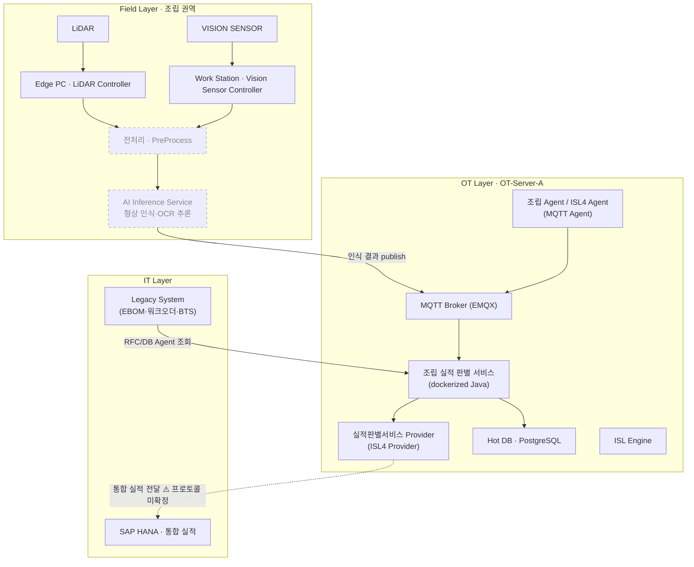
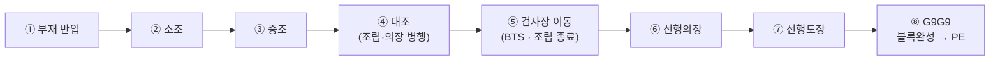
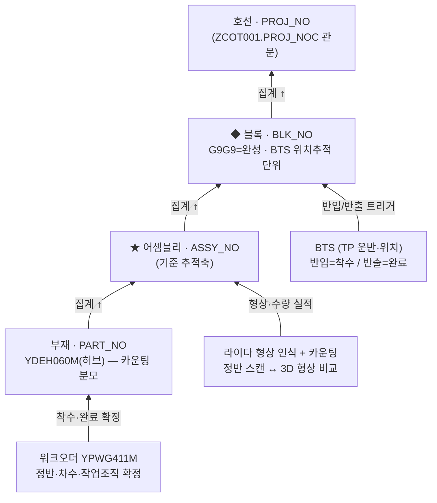
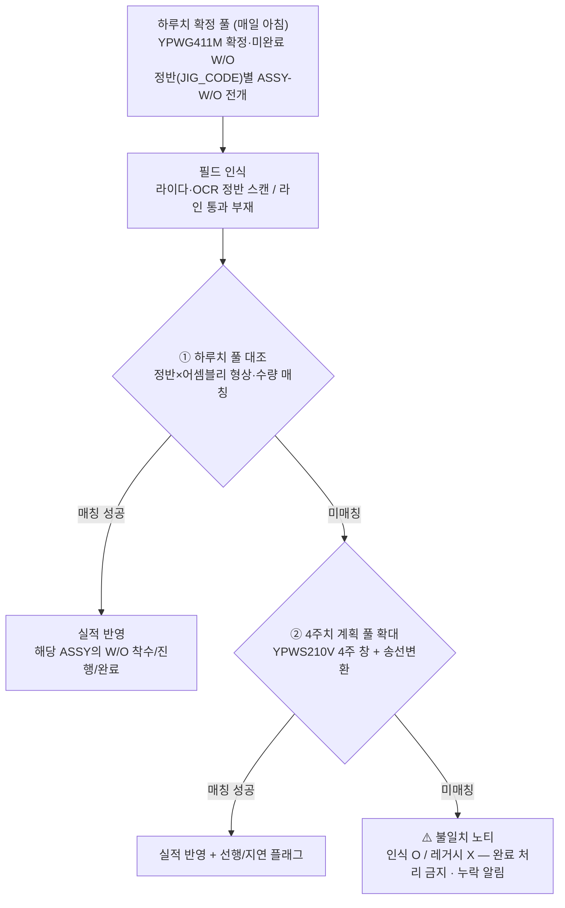

# 내업 공정실적 자동수집 시스템
# 조립권역 실적 판별 기능 정의서

**버전:** v0.5
**작성:** 이태훈 PM
**소속:** 한화에너지 컨버전스사업부 R&D센터 솔루션개발1팀

> ⚠️ **초안(Draft):** 본 문서는 `조립권역_dataflow.drawio`(3개 페이지)·시스템 아키텍처 다이어그램과 「2026-07-28 레거시 시스템 분석을 위한 조립공정 인터뷰」 회의록을 근거로 작성한 초안이다. 회의록에서 확인된 미결 사항은 9장에 ⚠️로 정리했으며 후속 협의로 확정한다.

---

## 목차

1. [개요](#1-개요)
2. [시스템 구성](#2-시스템-구성)
3. [데이터 흐름](#3-데이터-흐름)
4. [레거시 데이터 소스 및 키체인](#4-레거시-데이터-소스-및-키체인)
5. [기능 목록](#5-기능-목록)
6. [기능별 상세 정의](#6-기능별-상세-정의)
7. [인터페이스 정의](#7-인터페이스-정의)
8. [비기능 요구사항](#8-비기능-요구사항)
9. [제약사항 및 미확정 항목](#9-제약사항-및-미확정-항목)
10. [용어 정의](#10-용어-정의)

---

## 1. 개요

본 문서는 내업 공정실적 자동수집 시스템의 **조립권역**(`ot-pipeline-assembly`) 실적 판별 기능을 정의한다.

- **목적:** 조립권역 현장의 라이다·OCR 센싱 실적과 레거시(EBOM·워크오더·BTS) 데이터를 결합하여, **어셈블리(ASSY_NO) 기준**으로 실적을 자동 판별하고 블록·호선으로 집계(rollup)한다.
- **범위:** 조립 공정 흐름(부재 반입 → 소조 → 중조 → 대조 → 검사장 이동)의 실적 발생·매칭·판별·집계. 선행의장/선행도장은 상위 공정 흐름 맥락으로만 참조하며 본 문서 범위 밖이다.
- **범위 밖(입력으로만 사용):** 현장 형상 인식·OCR **추론**, **전처리**, **모델 학습**은 별도 주체가 담당하며 본 문서 범위 밖이다. 본 서비스는 그 **인식 결과를 입력**으로만 사용한다.
- **대상 독자:** 조립권역 판별 서비스 개발자, PM. 시스템 전반 구조는 「개발환경 가이드」, 「OT Server 인프라 구성 및 CI/CD 설계서」를 참조한다.
- **근거 자료:** `조립권역_dataflow.drawio` — ① 조립권역 계층 추적 데이터플로우, ② 조립권역 레거시데이터 키체인, ③ 조립권역 실적 수집 사이클 / `시스템 아키텍쳐.drawio` — 시스템 아키텍처(page 1) / 회의록 「2026-07-28 레거시 시스템 분석을 위한 조립공정 인터뷰」(참여: 문재완·장주현 책임 외).

---

## 2. 시스템 구성

조립권역은 **Field Layer(현장 센싱)** → **OT Layer(수집·판별)** → **IT Layer(레거시·통합 실적)**의 3계층으로 동작한다. OT-Server-A(조립+도장)에 조립 Agent·판별 서비스·MQTT Broker가 배치된다.

> **참고:** zone 판별 서비스는 MQTT를 직접 구독하지 않고, ISL4 Agent(별도 개발 컴포넌트)의 구독 결과를 OT Core가 Provider로 호출한다. 위 그림에서 점선 표시된 필드 **AI Inference Service**(형상 인식·OCR 추론)·전처리는 별도 주체 담당(범위 밖)으로, 본 서비스는 인식 결과만 입력받는다. `PROV → HANA` 통합 실적 전달 프로토콜은 미확정이다(9장 참조).

---

## 3. 데이터 흐름

### 3.1 조립 공정 흐름 (현장 순서)

> 중조 단계에서도 커버류 등 일부 의장품이 선부착되어 조립·의장이 병렬 진행될 수 있다(인터뷰 확인).

### 3.2 계층 추적축과 집계(rollup)

실적은 **부재 → 어셈블리 → 블록 → 호선**으로 아래에서 위로 집계된다. 기준 추적축은 **어셈블리(ASSY_NO)** 이며, 진척률(%)이 아닌 **형상 인식 + 카운팅** 관점으로 판정한다. 어셈블리 계층은 블록 하위로 **대조 > 중조 > 소조 > 부재** Parent-Child 구조이며 **송선코드를 포함하지 않는다**. SAP에서 이 계층을 직접 조회할 수 없어 **라이다 측이 계층 구조를 자체 구성**한다(회의록 5.2).

### 3.3 자동실적 운영 사이클 — 매칭 캐스케이드

실적 귀속 그릇은 **워크오더(W/O)** 이며, 매칭 기준은 **하루치(확정 W/O)를 1차**로 하고 미매칭 시 **4주치 계획으로 폴백**한다. 그래도 없으면 **불일치 노티**(완료 처리 금지)로 처리한다.

### 3.4 이중 실적 모드 (작업장 유형별 이원화)

작업장 마스터(정반 vs 라인)로 분기하여 동일 시스템 내에서 두 모드를 처리한다.

| 구분 | 모드 A — 정반 어셈블리 매칭 | 모드 B — 라인 카운팅 |
|---|---|---|
| 대상 작업장 | 중조·대조·조립의장 정반 | CAS·PAS (소조/판넬 라인) |
| 판별 단위 | 어셈블리(ASSY_NO) | 부재 레벨(개별 식별 없이 라인 통과 수량) |
| 실적 분모 | ASSY_REQ_QTY (부재 카운팅으로 완료 판정) | 당일 W/O 계획수량(PLN_WV) |
| 특성 | 5개 중 4개 인식 → 완료 대신 **누락 노티** | 사이클 짧고 물량 多 |

---

## 4. 레거시 데이터 소스 및 키체인

조립권역 실적 판별은 아래 레거시 테이블을 계층적으로 조인하여 후보 모수를 구성한다.

| 계층 | 테이블 | 역할 | 핵심 키(★=추적 키체인 핵심) |
|---|---|---|---|
| EBOM(허브) | YDEH060M 부재 마스터 | 계층 허브·카운팅 분모 | ★PART_NO, ★PROJ_NO, ★BLK_NO, ★ASSY_SER_NO, ★ASSY_STRC_CODE, PART_TYPE_CODE(K/A/L/M/F), ASSY_WSTG/NEXT_WSTG(설계송선) |
| BOM | YDEH040M 조립 BOM | 부모추적·재귀(셀프조인 4단) | ★PRDT_PART_NO(부모), ★CMPT_PART_NO(자식), CMPT_PART_QTY |
| 어셈블리 | YDEH050M 조립품 정보 | ASSY 확정 | ★ASSY_NO, ASSY_WSTG_CODE(조립송선), ASSY_REQ_QTY(분모), ASSY_MFG_SD/FD |
| 계획 | YPWS210V / ZPPT004_1 월간실행계획 | 4주 창 후보 모수 | ★PROJ_NO, ★BLK_NO, ★WSTG_CODE, ★AUFNR, WORK_CNTR(정반), DETL_SD_PLN/FD_PLN |
| 오더매핑 | YPWG214M 생산오더-작업오더 매핑 | 계획 ↔ W/O 연결 | ★PROD_ORD_NO(=AUFNR), ★WORK_ORD_NO, OPER_NO |
| 워크오더 | YPWG411M 작업오더 마스터 | 실적 귀속 그릇·정반 최정확 소스 | ★WORK_ORD_NO, ★JIG_CODE(정반코드), WK_PLN_CNFM_DT(확정), WORK_OGAN_CODE(직영/협력), WO_ACTL_SD/FD, WO_PLN_SD/FD |
| 송선공정 | YPMA100M 송선공정정보 | 실적일 보강 | PROJ_NO+BLK_NO, BLK_FLAG('S00' 필터), WSTG_CODE, USER_ACTL_SD/FD, INSP_PLN/CNFM_DATE |
| 기준정보 | ZCOT001 호선 기준정보 마스터 | 호선 관문 | ★PROJ_NOC(관문 키), SHPG_TYPE(선종), OWNR_NAME(선주), PROJ_CLS(공사마감일) |
| 외부(Oracle) | BTS | 블록 운반·위치 추적 | 블록번호(트레슬 단위), 상차/하차 From/To, 반입=착수·반출=완료 |
| 센싱(신규) | 라이다 | 형상 인식·카운팅 | ★정반 ID(=위치 표준정보), 형상 매칭 결과, 카운트 수량(vs REQ_QTY) |

### 4.1 핵심 키 필드 규칙

- **ASSY_NO 조합식:** `PROJ_NO || '-' || BLK_NO || '-' || ASSY_STRC_CODE || ASSY_SER_NO` (쿼리1 실코드로 검증). 송선코드 미포함.
- **송선코드(WSTG_CODE, 4자리)** = 조립송선(2) + 차공정송선(2). **설계송선 ≠ 생산송선** — SZ/SC/N/L/동일송선 스킵 **5규칙 변환**(쿼리1) 후 매칭, 정합 ≈95%.
- **JIG_CODE** = 시수권역 W/O 문맥에서 '정반코드'(SE12 확인). 라이다 설치 정반과 매칭 검증 필요.
- **AUFNR ↔ PROD_ORD_NO:** 월간계획(4주 창)과 워크오더(하루치 확정)를 잇는 오더 체계 연결고리.
- **G9G9:** 송선 최종레벨(블록당 1) = 선행 전체 완료. 이후 송선 없고 BTS 블록 이동정보만 존재.
- **호선 관문:** `TRIM(ZCOT001.PROJ_NOC) = TRIM(PROJ_NO)`.

---

## 5. 기능 목록

| 기능ID | 기능명 | 설명 | 우선순위 |
|---|---|---|---|
| ASM-F01 | 필드 인식 수집 | 라이다 형상 인식·카운팅 / OCR 정반 스캔 결과 수집 | 상 |
| ASM-F02 | 어셈블리 기준 실적 판별 (모드 A) | 정반×어셈블리 형상·수량 매칭, ASSY_REQ_QTY 분모로 완료 판정 | 상 |
| ASM-F03 | 라인 카운팅 실적 (모드 B) | CAS·PAS 소조/판넬 라인 통과 부재 수량 카운팅 | 상 |
| ASM-F04 | 매칭 캐스케이드 | 하루치 확정 W/O → 4주 계획 폴백 → 불일치 노티 | 상 |
| ASM-F05 | 계층 집계/롤업 | 부재 → 어셈블리 → 블록 → 호선 집계 | 상 |
| ASM-F06 | 송선코드 변환 매칭 | 설계송선→생산송선 5규칙 변환 후 매칭(≈95%) | 상 |
| ASM-F07 | BTS 트리거 처리 | 반입=착수 / 반출=완료 / 검사장 이동=조립종료 | 중 |
| ASM-F08 | 워크오더 귀속 | 실적을 W/O에 귀속(ASSY↔W/O N:1), 착수/진행/완료 반영 | 상 |
| ASM-F09 | 선행/지연 플래그 | 폴백(4주) 매칭 실적에 선행/지연 표식 부여 | 중 |
| ASM-F10 | 불일치·누락 노티 | 인식 O·레거시 X 시 완료 처리 금지, 누락 알림 | 상 |

---

## 6. 기능별 상세 정의

### 6.1 ASM-F01 필드 인식 수집

- **입력:** 라이다 정반 스캔(형상), OCR 인식 결과, 라인 통과 부재. (필드 → MQTT Broker publish)
- **처리:** 정반 위 스캔 ↔ 3D 형상 비교. 동일 형상은 수량 판정. P/S 대칭 주의.
- **출력:** 형상 매칭 결과(ASSY 인식), 카운트 수량, 정반 ID.
- **예외:** ⚠️ OCR 인식 상세 규칙 미확정.

### 6.2 ASM-F02 어셈블리 기준 실적 판별 (모드 A)

- **입력:** 하루치 확정 W/O 후보(정반별 ASSY-W/O 전개), 라이다 형상·수량 실적.
- **처리:** 정반×어셈블리 후보와 형상·수량 매칭. 분모 = ASSY_REQ_QTY, 부재 카운팅으로 완료 판정.
- **출력:** 해당 ASSY의 W/O에 착수/진행/완료 반영.
- **예외:** N개 중 일부만 인식(예: 5개 중 4개) → **완료 대신 누락 노티**(ASM-F10).

### 6.3 ASM-F03 라인 카운팅 실적 (모드 B)

- **입력:** CAS·PAS(소조/판넬 라인) 통과 부재.
- **처리:** 개별 식별 없이 라인 통과 수량 카운팅. 분모 = 당일 W/O 계획수량(PLN_WV). 동일 형상·동일 자재타입은 개별 식별 불가하나 수량 판정은 가능(예: FR77C~FR81C 5개 전량 인식 시 완료).
- **출력:** W/O 기준 하루 생산량으로 실적 기록.
- **비고:** 소조는 작업이 짧고(약 2시간) 건수가 많아 개별 진척 관리보다 카운팅이 적합(회의록 5.3).

### 6.4 ASM-F04 매칭 캐스케이드

- **입력:** 필드 인식 실적, 하루치 확정 풀(YPWG411M), 4주치 계획 풀(YPWS210V).
- **처리:** ① 하루치 풀 대조 → 미매칭 시 ② 4주치 확대(송선변환 포함) → 미매칭 시 ③ 불일치 노티.
- **출력:** 매칭 성공 시 실적 반영(폴백 매칭은 선행/지연 플래그), 실패 시 노티.

### 6.5 ASM-F05 계층 집계/롤업

- **입력:** 어셈블리 단위 실적, YDEH060M/040M/050M 계층.
- **처리:** 부재(PART_NO) → 어셈블리(ASSY_NO) → 블록(BLK_NO) → 호선(PROJ_NO) 상향 집계.
- **출력:** 블록·호선 단위 집계 실적. G9G9 = 블록 완성.
- **비고:** 기준 추적축 = 어셈블리. 송선코드→정반 역추적은 무효 — 정반 기준정보는 워크오더·라이다 설치정반으로 자체 구축.

### 6.6 ASM-F06 송선코드 변환 매칭

- **입력:** 설계송선(YDEH060M ASSY_WSTG/NEXT_WSTG), 계획 WSTG_CODE.
- **처리:** SZ/SC/N/L/동일송선 스킵 5규칙 변환(쿼리1) 후 2단 매칭. 설계송선(1종)과 생산송선(2종)은 불일치 — 생산이 설계 파생코드를 일부 가공해 사용(회의록 4.2).
- **출력:** 계획↔실적 송선 정합(≈95%).
- **예외:** **Z계열/판계 특이 송선** — 선판계·후판계 등 선행 전처리가 개입되면 송선 시작 위치가 변경(예: `E2`→`SCE2`, 접두 `Z`). 설계 측 관계코드(SC·ES 계열)는 있으나 생산 순기에서 송선 미생성 → `Z` 시작 코드로 나타남. 규칙 보정해도 생산 가공분 결품 일부 발생(정합 ≈95%). ⚠️ Z계열 전체 비중·처리 규칙 미확정(회의록 4.3).
- **예외:** 좌우 대칭(P/S) 동형 이슈 — Y좌표 부호 반전 시 동일 형상이라 소조 단위 구분 어려움. 대블록 단위 위치·이력으로 구분(페어 블록은 함께 작업)(회의록 5.5).

### 6.7 ASM-F07 BTS 트리거 처리

- **입력:** BTS(Oracle) 블록 운반·위치(상차/하차 시각·위치, From/To). 도장 설비·트랜스포터 GPS 실시간 위치.
- **처리:** 블록번호 기준 반입=착수, 반출=완료, 검사장 이동=조립 종료 판정. 도면 서칭 모수 축소. 블록 이동 **계획 정보는 신뢰하지 않고 BTS·GPS 실적을 기준**으로 판단(회의록 6.3).
- **출력:** 블록 레벨 착수·완료 백업 트리거.

### 6.8 ASM-F08 워크오더 귀속

- **입력:** ASSY↔W/O 매핑(계획 WSTG → AUFNR → PROD_ORD_NO → WORK_ORD_NO).
- **처리:** 실적을 W/O에 귀속. 같은 송선의 ASSY 여러 개가 W/O를 공유(N:1) 가능.
- **출력:** W/O 착수/진행/완료 상태.

### 6.9 ASM-F09 선행/지연 플래그

- **처리:** 하루치(확정 W/O) 매칭이 아닌 4주치 폴백 매칭 실적에 선행/지연 표식을 달아 W/O에 반영.

### 6.10 ASM-F10 불일치·누락 노티

- **처리:** 다음 공정으로 이관된 대상은 원칙적으로 완료로 간주(실적 이관 의미). 카운팅/형상 불일치(예: 5개 중 4개) → **완료 처리 금지**, 누락 알림. 인식 O / 레거시 X도 정리 규칙 대상. "명칭까지 맞출 필요 없이 빠진 것만 알려줘도 유용"(현장 요구). 도면 이상값(쓰레기값)·비정상 형상 존재를 전제로 필드·레거시 양측 지속 보완.
- **예외:** ⚠️ **완료 처리 vs 노티 처리 최종 규칙 미확정** — 담당자(장책임) 정리 예정(회의록 5.4).

---

## 7. 인터페이스 정의

> **본 장은 요약이다.** 송·수신 시스템, 연동 주기, 인증, 오류 처리 등 상세는 「인터페이스 정의서」(`docs/인터페이스정의서.md`)를 단일 소스로 한다.

| I/F ID | 종류 | 방향 | 대상 | 관련 기능 |
|---|---|---|---|---|
| ASM-IF01 | MQTT (구독) | 필드 → OT | 조립 Agent / ISL4 Agent ← MQTT Broker(EMQX) | ASM-F01 |
| ASM-IF02 | SAP RFC | IT → OT | SAP HANA Legacy Scheme (YDEH·YPWG·YPWS·YPMA·ZCOT), RFC 모듈+RFC Agent | ASM-F04, ASM-F05, ASM-F06, ASM-F08 |
| ASM-IF03 | JDBC | IT → OT | BTS(Oracle) 운반 계획·실적·위치(NB103M·NB201M·NB202M) | ASM-F07 |
| ASM-IF04 | Provider | OT → IT | 실적판별서비스 Provider (ISL4 Provider) → 통합 실적(SAP HANA) | ASM-F10 |
| ASM-IF05 | JDBC | OT | Hot DB (PostgreSQL) | ASM-F02, ASM-F03, ASM-F05 |
| ASM-IF06 | JDBC | IT → OT | 지번(GIS) 기준정보 — GIF_LOTSMALL | ASM-F07 |

> ⚠️ ASM-IF04(통합 실적 전달)는 프로토콜이 미확정이다 — 포트만 정의하고 구현은 확정 후 진행한다. 상세는 「인터페이스 정의서」의 CMN-IF04를 따른다.

---

## 8. 비기능 요구사항

| 항목 | 요구사항 | 비고 |
|---|---|---|
| 성능 | 하루치 매칭 사이클 실시간 처리, 모드 B(라인)는 짧은 사이클·대물량 대응 | 수치 목표 ⚠️ 미확정 |
| 가용성/재시도 | DB·Broker 연결 견고성(`initialization-fail-timeout: -1` 등), 기동 순서 비가정 | AGENTS.md |
| 정합성 | 송선 변환 정합 ≈95% 관리, 불일치는 완료 금지·노티 | ASM-F06/F10 |
| 운영 | State Machine 인식 규칙 외부화(`STATE_MACHINE_CONFIG_PATH`), 재빌드 없이 재시작 반영 | `state-machine-configs/assembly.yml` |
| 보안 | 레거시 DB 자격증명 env 주입, 비공개 자료 비노출 | 플레이스홀더 |

---

## 9. 제약사항 및 미확정 항목

**회의록(2026-07-28) 후속 확인 사항**
- ⚠️ **실적 취합 최소 단위 최종 결정** — 어셈블리 유력(담당자 잠정)이나 액티비티(에코텍 기준 동일/별도) 대안 미확정. 워크오더 기준은 건수 과다.
- ⚠️ **Z계열·판계 특이 송선코드**의 전체 비중 및 처리 규칙 정의.
- ⚠️ **완료 처리 vs 노티 처리 규칙 확정** — 담당자(장책임) 정리분 수령 예정.
- ⚠️ **실적 귀속 대상(조직·업체·차수)** — 정반의 협력업체 계약 성격상 귀속 기준 협의 필요(회의록 6.2).
- ⚠️ **조립 정반에서의 의장 병행 작업 가능 여부** 재확인(문재완 책임 전언, 미확정).
- ⚠️ **SA135 "정반/선종별 특이블록 및 송선관리" 화면** 실물 확인·설명 확보.
- ⚠️ **SAP/MES 테이블 기준정보·필드 디스크립션 가이드** 확보.
- ⚠️ **어셈블리 계층 구조 1차 정리 후 담당자 검토** 요청.

**기타 미확정**
- ⚠️ **결과 전달 프로토콜(ASM-IF04):** OT-Server ↔ 통합 실적(SAP HANA/ISL Provider) 전달 방식 미확정. SAP 역반영 구상은 검토 단계이며 상세는 「인터페이스 정의서」의 CMN-IF04를 참조한다.
- ⚠️ **OCR 인식 상세 규칙** 미확정 (센싱 결과 포맷·판정 기준).
- ⚠️ **JIG_CODE(정반) ↔ 라이다 설치 정반 매칭 검증** 필요.
- ⚠️ **성능 수치 목표**(처리량/지연) 미정.
- ⚠️ **아키텍처 정합(물리배포 페이지 기준):** RFC/DB Agent의 물리 서버 배치(Hot Data DB 서버 vs ISL Server, AGENTS.md)와 다이어그램이 상이 — 확정 필요.

---

## 10. 용어 정의

| 용어 | 설명 |
|---|---|
| ASSY_NO | 어셈블리 번호. `PROJ_NO-BLK_NO-ASSY_STRC_CODE+ASSY_SER_NO` 조합키. 기준 추적축 |
| 송선(WSTG_CODE) | 4자리 공정 흐름 코드(조립송선2+차공정송선2). 설계≠생산, 변환 매칭 대상 |
| 정반(JIG_CODE) | 조립 작업이 이뤄지는 위치 기준정보. 라이다 설치 정반과 매칭 |
| W/O (워크오더) | 작업지시. 실적 귀속의 기준 그릇(WORK_ORD_NO) |
| G9G9 | 송선 최종레벨(블록당 1). 블록 완성(선행 전체 완료) |
| 모드 A / 모드 B | 정반 어셈블리 매칭 / 라인 카운팅. 작업장 유형별 실적 이원화 |
| BTS | 블록 추적 시스템(Oracle). 설비·트랜스포터 GPS로 블록 실시간 위치. 반입=착수·반출=완료 트리거 |
| 롤업(rollup) | 부재→어셈블리→블록→호선 상향 집계 |
| G9G9 상세 | 송선 최종레벨(블록당 1, 샵 무관). 조립+선행의장+선행도장 선행 전체 완료=블록 완성. 조립만 완료로는 미도달. 이후 송선 없고 블록 이동정보만 |
| LOT(로트) | 가공 단계에서 동일 형상을 함께 절단하는 단위(SAP "로트블록"). 동일 부재를 하나의 로트로 묶어 관리 |
| 액티비티(Activity) | 실적 최소 단위 후보 중 하나(에코텍 선행사례 기준). 오션 채택 여부 미확정 |

---

## 변경 이력

| 버전 | 날짜 | 내용 |
|---|---|---|
| v0.1 | 2026-08-14 | 최초 작성 (조립권역 DataFlow 3개 페이지 + 시스템 아키텍처 기반 자동 생성 초안) |
| v0.2 | 2026-08-14 | 범위 정합 보강(AI 추론·전처리·학습 범위 밖 명시) + 회의록「2026-07-28 조립공정 인터뷰」반영(계층 대조>중조>소조>부재, Z계열/판계 송선, 완료 vs 노티 미확정, 실적 귀속·SAP 역반영 구상, 후속 확인 8항) |
| v0.3 | 2026-08-18 | 인터페이스 정의 장을 요약화하고 「인터페이스 정의서」 참조로 정리(상세 이관, 관련 기능 열 추가) |
| v0.4 | 2026-08-19 | §7 ASM-IF02 종류를 SAP RFC로, 대상을 SAP HANA Legacy Scheme로 확정(2026-08-19 조사 — 인터페이스 정의서 v0.8 동기) |
| v0.5 | 2026-08-25 | §7 요약표에 ASM-IF06(지번 GIS 기준정보 — GIF_LOTSMALL) 추가, ASM-IF03 대상을 BTS 물리 테이블 3종(NB103M·NB201M·NB202M)으로 확정(2026-08-24 「Legacy Oracle 테이블·필드 정리」 — 인터페이스 정의서 v0.9 동기)
