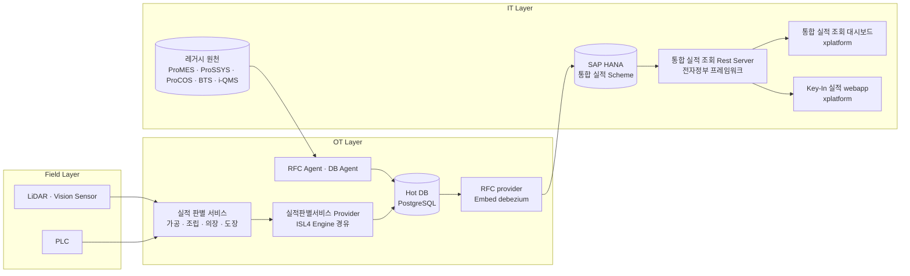
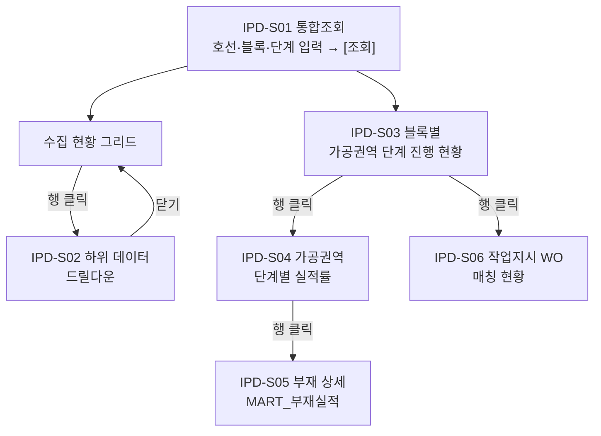

# 내업 공정실적 자동수집 시스템
# 통합실적대시보드 기능 정의서

**버전:** v0.4
**작성:** 이태훈 PM
**소속:** 한화에너지 컨버전스사업부 R&D센터 솔루션개발1팀

> **Draft:** 본 문서는 3차 MVP 화면 설계 자료를 근거로 작성한 초안이다. ⚠️ 표기 항목은 확정 후 갱신한다.

---

## 목차

1. [개요](#1-개요)
2. [시스템 구성](#2-시스템-구성)
3. [사용자 및 권한](#3-사용자-및-권한)
4. [화면 목록](#4-화면-목록)
5. [화면 흐름](#5-화면-흐름)
6. [화면별 상세 정의](#6-화면별-상세-정의)
7. [기능 목록](#7-기능-목록)
8. [기능별 상세 정의](#8-기능별-상세-정의)
9. [인터페이스 정의](#9-인터페이스-정의)
10. [비기능 요구사항](#10-비기능-요구사항)
11. [제약사항 및 미확정 항목](#11-제약사항-및-미확정-항목)
12. [용어 정의](#12-용어-정의)

---

## 1. 개요

본 문서는 통합실적대시보드의 화면 및 기능 요구사항을 정의한다.

- **목적:** 내업 공정(가공·조립·의장·도장)의 실적 원천 데이터를 호선·블록 단위로 통합 조회하고, 자동 수집 데이터와 레거시 실적의 정합성을 확인한다. 2차 MVP 시연(2026-07-20) 피드백을 반영한 3차 MVP 화면 설계를 근거로 한다.
- **범위:**
  - 포함 — 로우데이터 수집 현황 조회, 원천 화면별 드릴다운, 블록별 가공권역 단계 진행 현황, 가공권역 단계별 실적률, 부재 단위 상세, 작업지시(WO) 기준 자동수집·레거시 매칭 현황.
  - 제외 — 실적 등록·수정(Key-in 실적 시스템 소관), 설비 상태 감시(OT 대시보드 소관), 센서 원시 신호 처리.
- **성격:** 본 화면은 **로우데이터 수집·정합성 확인을 목적**으로 하며, 화면에 표시되는 공정률·실적률은 **참고 수치**다(원문 명시). 공식 실적 지표로 사용하지 않는다.
- **대상 사용자:** 생산계획팀 등 내업 공정실적 담당자.
- **대상 독자:** 개발자·PM. 관련 문서 「개발환경 가이드」, 「인터페이스 정의서」, 「레거시 인터페이스 정의서」 참조.
- **근거 자료:**
  - Confluence 「내업 공정실적 통합 대시보드 3차 MVP」 (`https://hc-support.atlassian.net/wiki/spaces/advancedre/pages/284295176`), 2026-08-19 조회
  - 첨부 `20260728_내업공정실적_통합실적화면정의서_rev1.0.0.html` (2026-07-28, 화면 프로토타입 번들)
  - `docs/design/system_architecture/시스템 아키텍쳐.drawio` — 「시스템 아키텍쳐」·「물리 배포 다이어그램」 페이지 (§2 시스템 구성의 근거)

> ⚠️ **근거 자료의 한계:** 첨부는 실행 가능한 화면 프로토타입이며, 그리드에 표시되는 **행 데이터는 시드 기반으로 생성된 모의 데이터**다. 따라서 본 문서는 프로토타입에서 **화면 구성·항목·조작·산출 규칙**만 근거로 채택했고, 표시된 **개별 값(호선번호·부재번호·일자·건수 등)은 요구사항으로 취급하지 않았다.**

---

## 2. 시스템 구성

통합실적대시보드는 IT 구간의 조회 전용 화면이며, **「통합 실적 조회 Rest Server」를 단일 진입점으로 삼는다.** 필드에서 수집된 실적은 OT 구간의 판별·적재를 거쳐 통합 실적 스킴에 반영된 뒤 이 서버를 통해 조회된다. 대시보드가 Hot DB나 레거시 원천에 직접 접속하지 않는다.

| 구성요소 | 역할 | 배치 | 비고 |
|---|---|---|---|
| 통합 실적 조회 대시보드 | 본 문서의 대상. 호선·블록 단위 실적 통합 조회 및 정합성 확인 | ⚠️ 미확정 (IT 구간) | **xplatform**. 조회 전용 |
| 통합 실적 조회 Rest Server | 대시보드의 유일한 조회 진입점 | ⚠️ 미확정 (IT 구간) | **전자정부 프레임워크**. Key-In 실적 webapp과 공유 |
| 통합 실적 Scheme | 최종 통합 실적 적재 스킴. Rest Server의 조회 원천 | IT망 SAP HANA | |
| RFC provider (Embed debezium) | Hot DB 변경분을 통합 실적 스킴으로 반영 | OT 구간 | CDC 방식 |
| Hot DB | 자동 수집·판별 실적 보관 | Hot Data DB 서버 (PostgreSQL) | 「인터페이스 정의서」 CMN-IF01 |
| 실적 판별 서비스 4종 | 권역별 실적 판별 | OT Server A · B | 대시보드와 직결되지 않는다 |
| RFC Agent · DB Agent | SAP·레거시 DB에서 원천 데이터 취득 | OT 구간 | 「인터페이스 정의서」 CMN-IF02 · CMN-IF03 |

> **참고:** 위 구성은 「시스템 아키텍쳐」 다이어그램을 근거로 한다. 다이어그램은 각 연계 지점에 `I-n`(IT) · `O-n`(OT) · `F-n`(Field) 라벨을 부여하고 있으나, 이는 **다이어그램 내부 표기이며 「인터페이스 정의서」의 IF-ID가 아니다.**

> ⚠️ 대시보드와 Rest Server의 **물리 배치는 미확정**이다 — 「물리 배포 다이어그램」은 OT 구간(OT Server A·B, ISL Server, Hot Data DB 서버, GPU Training Server, NAS)과 필드만 다루고 IT 구간 서버를 포함하지 않는다. **REST API 규격과 인증 방식도 미확정**이다.

---

## 3. 사용자 및 권한

| 역할 | 설명 | 접근 가능 화면 | 허용 조작 |
|---|---|---|---|
| 생산계획팀 | 내업 공정실적 담당. 화면 상단에 사용자 소속으로 표기됨 | IPD-S01 ~ IPD-S06 | 조회, 내보내기 |

> ⚠️ 역할 구분(관리자/일반), 인증·세션 정책, 호선별 접근 제한 여부는 **미확정**이다. 프로토타입은 단일 사용자 표기(`사용자: 생산계획팀`)만 두고 로그인 화면이 없다.

---

## 4. 화면 목록

본 시스템은 **단일 페이지 화면**이며, 아래 영역이 조회 결과와 행 선택에 따라 순차적으로 노출된다. 각 영역은 고유한 표시 항목·조작을 가지므로 화면ID를 개별 부여한다.

| 화면ID | 화면명 | 메뉴 경로 | 주요 기능 | 관련 기능ID |
|---|---|---|---|---|
| IPD-S01 | 내업 공정실적 통합조회 (메인) | 통합조회 — 데이터 게더링 | 조회 조건 입력, 수집 현황 그리드 | IPD-F01, IPD-F02, IPD-F08, IPD-F09 |
| IPD-S02 | 하위 데이터 드릴다운 | IPD-S01 행 클릭 | 선택 행의 원천 항목·값 상세 | IPD-F03 |
| IPD-S03 | 블록별 가공권역 단계 진행 현황 | IPD-S01 조회 결과 | 블록별 WO 진행률·가공 S1~S5 실적률 | IPD-F04, IPD-F07 |
| IPD-S04 | 가공권역 단계별 실적률 | IPD-S03 행 클릭 | 단계별 건수·중량 실적률, 판별 근거 | IPD-F05 |
| IPD-S05 | 부재 상세 (MART) | IPD-S04 행 클릭 | 부재 단위 S1~S5 진행 상태 | IPD-F06 |
| IPD-S06 | 작업지시(WO)·자동수집 매칭 | IPD-S03 행 클릭 | 자동 수집 ↔ 레거시 실적 매칭 대조 | IPD-F07, IPD-F10 |

---

## 5. 화면 흐름

> 조회 전 안내 문구: `호선 번호를 선택한 후 [조회]를 클릭하세요`. 즉 **호선 미선택 상태에서는 결과 영역이 표시되지 않는다.**

---

## 6. 화면별 상세 정의

> ⚠️ **화면 캡처 확보 필요.** 근거 첨부는 실행형 프로토타입이라 정적 이미지가 포함되어 있지 않다. 확정 화면 캡처를 `docs/assets/화면설계/통합실적대시보드/`에 배치한 뒤 각 절에 삽입한다.

### 6.1 IPD-S01 내업 공정실적 통합조회 (메인)

- **용도:** 호선·블록·공정 단계를 조건으로 내업 공정 실적의 원천 로우데이터 수집 현황을 조회한다.
- **진입 경로:** 시스템 진입 시 최초 화면.

**구성 요소**

| 구분 | 명칭 | 타입 | 필수 | 설명 |
|---|---|---|---|---|
| 상단바 | 시스템명 | 표시 | - | `한화오션 내업 공정실적 자료수집 시스템 / 통합조회 — 데이터 게더링` |
| 상단바 | 수집 상태 | 표시(상태등) | - | `수집중` 표기 + 상태 인디케이터 |
| 상단바 | 현재 일시 | 표시 | - | 날짜·시각 |
| 상단바 | 사용자 | 표시 | - | 사용자 소속 표기 |
| 헤더 | 화면 제목·기준일 | 표시 | - | `내업 공정실적 통합조회 [ 기준일 YYYY-MM-DD ]` |
| 헤더 | 목적 안내 | 표시 | - | `로우데이터 수집·정합성 확인 목적 · 공정률은 참고 수치` |
| 헤더 | 최종수신 | 표시 | - | 최종 수신 시각 |
| 헤더 | 자동갱신 | 토글 + 주기 | - | 갱신 주기(초) 표기. 기본 5초, 범위 3~60초 |
| 헤더 | 내보내기 | 버튼 | - | 조회 결과 내보내기 |
| 조회 조건 | 호선 번호 | 선택(Select) | **Y** | 미선택 시 `— 선택 —`. 조회 필수 조건 |
| 조회 조건 | 블록 No | 입력(Text) | N | **부분 입력**으로 특정 블록만 조회 |
| 조회 조건 | 단계(공정) | 선택(버튼군) | N | `전체` / `가공` / `조립` / `의장` / `도장`. 기본 `전체` |
| 조회 조건 | 조회 | 버튼 | - | 조건으로 결과 영역 조회 |
| 조회 조건 | 초기화 | 버튼 | - | 조회 조건 초기화 |
| 그리드 | 내업 공정 실적 수집 현황 | 표 | - | 건수 표기 + 행 클릭 시 드릴다운 |

**표시 항목 — 수집 현황 그리드**

그리드는 공정 단계·세부 단계 순으로 정렬되며, 단계 구성은 다음과 같다.

| 정렬 순서 | 단계 | 세부 단계 |
|---|---|---|
| 1 | SSY | 입고 → 적치 → 선별 → 불출 |
| 2 | 전처리 | 전처리 |
| 3 | 절단 | 절단 |
| 4 | 사상 | 사상 |
| 5 | 선별 | 선별 |
| 6 | 조립 | 스캔 인식 |
| 7 | 의장 | 설치 인식 |

- 화면 안내 문구: `단계: SSY(입고·적치·선별·불출) → 전처리 → 절단 → 사상 → 선별 · 적색 = 확인 필요`
- 컬럼 구성은 단계별로 달라지며, 원천 화면에서 사용하는 항목명을 그대로 노출한다(§6.2 참조).

> ⚠️ 도장 단계는 조회 조건(`단계(공정)`)에는 있으나 수집 현황 그리드의 단계 구성에는 나타나지 않는다 — **범위 확정 필요**.

**동작 / 이벤트**

| 트리거 | 처리 | 결과 |
|---|---|---|
| 화면 진입 | 조회 조건 초기 상태 표시 | 결과 영역 비표시, 안내 문구 노출 |
| 호선 선택 후 `조회` 클릭 | 호선·블록·단계 조건으로 원천 데이터 조회 | 수집 현황 그리드 및 IPD-S03 표시 |
| `초기화` 클릭 | 조회 조건 초기화 | 결과 영역 비표시 |
| 그리드 행 클릭 | 선택 행의 원천 항목 조회 | IPD-S02 드릴다운 패널 표시 |
| 자동갱신 주기 경과 | 갱신 조건 충족 시 데이터 재조회 | 최종수신 시각 갱신 |
| `내보내기` 클릭 | 조회 결과 파일 생성 | ⚠️ 대상 범위·형식 미확정 |

- **검증 / 예외 규칙:** 호선 미선택 시 조회 불가(안내 문구 노출). 값이 없는 항목은 `—`로 표기한다. `적색` 강조는 확인이 필요한 값을 뜻한다.
- **데이터 갱신:** 자동갱신 기본 5초, 설정 범위 3~60초(1초 단위). 자동갱신 해제 가능.
- **관련 기능:** IPD-F01, IPD-F02, IPD-F08, IPD-F09
- **관련 인터페이스:** IPD-IF01 (§9)

---

### 6.2 IPD-S02 하위 데이터 드릴다운

- **용도:** 수집 현황 그리드에서 선택한 행의 원천 항목과 값을 항목·값 쌍으로 표시한다.
- **진입 경로:** IPD-S01 그리드 행 클릭.

**구성 요소**

| 구분 | 명칭 | 타입 | 필수 | 설명 |
|---|---|---|---|---|
| 패널 헤더 | 제목 | 표시 | - | `하위 데이터 {대상명}` |
| 패널 헤더 | 관리 단위 | 표시 | - | 선택 행의 관리 단위(축) |
| 패널 헤더 | 닫기 | 버튼 | - | 패널 닫기 |
| 본문 | 항목 / 값 | 표(2열) | - | 원천 항목명과 값 |

**표시 항목 — 원천 화면별 주요 항목**

수집 현황은 다음 5개 원천 화면에서 취합한다. 원천 번호(①~⑤)는 화면과 §6.4 판별 근거에서 공통으로 쓰인다.

| 원천 | 화면명 | 성격 | 주요 항목 |
|---|---|---|---|
| ① | 강재불출 | 자재 | 순번, 고유번호, 자재번호, Roll No., SSY, 야드, 선급, 재질, 두께, 중량(kg), 불출요구일, 불출일, 시각, 차이 |
| ② | 절단일정 | 도면 | 도면번호, 절단장비, 불출예정일, 도면·테이프·강재 준비 여부, 마킹·절단 진행, 계획/지시/실적 수량, LINE NO, 작업장 |
| ③ | 부재종합 | 허브 | 부재번호, 도면번호, 절단장비, 계열, 중량, 두께, 강재반입일, 절단완료일시, 사상완료일시, 모듬번호, 상태 |
| ④ | 모듬 | 집계 | 모듬번호, 구성 부재 수, 합계 중량, 완료 여부 |
| ⑤ | 부재선별 | 송선 | 송선(LINE), 선별 건수(완료/전체), 팔레트 번호, 할당 상태 |

> ⚠️ 각 원천 화면의 시스템 소재(MES/BTS/i-QMS 등)와 테이블·컬럼 매핑은 「레거시 인터페이스 정의서」에서 확정한다. 본 문서는 화면 표기 항목명만 기록한다.

**동작 / 이벤트**

| 트리거 | 처리 | 결과 |
|---|---|---|
| IPD-S01 행 클릭 | 선택 행의 원천 항목·값 조회 | 패널 표시 |
| `닫기` 클릭 | 패널 종료 | IPD-S01로 복귀 |

- **관련 기능:** IPD-F03
- **관련 인터페이스:** IPD-IF01 (§9)

---

### 6.3 IPD-S03 블록별 가공권역 단계 진행 현황

- **용도:** 조회된 호선의 블록별 작업지시(WO) 진행 현황과 가공권역 5단계 실적률을 한 표에서 대조한다.
- **진입 경로:** IPD-S01 조회 실행 시 함께 표시.

> **참고:** 프로토타입 화면의 표기는 「블록 목록 × 가공권역 단계 히트맵」이다. 본 문서는 표시 형태(블록 × 단계 격자에 색을 입힌 표)를 더 정확히 나타내는 명칭을 쓴다. ⚠️ 화면 문구 자체의 변경 여부는 **확정 필요**하다.

**표시 항목**

| 항목 | 설명 | 산출 근거 |
|---|---|---|
| 블록 No | 블록 식별자 | 조회 조건 |
| WO 전체 / 대기 / 착수 / 완료 | 블록의 작업지시 상태별 건수 | 작업지시 원천 |
| 진행률(참고%) | **완료 WO ÷ 전체 WO** | 화면 명시. 참고 수치 |
| 가공 S1 반입 ~ S5 편성 | 단계별 실적률(%) | **중량 기준 실적률** |
| 가공종합 ★중량 | 가공권역 종합 실적률 | 5개 단계 중량 실적률의 평균(중량가중) |
| 최근 수신 | 해당 블록의 최근 데이터 수신 시각 | 자동 수집 |
| 정합성 이슈 | 확인이 필요한 건수. 없으면 `—` | §6.6 매칭 결과 |

- 화면 안내 문구: `진행률 = 완료 WO / 전체 WO · 가공 S1~S5 = 중량 기준 실적률(%) (참고 수치)`

**동작 / 이벤트**

| 트리거 | 처리 | 결과 |
|---|---|---|
| 행 클릭 | 선택 블록의 가공권역 단계·상세 조회 | IPD-S04, IPD-S06 표시 |

- **관련 기능:** IPD-F04, IPD-F07
- **관련 인터페이스:** IPD-IF01 (§9)

---

### 6.4 IPD-S04 가공권역 단계별 실적률

- **용도:** 선택 블록의 가공권역 5단계별 실적률을 건수·중량 기준으로 제시하고, 각 단계의 완료 판별 근거를 명시한다.
- **진입 경로:** IPD-S03 행 클릭.
- **성격:** **기준일 스냅샷**이다(화면 명시).

**표시 항목**

| 항목 | 설명 |
|---|---|
| 공정단계 | 단계 코드·명칭 |
| 완료 판별 근거 (원천화면) | 완료로 판별하는 원천 항목 |
| 이벤트 유형 | 판별 데이터의 형태 |
| 대상 부재 / 완료 / 진행중 | 단계별 부재 건수 |
| 실적률(건수%) | 완료 건수 ÷ 대상 건수 × 100 |
| 대상 중량(Kg) / 완료 중량(Kg) | 단계별 부재 중량 합계 |
| 실적률(중량%) ★주지표 | 완료 중량 ÷ 대상 중량 × 100 |
| 분모 제외 | `미대상` 상태 부재 건수 |
| 가공권역 종합(중량가중) | 5단계 중량 실적률의 평균 |

**단계별 완료 판별 근거**

| 코드 | 단계명 | 완료 판별 근거 (원천화면) | 이벤트 유형 |
|---|---|---|---|
| S1 | 강재반입 | ③ 부재종합.강재반입일 | 일자 기입형 |
| S2 | 전처리(불출) | ① 강재불출.불출일자 + 시각 | 일자 기입형 |
| S3 | 절단 | ③ 절단완료일 · ② 진행플래그 | 일자 + 플래그형 |
| S4 | 사상 | ③ 사상일자 · ④ 모듬상태 | 일자 + 상태코드형 |
| S5 | 팔레트편성 | ③④ 모듬번호 · ⑤ 선별/팔레트 | 상태코드형 |

**단계 상태 구분**

| 상태 | 뜻 | 집계 반영 |
|---|---|---|
| 완료 | 판별 근거가 충족된 상태 | 분자·분모 모두 포함 |
| 진행중 | 착수했으나 미완료 | 분모에만 포함 |
| 미도래 | 선행 단계 미완료로 아직 대상이 아님 | 분모에만 포함 |
| 미대상 | 해당 부재에 그 단계가 적용되지 않음 | **분모에서 제외** |

- **검증 / 예외 규칙:** 단계는 **선행 단계가 완료된 부재에 한해** 다음 단계로 진행한다. `미대상` 부재는 해당 단계의 건수·중량 분모에서 모두 제외한다.
- **관련 기능:** IPD-F05
- **관련 인터페이스:** IPD-IF01 (§9)

---

### 6.5 IPD-S05 부재 상세 (MART)

- **용도:** 선택 단계의 부재 단위 진행 상태를 조회한다. 1행 = 부재 1건.
- **진입 경로:** IPD-S04 행 클릭.
- **원천:** `MART_부재실적` (화면 명시). 조회는 다른 화면과 동일하게 「통합 실적 조회 Rest Server」를 경유한다(§2). ⚠️ `MART_부재실적`이 통합 실적 스킴 내부 객체인지 별도 마트인지는 **확정 필요**하다.
- **정렬:** 미완료 우선 정렬.

**표시 항목**

| 항목 | 설명 |
|---|---|
| 부재번호 (추적키) | 부재 추적 키 |
| 도면번호 | 도면 식별자 |
| 절단장비 | 절단 설비 |
| 분류 / 계열 | 부재 분류·계열 코드 |
| 중량(Kg) / 두께(mm) | 부재 제원 |
| S1 반입 / S2 불출 / S3 절단 / S4 사상 / S5 편성(모듬번호) | 단계별 완료 일자 또는 상태. S5는 모듬번호 |
| 선택단계 상태 | IPD-S04에서 선택한 단계의 상태 |

- **동작:** 정렬 기준 변경 가능.
- **관련 기능:** IPD-F06
- **관련 인터페이스:** IPD-IF01 (§9)

---

### 6.6 IPD-S06 작업지시(WO)·자동수집 매칭

- **용도:** 작업지시 단위로 **자동 수집 실적**과 **레거시 실적**을 좌우로 대조해 매칭 여부·정합성 이슈를 확인한다.
- **진입 경로:** IPD-S03 행 클릭.
- **화면 구분:** `좌: 자동 수집 — 필드 (LiDAR·Vision)` / `우: 레거시 실적 (MES·BTS·i-QMS)`

**표시 항목**

| 구분 | 항목 |
|---|---|
| 공통 | 작업지시 No (WO), 작업명(대상 부재), 공정 구분, 상태, 착수일, 완료일 |
| 자동 수집 | 채널, 인식, 최근 인식 |
| 레거시 실적 | 소스, DO 참조, 수량, 실적 일시 |
| 판정 | 매칭 |

**조작**

| 조작 | 옵션 |
|---|---|
| 정렬 | 공정 / 상태 / 최근수신 / WO No |
| 매칭 필터 | 전체 / 불일치·미매칭 |
| 표시 모드 | WO 현황 (전 공정) |

- **검증 / 예외 규칙:** 매칭 결과가 불일치·미매칭인 건수가 IPD-S03의 `정합성 이슈` 컬럼에 집계된다. 이슈가 없으면 `—`로 표기한다.
- **관련 기능:** IPD-F07, IPD-F10
- **관련 인터페이스:** IPD-IF01 (§9)

---

## 7. 기능 목록

| 기능ID | 기능명 | 설명 | 관련 화면ID | 우선순위 |
|---|---|---|---|---|
| IPD-F01 | 조회 조건 입력 | 호선·블록·공정 단계 조건 입력 및 조회/초기화 | IPD-S01 | ⚠️ 미확정 |
| IPD-F02 | 수집 현황 조회 | 원천 ①~⑤의 로우데이터를 단계 순으로 통합 표시 | IPD-S01 | ⚠️ 미확정 |
| IPD-F03 | 하위 데이터 드릴다운 | 선택 행의 원천 항목·값 상세 표시 | IPD-S02 | ⚠️ 미확정 |
| IPD-F04 | 블록별 진행 현황 집계 | 블록별 WO 상태 집계 및 가공 단계별 실적률 표시 | IPD-S03 | ⚠️ 미확정 |
| IPD-F05 | 가공권역 실적률 산출 | 단계별 건수·중량 실적률 및 종합 실적률 산출 | IPD-S04 | ⚠️ 미확정 |
| IPD-F06 | 부재 단위 상세 조회 | 부재별 S1~S5 진행 상태 조회 | IPD-S05 | ⚠️ 미확정 |
| IPD-F07 | 자동수집·레거시 매칭 | WO 기준 대조 및 정합성 이슈 집계 | IPD-S03, IPD-S06 | ⚠️ 미확정 |
| IPD-F08 | 자동 갱신 | 설정 주기로 데이터 재조회 및 최종수신 시각 표시 | IPD-S01 | ⚠️ 미확정 |
| IPD-F09 | 내보내기 | 조회 결과 파일 내보내기 | IPD-S01 | ⚠️ 미확정 |
| IPD-F10 | 정렬·필터 | 결과 정렬 기준 및 매칭 필터 적용 | IPD-S05, IPD-S06 | ⚠️ 미확정 |

---

## 8. 기능별 상세 정의

### 8.1 IPD-F01 조회 조건 입력

- **입력:** 호선 번호(필수), 블록 No(선택, 부분 일치), 단계(공정) — 전체/가공/조립/의장/도장.
- **처리 규칙:** 호선이 선택되지 않으면 조회를 수행하지 않고 안내 문구를 표시한다. 블록 No는 부분 문자열 일치로 필터한다.
- **출력:** 수집 현황 그리드 및 블록 목록 표시.
- **예외 처리:** 호선 미선택 시 `호선 번호를 선택한 후 [조회]를 클릭하세요`.
- **관련 화면:** IPD-S01
- **관련 인터페이스:** IPD-IF01 (§9)

### 8.2 IPD-F02 수집 현황 조회

- **입력:** 조회 조건, 원천 ①~⑤ 데이터.
- **처리 규칙:** 블록 → 단계 → 세부 단계 → 키 순으로 정렬한다. 단계 정렬 순서는 SSY(1) → 전처리(2) → 절단(3) → 사상(4) → 선별(5) → 조립(6) → 의장(7) → 도장(8)이며, SSY의 세부 단계는 입고(1) → 적치(2) → 선별(3) → 불출(4)이다.
- **출력:** 단계별 컬럼 구성의 수집 현황 그리드, 총 건수.
- **예외 처리:** 값이 없는 항목은 `—`. 확인이 필요한 값은 적색 강조.
- **관련 화면:** IPD-S01
- **관련 인터페이스:** IPD-IF01 (§9)

### 8.3 IPD-F03 하위 데이터 드릴다운

- **입력:** 선택 행의 식별자.
- **처리 규칙:** 선택 행이 속한 원천 화면의 항목·값을 항목/값 2열로 구성한다. 관리 단위(축)를 함께 표시한다.
- **출력:** 드릴다운 패널.
- **관련 화면:** IPD-S02

### 8.4 IPD-F04 블록별 진행 현황 집계

- **입력:** 블록별 작업지시(WO), 부재 단계 상태.
- **처리 규칙:** `진행률(참고%) = 완료 WO ÷ 전체 WO × 100`. 가공 S1~S5 컬럼에는 각 단계의 **중량 기준 실적률**을 표시한다.
- **출력:** 블록별 단계 진행 현황, 최근 수신 시각, 정합성 이슈 건수.
- **관련 화면:** IPD-S03

### 8.5 IPD-F05 가공권역 실적률 산출

- **입력:** 선택 블록의 부재별 단계 상태(완료/진행중/미도래/미대상)와 부재 중량.
- **처리 규칙:**
  1. 각 단계에 대해 `미대상` 부재를 **분모에서 제외**한다.
  2. `실적률(건수%) = 완료 건수 ÷ 대상 건수 × 100`
  3. `실적률(중량%) = 완료 중량 ÷ 대상 중량 × 100` — **주지표**
  4. `가공권역 종합(중량가중) = 5개 단계의 중량 실적률 평균`
  5. 단계 완료 판별 근거는 §6.4 표를 따른다.
- **출력:** 단계별 실적률 표, 종합 실적률.
- **예외 처리:** 대상 건수·중량이 0이면 실적률은 0으로 처리한다.
- **관련 화면:** IPD-S04
- **관련 인터페이스:** IPD-IF01 (§9)

> ⚠️ 종합 실적률이 "중량가중"으로 표기되어 있으나 산출식은 **단계별 중량 실적률의 단순 평균**이다 — 표기와 산식의 정합 여부를 확정해야 한다.

### 8.6 IPD-F06 부재 단위 상세 조회

- **입력:** 선택 블록·선택 단계.
- **처리 규칙:** 부재 1건을 1행으로 표시하고 **미완료 부재를 우선 정렬**한다. S5는 완료 시 모듬번호를 표시한다.
- **출력:** 부재 상세 그리드.
- **관련 화면:** IPD-S05

### 8.7 IPD-F07 자동수집·레거시 매칭

- **입력:** 자동 수집 실적(채널·인식·최근 인식), 레거시 실적(소스·DO 참조·수량·실적 일시).
- **처리 규칙:** 작업지시(WO)를 기준으로 양측을 대조해 매칭 여부를 판정한다. 불일치·미매칭 건수를 블록 단위로 집계해 IPD-S03의 `정합성 이슈`에 표시한다.
- **출력:** 매칭 결과 컬럼, 블록별 정합성 이슈 건수.
- **예외 처리:** 이슈가 없으면 `—`.
- **관련 화면:** IPD-S03, IPD-S06
- **관련 인터페이스:** IPD-IF01 (§9)

> ⚠️ **매칭 판정 규칙(키 구성, 허용 오차, 시간 창)이 미확정이다.** 프로토타입은 판정 결과만 표시하고 규칙을 구현하지 않는다.

### 8.8 IPD-F08 자동 갱신

- **입력:** 자동갱신 설정(on/off), 갱신 주기.
- **처리 규칙:** 갱신 주기는 기본 5초, 설정 범위 3~60초(1초 단위)다. 마지막 갱신 이후 주기가 경과하면 데이터를 재조회하고 최종수신 시각을 갱신한다. 자동갱신 해제 시 재조회하지 않는다.
- **출력:** 갱신된 데이터, 최종수신 시각.
- **관련 화면:** IPD-S01

> ⚠️ 실 데이터 연동 시의 갱신 주기(3~60초)가 원천 시스템 부하 관점에서 타당한지 **확정 필요**하다.

### 8.9 IPD-F09 내보내기

- **입력:** 현재 조회 결과.
- **처리 규칙:** ⚠️ **미확정** — 대상 범위(현재 그리드 / 전체 결과), 파일 형식, 파일명 규칙이 정의되지 않았다.
- **출력:** ⚠️ 미확정
- **관련 화면:** IPD-S01

### 8.10 IPD-F10 정렬·필터

- **입력:** 정렬 기준(공정 / 상태 / 최근수신 / WO No), 매칭 필터(전체 / 불일치·미매칭).
- **처리 규칙:** 선택한 기준으로 결과를 재정렬하거나 필터한다.
- **출력:** 재정렬·필터된 그리드.
- **관련 화면:** IPD-S05, IPD-S06

---

## 9. 인터페이스 정의

> **본 장은 요약이다.** 송·수신 시스템, 연동 주기, 인증, 오류 처리 등 상세는 「인터페이스 정의서」(`docs/인터페이스정의서.md`)를 단일 소스로 한다.

본 시스템은 **「통합 실적 조회 Rest Server」 한 곳하고만 연계한다**(§2). 화면에 표시되는 모든 데이터는 이 인터페이스를 통해 조회된다.

| I/F ID | 종류 | 방향 | 대상 | 관련 기능 |
|---|---|---|---|---|
| IPD-IF01 | REST | IT | 통합 실적 조회 Rest Server (전자정부 프레임워크) | IPD-F01 ~ IPD-F10 |

> ⚠️ IPD-IF01은 채번만 완료되었고 **엔드포인트·요청/응답 스키마·주기·인증·오류 처리는 미확정**이다. 상세와 확정 이력은 「인터페이스 정의서」를 따른다.

**상류 경로(본 시스템의 인터페이스가 아님).** 대시보드가 조회하는 데이터가 통합 실적 스킴까지 도달하는 경로는 아래와 같으며, 이미 「인터페이스 정의서」에 채번되어 있거나 다른 문서의 소관이다. 본 문서에서 중복 채번하지 않는다.

| 구간 | 대응 | 비고 |
|---|---|---|
| 실적 판별 서비스 → Hot DB | CMN-IF01 | 확정 |
| SAP → RFC Agent | CMN-IF02 | ⚠️ 미확정 |
| 레거시 DB → DB Agent | CMN-IF03 | ⚠️ 미확정 |
| 실적판별서비스 Provider → 통합 실적(SAP HANA) | CMN-IF04 | ⚠️ 미확정 |
| Hot DB → 통합 실적 Scheme (RFC provider, CDC) | ⚠️ 미채번 | 「인터페이스 정의서」에서 채번 검토 필요 |
| 통합 실적 Scheme → Rest Server | ⚠️ 미채번 | Rest Server 소관. 대시보드의 인터페이스가 아니다 |

> **참고:** 레거시 원천(①강재불출 · ②절단일정 · ③부재종합 · ④모듬 · ⑤부재선별)의 테이블·컬럼 매핑은 「레거시 인터페이스 정의서」를 따른다.

> ⚠️ 「통합 실적 조회 Rest Server」는 **Key-In 실적 webapp과 공유**된다(§2). API 규격 변경 시 두 시스템에 함께 영향이 미치므로 규격 확정 시 양쪽을 함께 검토한다.

---

## 10. 비기능 요구사항

| 항목 | 요구사항 | 비고 |
|---|---|---|
| 성능 | ⚠️ 조회 응답 시간 미정의 | 자동갱신 최소 3초 주기를 견딜 수 있어야 한다 |
| 동시 사용 | ⚠️ 동시 접속 규모 미정의 | |
| 데이터 갱신 | 자동갱신 3~60초(기본 5초), 해제 가능 | IPD-F08 |
| 기준 시점 | 실적률은 **기준일 스냅샷** 기준 | IPD-S04 명시 |
| 브라우저/단말 | ⚠️ 지원 브라우저·해상도 미정의 | 프로토타입은 데스크톱 폭 기준 레이아웃 |
| 표시 정확도 | 공정률·실적률은 **참고 수치**임을 화면에 명시 | 화면 헤더 문구 |
| 보안 | 인증·세션 정책 ⚠️ 미확정. 자격증명은 환경변수 주입 | AGENTS.md 보안 규칙 |
| 운영 | ⚠️ 원천 연동 실패 시 화면 표시 정책 미정의 | |

---

## 11. 제약사항 및 미확정 항목

- ⚠️ 근거 자료는 **화면 프로토타입**이며 표시된 행 데이터는 모의 데이터다. 개별 값은 요구사항이 아니다(§1 참조).
- ⚠️ 대시보드의 소속 레포와 **물리 배치가 미확정**이다. 구현 기술은 xplatform으로 확인됐으나(§2), 「물리 배포 다이어그램」이 IT 구간 서버를 다루지 않는다.
- ⚠️ 「통합 실적 조회 Rest Server」의 **API 규격**(엔드포인트, 요청·응답 스키마, 페이징·정렬 전달 방식)이 미확정이다.
- ⚠️ 본 시스템의 인터페이스는 `IPD-IF01`로 채번되었으나 **엔드포인트·스키마·인증·오류 처리가 미확정**이다(§9).
- ⚠️ Rest Server를 **Key-In 실적 webapp과 공유**하므로 API 변경 시 상호 영향이 있다(§9).
- ⚠️ 인증·권한 체계(역할 구분, 호선별 접근 제한)가 미확정이다(§3).
- ⚠️ 자동수집·레거시 **매칭 판정 규칙**(키 구성, 허용 오차, 시간 창)이 미확정이다(§8.7).
- ⚠️ `가공권역 종합(중량가중)` 표기와 실제 산식(단계별 중량 실적률의 단순 평균)의 정합 여부 확정 필요(§8.5).
- ⚠️ 조회 조건의 `도장` 단계가 수집 현황 그리드 단계 구성에 없다 — 범위 확정 필요(§6.1).
- ⚠️ 내보내기의 대상 범위·파일 형식이 미확정이다(§8.9).
- 본 화면은 **조회 전용**이다. 실적 등록·수정은 Key-in 실적 시스템 소관이다.
- 화면에 표시되는 공정률·실적률은 참고 수치이며 공식 실적 지표가 아니다.

---

## 12. 용어 정의

| 용어 | 설명 |
|---|---|
| SSY | 강재 입고·적치·선별·불출을 포괄하는 자재 단계 |
| WO | 작업지시(Work Order) |
| 부재 | 가공 대상 단위 자재. 부재번호가 추적키다 |
| 모듬 | 부재를 팔레트 편성 단위로 묶은 집합. 모듬번호로 식별 |
| 송선 | 선별된 부재를 다음 공정 라인으로 보내는 단위(LINE) |
| MART_부재실적 | 부재 단위 실적 조회 원천 |
| 미대상 | 해당 부재에 그 공정 단계가 적용되지 않는 상태. 실적률 분모에서 제외 |
| 미도래 | 선행 단계가 완료되지 않아 아직 대상이 아닌 상태 |
| 정합성 이슈 | 자동 수집 실적과 레거시 실적이 불일치하거나 매칭되지 않은 건 |
| 기준일 스냅샷 | 특정 기준일 시점으로 고정해 산출한 집계 |

---

## 변경 이력

| 버전 | 날짜 | 내용 |
|---|---|---|
| v0.1 | 2026-08-19 | 최초 작성. Confluence 「내업 공정실적 통합 대시보드 3차 MVP」 첨부 화면 설계 자료(rev1.0.0, 2026-07-28) 기반 초안 |
| v0.2 | 2026-08-19 | 「시스템 아키텍쳐」 다이어그램 반영. §2 구성 교정(Rest Server 단일 진입점 확정, xplatform·전자정부 프레임워크 명시), §9 인터페이스를 실연계 1건 + 상류 경로로 재정리, 해소된 미확정 항목 정리 |
| v0.3 | 2026-08-19 | 화면 표시 형태에 맞춰 "히트맵" 용어를 "단계 진행 현황"으로 교체(IPD-S03 화면명 포함). 프로토타입 원문 라벨은 §6.3에 병기 |
| v0.4 | 2026-08-19 | 「인터페이스 정의서」에 `IPD-IF01`(통합 실적 조회) 채번 완료에 따라 §9 요약표 동기화 |
