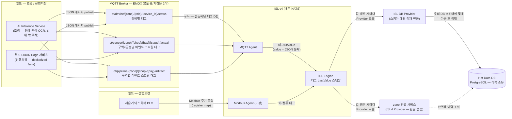

# 내업 공정실적 자동수집 시스템
# 필드 인터페이스 정의서

**버전:** v0.2
**작성:** 이태훈 PM
**소속:** 한화에너지 컨버전스사업부 R&D센터 솔루션개발1팀

> ⚠️ **초안(Draft):** 본 문서는 「필드 데이터 수집 메시지 설계 v0.2」를 승계해 인터페이스 정의서 체계로 재편한 초안이다. **조립·선행의장·선행도장 3개 권역의 필드 계층**을 다룬다(가공권역은 필드 센서가 없어 대상이 아니다). 토픽·태그 명명과 페이로드 스키마는 **ISL 벤더 합의 전의 확정 제안**이며, 합의·현장 확인이 끝나지 않은 항목은 전부 ⚠️로 남겼다 — 추측으로 채우지 않는다.

---

## 목차

1. [개요](#1-개요)
2. [문서 체계와 참조 관계](#2-문서-체계와-참조-관계)
3. [수집 경로와 데이터 흐름](#3-수집-경로와-데이터-흐름)
4. [식별 계층과 명명 규칙](#4-식별-계층과-명명-규칙)
5. [태그 등록과 값 수명](#5-태그-등록과-값-수명)
6. [조립·선행의장 메시지 명세](#6-조립선행의장-메시지-명세)
7. [선행도장 태그 명세](#7-선행도장-태그-명세)
8. [장비 마스터(Device Registry)](#8-장비-마스터device-registry)
9. [제약사항 및 미확정 항목](#9-제약사항-및-미확정-항목)
10. [용어 정의](#10-용어-정의)

---

## 1. 개요

본 문서는 내업 공정실적 자동수집 시스템이 현장 장비로부터 수집하는 **필드 계층 데이터의 규격**을 정의한다.

- **목적:** 「시스템 인터페이스 정의서」가 채널 단위(IF-ID·프로토콜·주기·인증)로 정의한 필드 수집 인터페이스에 대해, 실제로 어떤 **토픽·태그명·페이로드 항목**이 오가는지를 구현 가능한 수준으로 규정한다.
- **범위:** 조립·선행의장의 MQTT 메시지 3계열(장비 상태·실적률 결과·파이프라인 산출물)과 선행도장의 Modbus 태그 6종, 그리고 이들의 식별 계층·태그 등록 모델·장비 마스터를 다룬다. **가공권역은 LiDAR/PLC 같은 필드 센서가 없어 대상이 아니고**, 레거시 테이블 규격(「레거시 인터페이스 정의서」 소관)과 Hot Data DB 적재 스키마도 대상이 아니다.
- **대상 독자:** 필드 서비스 개발자(리옵스), 권역별 실적 판별 서비스 개발자, ISL 벤더(MQTT Agent·Modbus Agent 수집 설정 담당), ISL DB Provider 개발자.
- **근거 자료:** 「필드 데이터 수집 메시지 설계 v0.2」(본 문서가 승계) / 「시스템 인터페이스 정의서」 §5·§7·§8·부록 A·부록 B / `docs/design/system_architecture/시스템 아키텍쳐.drawio` / 「OT Server 인프라 구성 및 CI/CD 설계서」 §2.4 / `AGENTS.md`. v0.1 계열 문서(조립권역·센서디바이스상태·선행도장권역 메시지설계)는 레포 외부 자료이며, 본 문서가 해당 내용을 인라인으로 승계한다.

---

## 2. 문서 체계와 참조 관계

> **본 문서는 「시스템 인터페이스 정의서」의 하위 문서다.** IF-ID **채번**, 송·수신 시스템, 프로토콜, 연동 주기, 인증, 오류·재처리 정의는 「시스템 인터페이스 정의서」(`docs/인터페이스정의서.md`)를 **유일한 소스**로 한다. 본 문서는 그 인터페이스가 실어 나르는 **데이터 규격**만 정의하며, **본 문서에서 IF-ID를 채번하지 않는다.**

| 문서 | 정의하는 것 | 정의하지 않는 것 |
|---|---|---|
| 시스템 인터페이스 정의서 | IF-ID 채번, 송·수신 시스템, 프로토콜, 주기, 인증, 오류·재처리 | 토픽·태그명 상세, 페이로드 항목, 테이블 컬럼 |
| **본 문서(필드 인터페이스 정의서)** | 필드 계층 — MQTT 토픽·Modbus 태그명, 페이로드 스키마, 식별 계층, 태그 등록 모델, 장비 마스터 | IF-ID 채번, 프로토콜·주기·인증 |
| 레거시 인터페이스 정의서 | IT 계층 — 레거시 테이블·컬럼 명세, 키체인·조인 조건 | IF-ID 채번, 프로토콜·주기·인증 |
| 권역별 기능 정의서 | 기능ID 단위 판별 규칙 | 위 셋 모두의 상세 |

운영 규칙은 다음과 같다.

1. 본 문서의 각 채널은 `관련 I/F ID`로 「시스템 인터페이스 정의서」의 채널을 참조한다. **참조할 IF-ID가 없으면 만들지 말고 `⚠️ 미채번`으로 남긴다.**
2. 「시스템 인터페이스 정의서」 부록 A(토픽·서브젝트 명명)와 부록 B(공통 메시지 Envelope)는 **요약**이고, 필드 계층의 토픽 규칙·페이로드 상세는 본 문서가 보유한다. 명명 규칙이 바뀌면 양쪽을 함께 갱신한다.
3. 토픽·페이로드가 확정되면 「시스템 인터페이스 정의서」 각 상세의 `데이터 항목` 행에서 본 문서를 참조하도록 유지한다.

**하나의 물리 채널에 토픽 3계열** — 조립·선행의장의 세 토픽 계열(§6.2~§6.4)은 같은 EMQX 브로커에 동일 접속 파라미터로 publish되는 **하나의 물리 채널**이므로 IF-ID를 나누지 않는다(조립 `ASM-IF01`, 선행의장 `OUT-IF01`). ISL 벤더가 계열별 수집 채널 분리를 요구하는 경우에만 「시스템 인터페이스 정의서」에서 추가 채번을 검토한다(§9).

---

## 3. 수집 경로와 데이터 흐름

권역별로 데이터가 ISL Engine에 도달하는 경로가 다르고, 그에 따라 설계 단위도 다르다.

- **메시지형(조립·선행의장)** — 필드의 publish 주체가 **MQTT Broker(EMQX)**에 JSON 메시지를 publish하고, **ISL MQTT Agent**가 이를 구독해 ISL Engine으로 전달한다(`ASM-IF01`, `OUT-IF01`). ISL에 저장되는 최종 형태는 태그형과 동일한 **태그ID/value**다 — 태그ID는 MQTT 토픽에서 유도되고, value에는 **JSON payload 통째가 1개 태그 값**으로 들어간다. 따라서 메시지 내부 구조(중첩 객체 포함)는 본 문서에서 자유롭게 설계할 수 있고, **토픽 설계가 곧 태그ID 설계**다. 수집은 ISL의 **선등록 모델**을 따른다 — 수집 대상 태그를 Engine에 먼저 등록하면 Agent가 그 목록을 받아 해당 토픽 구독을 시작하므로, 태그 ID는 사전에 정의·등록 가능해야 한다(§5.1). §6이 이 유형이다. **publish 주체는 권역별로 다르다** — 조립은 `AI Inference Service`(형상 인식·OCR 추론, 범위 밖 주체), 선행의장은 `필드 LiDAR Edge 서비스`(dockerized Java)다. 두 권역이 공유하는 것은 EMQX 경유·MQTT Agent 구독 구조이며, 식별자 정의는 「시스템 인터페이스 정의서」 §2.2를 따른다.
- **태그형(선행도장)** — PLC가 Modbus로 **ISL Server의 도장 Modbus Agent에 직결**되며 MQTT Broker를 경유하지 않는다(`PNT-IF01`). Modbus Agent는 register를 주기 폴링해 **키-밸류 형식의 태그**로 수집하므로, 설계 단위는 JSON 메시지가 아니라 **태그(태그명 + 값)**다. 이쪽도 선등록 모델은 동일하다 — 등록된 태그와 register map에 따라 폴링이 시작된다. §7이 이 유형이다.

> EMQX는 필드→OT 전달용 MQTT Broker이고, NATS는 ISL v4 내부 메시징 구현체다. 두 계층은 별개이므로 혼동하지 않는다.

두 경로의 전체 데이터 흐름은 다음과 같다.



---

## 4. 식별 계층과 명명 규칙

### 4.1 설계 원칙 — 설비·벤더·사업장 비종속

수집 체계는 ISL 기반 태그 중심이다. 태그 네이밍과 메시지 스키마에 특정 장비 모델명(LIVOX AVIA, PTS-3050D 등)이나 벤더명(리옵스)이 들어가면, 장비 교체·벤더 변경·미국 필리조선소 확장 때마다 태그 체계를 다시 짜야 한다. 따라서 다음 원칙을 적용한다.

- 태그·메시지에는 **논리적 역할(role)**만 쓴다 — `lidar`, `pan_tilt`, `edge_pc`, `inference_ws`, `vision_ocr`, `plc_dehumidifier`, `plc_gas_heater`
- 실제 모델명·시리얼·벤더는 **장비 마스터(device registry)**에서 device_id로 조회하는 참조 데이터로 분리한다(§8)
- 사업장·공장·설치위치도 태그 계층의 값으로만 존재하고, 스키마 구조 자체는 어느 사업장이든 동일하다

즉 "거제 조립1공장의 LIVOX가 필리조선소의 다른 벤더 LiDAR로 바뀌어도" 태그 구조와 메시지 스키마는 그대로이고, device registry의 매핑만 바뀐다.

### 4.2 식별 계층

권역 공통 식별 계층은 아래 7단계다.

```
{site}/{zone}/{shop}/{bay}/{device_role}/{device_id}/{metric}
```

| 세그먼트 | 의미 | 예 |
|---|---|---|
| site | 사업장 | geoje (향후 미국 필리조선소 등 확장 대비 — 예: philly) |
| zone | 권역 | assembly / outfitting / painting |
| shop | 내업 shop (공장 단위. 도장은 도크 단위 — §7.3 참조) | assembly1, outfitting1, dock1 |
| bay | shop 내 bay | bay3 |
| device_role | 장비의 논리 역할 | lidar / pan_tilt / edge_pc / inference_ws / vision_ocr / plc_dehumidifier / plc_gas_heater |
| device_id | 장비 식별자 — device registry(§8)의 키와 동일 | LDR-GJ-A1B3-01 |
| metric | 태그 항목 | operating_mode, actual_value, modbus_link 등 |

순번(device_seq: 01, 02) 대신 **device_id**를 쓰는 이유는, 조립 ~210대·의장 ~140대 규모에서 bay별 순번 채번을 별도로 관리하면 충돌·중복 위험만 늘어나기 때문이다. device_id는 이미 전역 유일하고 registry 조인 키와 일치한다. 장비 교체 시 태그명이 바뀌어 시계열이 나뉘는 점은 registry의 설치 위치 이력(installed_at/retired_at)으로 이어 붙인다.

이 계층이 쓰이는 자리는 수집 유형에 따라 다르다.

- **태그형(선행도장)** — 이 계층 전체가 곧 **태그명**이다. 키-밸류 수집에서는 태그명이 유일한 식별 수단이므로 계층을 전부 태그명에 담는다. 예: `geoje/painting/dock1/bay2/plc_gas_heater/PLC-GH-D1-03/actual_value`
- **메시지형(조립·선행의장)** — site/zone/shop/bay 등은 **JSON payload의 필드**로 존재하고, 토픽(=태그ID)에는 태그 분리 단위까지만 담는다 — 장비 상태는 장비별(device_id 포함), 실적·산출물은 shop/bay 작업 구역 단위다(§4.3).

### 4.3 MQTT 토픽 설계 — 메시지형 채널 (필드 서비스 → EMQX)

토픽이 곧 ISL 태그ID가 되므로, 토픽에는 **태그를 나누고 싶은 단위**까지만 담는다.

```
ot/device/{zone}/{device_role}/{device_id}/status   ← §6.2 장비 상태 — 장비별 태그
ot/sensor/{zone}/{shop}/{bay}/{stage}/actual        ← §6.3 실적률 결과 — 구역(shop/bay)×공정(stage)별 이벤트 스트림 태그
ot/pipeline/{zone}/{shop}/{bay}/artifact            ← §6.4 추론 과정 산출물 메타데이터 — 구역별 이벤트 스트림 태그
```

- **장비 상태**는 토픽에 device_id를 넣어 **장비별 태그**로 분리한다 — 조립 ~210대·의장 ~140대의 LiDAR를 장비별로 현재 상태 조회하고 장비 단위로 이력을 적재해야 하기 때문이다. 토픽 하나에 전 장비 상태가 섞이면 ISL에서 장비별 조회가 되지 않는다.
- **실적률·산출물**은 특정 장비가 아니라 스캔 이벤트 단위이지만, **shop/bay 작업 구역 단위로 태그를 분리**한다 — 구역별 이벤트 스트림이 독립 태그가 되어 구역 단위 조회·모니터링이 가능하고, 여러 구역의 이벤트가 태그 하나에 몰리지 않는다. 장비 추적은 payload의 device_ids 필드로 한다.
- scan_id·hull_no·block_id처럼 런타임에 무한히 생기는 식별자는 payload 전용이다(선등록 불가). shop/bay는 태그 분리 단위로 토픽에 포함하되, payload 필드로도 유지한다(토픽↔payload 정합 검증용).

> ⚠️ **본 절은 확정 제안이다.** 「시스템 인터페이스 정의서」 부록 A의 "운영 MQTT 토픽 명명 규칙: ⚠️ 미확정" 자리에 대응하며, ISL 벤더(MQTT Agent 구독 설정)와 합의해 확정되면 양쪽을 함께 갱신한다(§2 운영 규칙 2).

### 4.4 NATS subject (참조 — ISL 내부)

ISL v4 내부에서 MQTT 토픽은 구분자만 바뀐 NATS subject로 1:1 변환된다(`/` ↔ `.`). 예: `ot/device/assembly/lidar/LDR-GJ-A1B3-01/status` ↔ `ot.device.assembly.lidar.LDR-GJ-A1B3-01.status`. 이 변환은 ISL 스택(별도 repo) 소관이며, 필드 서비스가 publish하는 대상은 어디까지나 EMQX의 MQTT 토픽이다.

---

## 5. 태그 등록과 값 수명

### 5.1 태그 사전 등록 (선등록 모델)

ISL의 수집 모델은 **선등록**이다 — 수집할 태그를 Engine에 먼저 등록하고, Agent는 등록된 수집 대상 태그 목록을 Engine으로부터 받아 수집(MQTT 구독 / Modbus 폴링)을 시작한다. 이 제약이 본 설계에 주는 귀결은 다음 둘이다.

**정적 열거 가능성** — 태그 ID의 모든 세그먼트는 사전에 열거 가능한 값이어야 한다: 유한 enum(zone, device_role, stage, metric)이거나 registry에 등록된 값(device_id)이어야 한다. scan_id·hull_no·block_id처럼 런타임에 무한히 생기는 변량을 태그 ID에 넣지 않는 이유가 바로 이것이며, 이런 값은 payload 필드로만 다룬다.

**이벤트 태그의 태그 ID는 레코드 키가 아니라 채널 주소** — 실적률·산출물은 레코드 하나하나가 유니크하지만, 그 유니크함을 태그 ID에 담으려 해서는 안 된다. 레코드별 태그는 사전 등록이 불가능하고(무한 채번), 불필요하다 — ISL은 LastValue 스냅샷 + 갱신 통지 전달자이지 레코드 저장소가 아니며, 채널 태그 하나로도 모든 레코드가 건별 Provider 호출로 후단(ISL DB Provider·판별 서비스)에 도달한다(§5.3). 키는 세 층으로 분리된다.

| 층 | 키 | 성격 | 보장 주체 |
|---|---|---|---|
| 채널 주소 | **태그 ID** (예: `ot/sensor/assembly/assembly1/bay3/arrangement/actual`) | 계측점 — 유한·정적, 선등록 대상 | ISL 태그 등록 |
| 레코드 유니크 키 | payload의 **idempotency_key** | 이벤트 건별 유일 | Hot Data DB 적재 시 unique 제약 |
| 도메인 조인 키 | payload의 scan_id / hull_no / block_id | 산출물↔실적 연결, 블록 추적 | 판별 서비스 / Hot Data DB |

따라서 실적률·산출물 채널에서 사전 등록할 태그 ID는 shop/bay 조합 × stage의 전개다. (stage↔zone 배정은 §6.3 stage enum 기준이며 공정 정의 확정 시 조정한다. 토픽·태그 세그먼트는 소문자, payload enum 값은 대문자를 관례로 한다. shop/bay 목록은 현장 레이아웃 확정 후 열거한다 — §9)

| 채널 | 태그 ID 패턴 | 등록 수 |
|---|---|---|
| 실적률 (조립) | `ot/sensor/assembly/{shop}/{bay}/{stage}/actual` — stage: arrangement/processing/inspection/outbound | 조립 shop×bay 조합 × 4 |
| 실적률 (선행의장) | `ot/sensor/outfitting/{shop}/{bay}/{stage}/actual` — stage: wiring/penetration | 의장 shop×bay 조합 × 2 |
| 산출물 | `ot/pipeline/{zone}/{shop}/{bay}/artifact` | zone별 shop×bay 조합 × 1 |

예: `ot/sensor/assembly/assembly1/bay3/arrangement/actual`, `ot/pipeline/outfitting/outfitting1/bay2/artifact`

### 5.2 태그 인벤토리와 프로비저닝

| 채널 | 태그 ID 패턴 | 수량 산정 |
|---|---|---|
| 장비 상태 (§6.2) | `ot/device/{zone}/{device_role}/{device_id}/status` | 장비 대수만큼 — LiDAR 조립 ~210대 + 의장 ~140대, 부속 장비(pan_tilt/edge_pc/inference_ws/vision_ocr)는 별도. **device registry에서 생성** |
| 실적률 (§6.3) | `ot/sensor/{zone}/{shop}/{bay}/{stage}/actual` | shop×bay 조합 × stage (현장 레이아웃 확정 필요) |
| 산출물 (§6.4) | `ot/pipeline/{zone}/{shop}/{bay}/artifact` | shop×bay 조합 × 1 |
| 도장 운전 (§7) | `{site}/painting/{dock}/{bay}/{device_role}/{device_id}/{metric}` | PLC 대수 × metric 6종 |

**프로비저닝 워크플로우** — 장비별 태그(장비 상태·도장 운전)의 등록 원천은 device registry(§8)다.

1. 장비 신규 설치·교체 시 registry에 행 추가 (device_id 확정)
2. 그 행에서 파생되는 태그 ID를 ISL Engine에 등록
3. Agent가 갱신된 수집 대상 목록으로 수집 시작

**등록 전에는 필드 서비스가 publish해도 수집되지 않는다.** 장비 설치 절차에 registry 등록 → ISL 태그 등록이 선행 단계로 들어가야 한다.

### 5.3 태그 값의 수명 — LastValue와 이력 적재

ISL Engine은 태그당 **최신값(LastValue)만 유지**하고 시계열 이력을 쌓지 않는다. 대신 **태그 값이 갱신될 때마다 Engine이 등록된 Provider들을 호출**한다. 채널별 귀결은 다음과 같다.

- **장비 상태** — LastValue가 곧 현재 상태이므로 조회 용도로는 그 자체로 충분하다. 상태 변화 이력·가동률 분석은 아래 적재 이력에서 한다.
- **이벤트 태그(실적률·산출물)** — 연속 이벤트가 LastValue를 덮어써도 갱신 통지가 건마다 Provider로 나가므로 **이벤트가 유실되지 않는다**. 중복 호출은 envelope의 idempotency_key로 걸러낸다.
- **도장 운전 태그** — 공정 추정에 필요한 시계열은 ISL에 없으므로 아래 적재 경로로 구성한다.

**이력 적재 주체는 ISL DB Provider(신규 설계)**다 — 적재 전용 Provider를 별도로 두어, Engine의 갱신 통지를 받아 **우리 DB 스키마에 맞게 경량 가공**(envelope 공통 필드 → 컬럼 매핑, payload 원본 보존)한 뒤 Hot Data DB(PostgreSQL)에 적재한다. **권역 판별 서비스는 적재를 겸하지 않고 판별 전용**이다 — Engine의 갱신 통지를 판별 입력으로 받고, 판별에 필요한 시계열·이력은 Hot Data DB에서 조회한다. 역할 분담은 **ISL 태그 = 현재 스냅샷, ISL DB Provider = 적재, Hot Data DB = 이력 소유, 판별 서비스 = 판별**이다. 본 문서의 "추이", "이력", "체인 조회" 서술은 모두 Hot Data DB에 적재된 이력을 전제한다.

---

## 6. 조립·선행의장 메시지 명세

### 6.1 채널 인벤토리

「시스템 인터페이스 정의서」의 채널(IF-ID)과 본 문서의 명세를 잇는 매핑표다. IF-ID의 채번·프로토콜·주기·인증은 그 문서를 따른다(§2).

| 채널 | 토픽 / 태그 패턴 | 권역 | 관련 I/F ID | 본 문서 절 | 상태 |
|---|---|---|---|---|---|
| 장비 상태 | `ot/device/{zone}/{device_role}/{device_id}/status` | 조립 · 선행의장 | ASM-IF01 / OUT-IF01 | §6.2 | ⚠️ 미확정(벤더 합의 전) |
| 실적률 결과 | `ot/sensor/{zone}/{shop}/{bay}/{stage}/actual` | 조립 · 선행의장 | ASM-IF01 / OUT-IF01 | §6.3 | ⚠️ 미확정(벤더 합의 전) |
| 파이프라인 산출물 | `ot/pipeline/{zone}/{shop}/{bay}/artifact` | 조립 · 선행의장 | ASM-IF01 / OUT-IF01 | §6.4 | ⚠️ 미확정(벤더 합의 전) |
| PLC 운전 데이터 | `{site}/painting/{dock}/{bay}/{device_role}/{device_id}/{metric}` | 선행도장 | PNT-IF01 | §7 | ⚠️ 미확정(register map 미확보) |

세 MQTT 채널이 IF-ID를 공유하는 근거는 §2 말미를 참조한다.

### 6.2 장비 상태 메시지 — `ot/device/{zone}/{device_role}/{device_id}/status`

「센서디바이스 상태 메시지설계 v0.1」의 공통 Envelope을 그대로 쓰되, device_type을 모델 기반이 아닌 역할 기반으로 바꾸고 역할별 raw_payload를 정의한다. 도장 PLC는 MQTT를 경유하지 않으므로 이 메시지의 대상이 아니다 — 도장 설비의 통신 상태(modbus_link, fault_code)는 §7의 태그로 수집한다.

**공통 Envelope**

```json
{
  "device_id": "string",
  "device_role": "LIDAR | PAN_TILT | EDGE_PC | INFERENCE_WS | VISION_OCR",
  "site": "string",
  "zone": "ASSEMBLY | OUTFITTING",
  "shop": "string",
  "bay": "string",
  "status": "ONLINE | OFFLINE | ERROR | CALIBRATING",
  "last_heartbeat_at": "ISO8601",
  "error_code": "string | null",
  "occurred_at": "ISO8601",
  "ingested_at": "ISO8601",
  "idempotency_key": "string",
  "raw_payload": {}
}
```

**역할별 raw_payload**

`LIDAR` — 현재 LIVOX AVIA 단일 모델이나, 비종속 원칙(§4.1)에 따라 특정 모델에 종속되지 않는 항목만 둔다.

```json
{ "scan_rate_pts_per_sec": "number", "temperature_c": "number", "connectivity_rssi": "number", "fov_mode": "string" }
```

`PAN_TILT`

```json
{ "pan_deg": "number", "tilt_deg": "number", "moving": "boolean", "preset_id": "string | null" }
```

| 필드 | 설명 |
|---|---|
| pan_deg / tilt_deg | 현재 자세 각도 — 스캔이 어느 방향을 보고 있었는지 실적 데이터와 대조할 때 필요 |
| moving | 구동 중 여부 — 이동 중 스캔은 품질이 낮을 수 있어 구분 |
| preset_id | 정반·구역별 사전 정의된 스캔 자세 프리셋 (있는 경우) |

`EDGE_PC` (전처리 PC)

```json
{ "cpu_pct": "number", "mem_pct": "number", "disk_pct": "number", "queue_depth": "int" }
```

`queue_depth`는 전처리 대기 중인 스캔 건수이며, 여기가 쌓이면 실적 반영이 늦어지고 있다는 신호다.

`INFERENCE_WS` (GPU 워크스테이션)

```json
{ "gpu_util_pct": "number", "gpu_mem_pct": "number", "gpu_temp_c": "number", "inference_queue_depth": "int", "model_version": "string" }
```

`model_version`은 추론 모델 버전으로, 실적률 값이 갑자기 달라졌을 때 모델 교체 때문인지 추적하는 용도다.

`VISION_OCR` — 특정 조립공장 입구에만 설치된다.

```json
{ "frame_rate_fps": "number", "ocr_confidence_avg": "number", "lens_condition": "CLEAN | DIRTY | OBSTRUCTED" }
```

### 6.3 실적률 결과 메시지 — `ot/sensor/{zone}/{shop}/{bay}/{stage}/actual`

「조립권역 메시지설계 v0.1」의 구조를 그대로 쓰되, 어느 장비 조합이 이 결과를 만들었는지 추적할 수 있게 필드를 보강한다. ISL MQTT Agent가 payload 통째를 1개 태그 값으로 수집하므로 device_ids·raw_payload 같은 중첩 객체를 그대로 쓸 수 있다. 레코드 건별 유니크함은 태그 ID가 아니라 payload의 idempotency_key가 대표한다(§5.1).

```json
{
  "zone": "ASSEMBLY | OUTFITTING",
  "site": "string",
  "shop": "string",
  "bay": "string",
  "stage": "ARRANGEMENT | PROCESSING | INSPECTION | OUTBOUND | WIRING | PENETRATION",
  "record_type": "ACTUAL",
  "input_method": "AUTO",
  "source_system": "AI Inference Service | LiDAR Edge Service",
  "hull_no": "string",
  "block_id": "string",
  "scan_id": "string",
  "scanned_at": "ISO8601",
  "device_ids": {
    "lidar": "string",
    "pan_tilt": "string | null",
    "edge_pc": "string",
    "inference_ws": "string",
    "vision_ocr": "string | null"
  },
  "event_type": "START | PROGRESS | COMPLETE",
  "occurred_at": "ISO8601",
  "ingested_at": "ISO8601",
  "idempotency_key": "string",
  "raw_payload": {
    "block_progress_rate": "number",
    "reference_cad_id": "string",
    "match_confidence": "number",
    "model_version": "string"
  }
}
```

| 보강된 필드 | 설명 |
|---|---|
| device_ids | 이 결과를 만든 장비 체인 전체. 특정 LiDAR나 특정 모델 버전의 값만 이상할 때 역추적하는 용도. 벤더 비종속 원칙에 따라 역할 키로 구성 |
| scan_id | 스캔 회차 — §6.4의 파이프라인 산출물과 이 실적 결과를 잇는 연결 키 |
| model_version | 추론에 쓴 모델 버전. `INFERENCE_WS` 상태 메시지와 대조 가능 |

Vision OCR은 조립공장 입구에서 블록·부재 식별(마킹 판독)에 쓰이므로, OCR이 개입한 결과에만 `device_ids.vision_ocr`이 채워진다.

### 6.4 파이프라인 산출물 메시지 — `ot/pipeline/{zone}/{shop}/{bay}/artifact`

실적률이 나오기까지의 중간 산출물 — 원본 PCD 정합본, Transformation Matrix, Segmentation 단위 PCD — 도 모니터링용으로 수집한다.

**큰 파일은 메시지에 싣지 않는다** — PCD 파일은 수십 MB~GB 단위라 메시지·태그 파이프라인(EMQX → ISL)에 직접 실을 수 없다. 파일 본체는 **스토리지(로컬 blob 또는 파일서버)에 저장**하고, 메시지에는 **메타데이터 + 저장 위치 참조(URI)**만 싣는다. 기존 아키텍처의 "Raw data(local blob) → PCD 학습서버" 흐름과 같은 원칙이다. Transformation Matrix는 4×4 숫자 16개뿐이라 예외적으로 메시지에 직접 포함한다.

```json
{
  "zone": "ASSEMBLY | OUTFITTING",
  "site": "string",
  "shop": "string",
  "bay": "string",
  "scan_id": "string",
  "artifact_type": "REGISTERED_PCD | TRANSFORMATION_MATRIX | SEGMENTED_PCD",
  "hull_no": "string | null",
  "block_id": "string | null",
  "segment_id": "string | null",
  "storage_uri": "string | null",
  "file_size_bytes": "number | null",
  "checksum": "string | null",
  "transformation_matrix": "number[16] | null",
  "produced_by_device_id": "string",
  "model_version": "string",
  "occurred_at": "ISO8601",
  "ingested_at": "ISO8601",
  "idempotency_key": "string",
  "raw_payload": {}
}
```

| 필드 | 설명 |
|---|---|
| scan_id | §6.3 실적 결과 메시지와 같은 스캔 회차 — 이 키로 "이 실적률이 어떤 PCD에서 나왔는지" 연결 |
| artifact_type | 세 종류 — 정합된 원본 PCD / 변환 행렬 / Segmentation 단위 PCD |
| segment_id | `SEGMENTED_PCD`일 때만 — 어느 세그먼트(부재·구역)인지 |
| storage_uri | 파일 본체 위치. `TRANSFORMATION_MATRIX`는 null |
| checksum | 파일 무결성 검증용 |
| transformation_matrix | 변환 행렬은 4×4=16개 숫자라 메시지에 직접 포함. 나머지 타입은 null |
| produced_by_device_id | 이 산출물을 만든 장비 (주로 inference_ws) |

**모니터링 활용** — 아래는 모두 Hot Data DB에 적재된 이력 기준이다 (ISL 태그에는 최신 건만 남는다 — §5.3).

- scan_id 하나로 "정합 PCD → 변환 행렬 → 세그먼트 PCD들 → 최종 실적률"의 전체 체인을 조회 가능
- 실적률이 이상할 때 해당 스캔의 PCD를 열어서 눈으로 확인하는 워크플로우 지원
- 세그먼트 개수·파일 크기 추이로 파이프라인 품질 변화 감지

### 6.5 scan_id 채번 규칙

채번 주체는 Edge PC(리옵스 스코프)다. 스캔이 발생하는 지점에서 ID가 생성돼야 이후 파이프라인 산출물 전체가 같은 키를 물고 갈 수 있다.

**형식은 지정하지 않는다.** 내부 구조를 우리가 정하면 그것을 파싱하는 코드가 생기고, 벤더·채번 방식이 바뀔 때 같이 깨진다. shop/bay/시각 같은 정보는 이미 메시지에 별도 필드로 있으므로 scan_id에 중복해 넣을 이유도 없다. 대신 리옵스와의 인터페이스 계약으로 아래 세 조건만 요구한다.

1. **전역 유일성** — 전 사업장·전 장비에 걸쳐 중복 없음 (UUID 권장이지만 강제 아님)
2. **불변성** — 한 스캔에서 나온 모든 산출물(정합 PCD, 변환 행렬, 세그먼트, 실적률)에 동일 값
3. **불투명 취급** — 우리 쪽에서는 파싱하지 않고 조인 키로만 사용. 리옵스 내부 구조는 자유

---

## 7. 선행도장 태그 명세

선행도장은 LiDAR 같은 실적 이벤트가 아니라, 제습기·가스히터의 **연속 운전 데이터**를 주기 폴링으로 수집한다. 이 원본 시계열이 판별 서비스의 공정 추정(전처리·도장 단계) 입력이 된다 — 추정 결과는 「선행도장권역 메시지설계 v0.1」의 실적 채널(`ot.sensor.painting.{stage}.actual`)로 나가고, 이 태그들은 그 재료인 원본이다. ISL 태그에는 최신 폴링 값만 남으므로, 공정 추정용 시계열은 ISL DB Provider가 갱신 통지로 받은 값을 Hot Data DB에 적재해 구성하고, 판별 서비스는 그 이력을 조회한다(§5.3).

경로는 기존 아키텍처 그대로다 — PLC → ISL Server의 도장 Modbus Agent 직결(MQTT Broker 미경유, Kepware/OPC-UA 없음). Modbus Agent가 register를 폴링해 **키-밸류 태그**로 수집하므로, 설계 단위는 JSON 메시지가 아니라 태그다. 태그명은 §4.2 식별 계층의 슬래시 규칙을 따르고, metric별로 태그 1개씩 정의한다.

### 7.1 태그 정의표

태그명: `{site}/painting/{dock}/{bay}/{device_role}/{device_id}/{metric}`
예: `geoje/painting/dock1/bay2/plc_gas_heater/PLC-GH-D1-03/actual_value`

| metric | 자료형 | 단위 | 설명 |
|---|---|---|---|
| operating_mode | bool | - | 가동·정지 — 공정 추정의 핵심 신호 |
| setpoint | float | %RH(제습기) / °C(히터) | 설정값 |
| actual_value | float | %RH(제습기) / °C(히터) | 실측값 |
| runtime_minutes_today | int | min | 당일 누적 가동 시간 (PLC가 제공하는 경우) — 절대 공기 6~8일 패턴 대입에 유용 |
| modbus_link | enum (OK / TIMEOUT / CRC_ERROR) | - | Modbus 통신 상태 — 조립·의장의 §6.2 상태 메시지에 해당하는 역할 |
| fault_code | int (fault 없으면 0) | - | 장비 fault 코드 |

- **단위는 별도 태그가 아니라 태그 정의의 고정 속성**이다 — device_role별로 단위가 확정되므로(제습기=습도, 히터=온도) 값과 함께 흘려보낼 이유가 없다.
- 조립·의장 메시지의 envelope 필드(occurred_at/ingested_at/idempotency_key 등)는 태그 스트림에는 없다 — **폴링 시각은 태그 값에 붙는 타임스탬프**가 그 역할을 하고, 주기 폴링 시계열이라 idempotency 개념도 해당 없다.
- PLC 모델별 추가 register 값이 필요하면 metric을 추가로 정의한다. Modbus register 주소는 태그명에 넣지 않는다(§7.2).

### 7.2 Modbus register 비종속 원칙

register 주소(예: 40001)는 PLC 모델·결선에 종속된 물리 정보다. 태그·메시지에는 논리 필드명(operating_mode 등)만 쓰고, **register 주소 ↔ 논리 필드 매핑은 Modbus Agent의 설정(register map)으로 분리**한다. 장비 교체 시 register map만 갱신하면 되고, 메시지 스키마와 그 뒤 파이프라인은 그대로다 — LiDAR 쪽 device registry와 같은 원칙이다(§4.1).

### 7.3 도장의 shop/bay 매핑

도장은 조립처럼 공장이 아니라 도크(1도크·2도크·느태·텍사코·GPS) 단위다. shop 자리에 도크를 매핑하는 것으로 제안한다(예: `geoje/painting/dock1/bay2/plc_gas_heater/PLC-GH-D1-03/...`). ⚠️ 도크 내부가 bay 개념으로 나뉘는지, 셀·구역 등 다른 명칭인지는 현장 확인이 필요하다(§9).

---

## 8. 장비 마스터(Device Registry)

벤더 비종속 원칙(§4.1)의 반대편 짝이자, **ISL 태그 등록의 원천**이다. 메시지에서 뺀 모델명·벤더·시리얼을 여기서 관리하고, 장비별 태그(§6.2 장비 상태, §7 도장 운전)의 태그 ID가 registry 행에서 파생된다(§5.2).

| 필드 | 예 |
|---|---|
| device_id | LDR-GJ-A1B3-01 |
| device_role | LIDAR |
| site / zone / shop / bay | geoje / ASSEMBLY / assembly1 / bay3 |
| vendor | 리옵스 (조달 기준) |
| model | LIVOX AVIA (교체 시 여기만 갱신) |
| serial_no | (장비사 제공) |
| installed_at / retired_at | 설치·철거 일자 |

장비를 교체하면 registry에 새 행을 추가하고 이전 행을 retire 처리한다 — 태그·메시지 스키마는 건드리지 않는다. Hot Data DB에 `ot_device_registry` 테이블로 추가하며, 기존 `ot_device_status`와 device_id로 연결한다.

---

## 9. 제약사항 및 미확정 항목

「필드 데이터 수집 메시지 설계 v0.2」의 오픈 이슈를 승계해 확인 주체별로 분류했다. 해소되면 해당 절을 갱신하고 본 장에서 제거하며, 그 사실을 변경 이력에 남긴다.

### 9.1 규격 — 본 문서에서 확정해야 할 항목

- ⚠️ **조립·선행의장 shop/bay 목록(현장 레이아웃) 미확정** — 실적률·산출물 태그 등록 수가 shop×bay 조합에 비례하므로(§5.2), 목록 확정 후 태그 ID 전개표를 작성해야 한다.
- ⚠️ **PCD 파일 스토리지 위치·용량 정책 미정**(§6.4) — 정합본과 세그먼트를 스캔마다 모두 보관하면 용량이 빠르게 찬다. 보관 주기(예: 최근 N일) 또는 샘플링 정책이 필요하다.
- ⚠️ **ISL DB Provider 상세 설계 필요**(§5.3) — 우리 DB 스키마 매핑 규칙(envelope 공통 필드 → 컬럼, raw_payload 보존 방식 — 예: JSONB), 배치 위치(Hot Data DB 서버의 기존 Hot DB Agent/Provider와의 관계), 채널별 대상 테이블을 정의해야 한다.
- ⚠️ **Modbus 폴링 주기 미정**(§7) — 너무 짧으면 PLC 부하, 너무 길면 가동 시작·종료 시점의 해상도가 떨어진다. 공정 추정에 필요한 최소 해상도를 기준으로 결정한다.

### 9.2 ISL 벤더 확인 필요

- ⚠️ **운영 MQTT 토픽 명명 규칙 합의 전**(§4.3) — 본 문서의 규칙은 확정 제안이다. MQTT Agent 구독 설정 담당과 합의되면 「시스템 인터페이스 정의서」 부록 A와 함께 갱신한다.
- ⚠️ **ISL MQTT Agent의 태그화 방식 미확인** — 본 설계는 "JSON payload 통째 = 1개 태그 값"을 전제한다(§3). 필드별 태그 분해 방식이라면 §6.3의 중첩 객체 구조(device_ids·raw_payload)를 재검토해야 한다. 아울러 Agent의 구독 단위가 등록된 태그 ID와 정확히 1:1인지(와일드카드 구독 지원 여부)도 확인이 필요하다.
- ⚠️ **태그 대량 등록 방식 미확인**(§5.2) — 장비별 상태 태그만 수백 개 규모다(LiDAR ~350대 + 부속 장비). ISL Engine의 벌크 등록 수단(API·CSV 등)과 등록 수 한계를 확인해야 한다.
- ⚠️ **태그 목록 변경 시 Agent 반영 방식 미확인**(§5.2) — 장비 추가·교체로 태그가 등록·retire될 때 Agent가 핫 리로드하는지, 재시작이 필요한지 확인이 필요하다.
- ⚠️ **Engine의 Provider 호출 조건 미확인**(§5.3) — "쓰기(write)마다"인지 "값 변경(change) 시만"인지에 따라 결과가 갈린다. 도장 태그처럼 값이 장시간 동일한 경우(operating_mode ON 유지) 변경 시만 통지라면 주기 샘플이 ISL DB Provider에 도달하지 않아 시계열 적재·가동시간 계산에 영향이 있다. 메시지형은 idempotency_key·occurred_at 때문에 payload가 매번 달라 실질 영향이 없다.
- ⚠️ **채널 분리 시 채번 검토**(§2) — 벤더가 토픽 3계열을 별개 수집 채널로 요구하면 「시스템 인터페이스 정의서」에서 추가 채번이 필요하다. 본 문서에서 채번하지 않는다.

### 9.3 장비·현장 확인 필요

- ⚠️ **LiDAR 상태 항목 스펙 확인**(§6.2) — LiDAR는 LIVOX AVIA 단일 모델이다. `LIDAR` raw_payload 항목(scan_rate, temperature, rssi, fov_mode)이 AVIA가 실제 제공하는 상태 항목과 일치하는지 리옵스·장비사 스펙 확인이 필요하다. 모델 특화 항목은 raw_payload 추가 필드로 허용한다(향후 모델 교체·추가 대비).
- ⚠️ **Vision OCR 장비 TBD**(§6.2) — 확정되면 registry에 등록만 하면 되는 구조인지 검증이 필요하다.
- ⚠️ **transformation_matrix의 좌표계 기준 미확인**(§6.4) — 어느 원점 기준 변환인지 리옵스 확인이 필요하다.
- ⚠️ **선행의장 shop/bay 구분 미확인**(§4.2) — 전장·관철 작업 구역이 bay 체계로 나뉘는지, 별도 구역 개념인지 현장 확인이 필요하다.
- ⚠️ **도장 도크의 bay 개념 미확인**(§7.3) — 도크 내부가 bay로 나뉘는지, 셀·구역 등 다른 명칭인지 현장 확인이 필요하다.
- ⚠️ **도장 PLC의 register map 미확보**(§7.2) — 어느 register가 operating_mode인지 등. 도크별 설비 대수·모델이 달라 도크마다 map이 다를 수 있고, 그 경우 §7.1 태그 정의표의 metric 구성도 도크별 편차가 생길 수 있다.
- ⚠️ **runtime_minutes_today 제공 주체 미확인**(§7.1) — 누적값을 PLC가 직접 주는지, 우리가 ON/OFF 전이로 계산해야 하는지 확인이 필요하다.
- ⚠️ **LiDAR 대수 출처 불일치** — 「OT Server 인프라 구성 및 CI/CD 설계서」 §2.4는 조립 340대로, 본 문서는 조립 ~210대 + 선행의장 ~140대로 적고 있다. 어느 쪽이 최신인지 확인해 양쪽을 일치시켜야 한다.

### 9.4 범위 밖·후속 과제

- **도장 설비-블록 연결 문제** — PLC 운전 데이터에는 블록 정보가 없다. "이 도크에 지금 어느 블록이 들어있는지"는 BTS 입출고 기록과 대조해야 하고, 그 매핑은 판별 서비스 몫이다(본 문서 범위 밖).
- **배열 시점 블록 식별 문제** — 본 문서 범위 밖이며 여전히 미해결이다. Vision OCR이 입구에서 블록을 식별해주는 것이 해결책일 가능성이 있으므로, OCR 판독 결과와 LiDAR 스캔을 잇는 흐름 확인이 필요하다.

---

## 10. 용어 정의

| 용어 | 정의 |
|---|---|
| 메시지형 | 필드의 publish 주체가 MQTT Broker(EMQX)에 JSON 메시지를 publish하고 ISL MQTT Agent가 구독하는 수집 유형. 조립·선행의장이 해당하며, publish 주체는 각각 AI Inference Service·필드 LiDAR Edge 서비스다(§3) |
| 태그형 | PLC가 Modbus로 ISL Server에 직결되고 Modbus Agent가 register를 주기 폴링해 키-밸류로 수집하는 유형. 선행도장이 해당한다 |
| 선등록 모델 | 수집 대상 태그를 ISL Engine에 먼저 등록해야 Agent가 수집을 시작하는 ISL의 수집 모델. 등록 전 publish는 수집되지 않는다 |
| 태그 ID | ISL이 값을 담는 계측점 주소. 메시지형에서는 MQTT 토픽에서 유도되며, value에 JSON payload 통째가 들어간다 |
| 채널 태그 | 레코드 하나가 아니라 이벤트 스트림 하나에 대응하는 태그. 실적률·산출물 채널이 해당하며, 레코드 유니크 키는 payload의 idempotency_key가 맡는다 |
| LastValue | ISL Engine이 태그당 유지하는 최신값 스냅샷. 시계열 이력은 쌓지 않으며, 값 갱신 시마다 등록된 Provider를 호출한다 |
| ISL DB Provider | Engine의 태그 갱신 통지를 받아 우리 DB 스키마에 맞게 가공한 뒤 Hot Data DB에 적재하는 **적재 전용** Provider. ⚠️ 상세 설계 미확정 |
| 판별 서비스 | `ot-pipeline-{zone}`. Engine의 갱신 통지를 판별 입력으로 받는 **판별 전용** ISL4 Provider이며, 적재를 겸하지 않는다 |
| device registry | 장비 마스터. device_id ↔ 모델·벤더·시리얼·설치 위치를 매핑하는 참조 테이블이자 장비별 태그 등록의 원천(§8) |
| device_role | 장비의 논리 역할. 모델명·벤더명 대신 태그·메시지에 쓰는 비종속 식별자(§4.1) |
| register map | Modbus register 주소 ↔ 논리 필드명 매핑. Modbus Agent 설정으로 분리해 PLC 교체 시 이 설정만 갱신한다(§7.2) |
| scan_id | 스캔 회차 식별자. Edge PC가 채번하며, 한 스캔에서 나온 산출물과 실적률을 잇는 조인 키다(§6.5) |
| EMQX | 필드 → OT 전달용 MQTT Broker. 조립용·의장용 2식으로 분리 운영한다 |
| NATS | ISL v4 스택 내부 메시징 구현체. EMQX와는 별개 계층이며 본 시스템의 직접 연계 대상이 아니다 |

---

## 변경 이력

| 버전 | 날짜 | 내용 |
|---|---|---|
| v0.1 | 2026-08-27 | 「필드 데이터 수집 메시지 설계 v0.2」를 승계해 **「필드 인터페이스 정의서」로 재편**. 「시스템 인터페이스 정의서」의 하위 문서로 §2(문서 체계와 참조 관계)·§6.1(채널 인벤토리 — IF-ID 매핑)·§10(용어 정의)을 신설하고, 오픈 이슈를 §9(제약사항 및 미확정 항목)로 확인 주체별 분류. 조립·선행의장 3개 토픽 계열은 동일 물리 채널이므로 `ASM-IF01`·`OUT-IF01`을 공유하는 것으로 정리 — **본 문서에서 채번하지 않으며 신규 채번도 없다**. scan_id 채번 주체(Edge PC)를 §6.5로 확정 반영. 미확정 항목의 확정 승격은 없다 |
| v0.2 | 2026-09-02 | **조립 권역 publish 주체 정정** — 조립은 `AI Inference Service`(범위 밖 주체)가 EMQX에 직접 publish하고 선행의장은 `필드 LiDAR Edge 서비스`가 publish한다. v0.1은 두 권역을 `필드 Java 서비스` 하나로 묶어 「시스템 인터페이스 정의서」·「조립 기능 정의서」와 어긋나 있었다. §3 서술·흐름도 노드를 권역별로 분리하고, §6.3 `source_system` 을 `AI Inference Service | LiDAR Edge Service` 로, §10 `메시지형` 용어를 함께 정정. **채번·토픽 설계 변경 없음.** 인터페이스 정의서 v0.12와 동기 |
